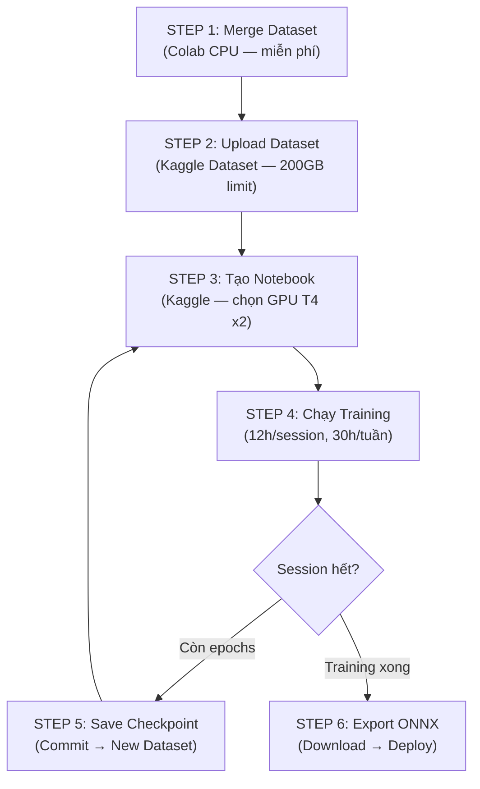

# 🚀 KAGGLE TRAINING GUIDE — EatFitAI YOLO11m

Hướng dẫn từng bước setup và chạy training YOLO11m trên Kaggle Free Tier.

---

## 📋 Tổng Quan Workflow



---

## STEP 1: Merge Dataset Trên Colab (CPU — Miễn Phí)

> [!IMPORTANT]
> Bước này KHÔNG cần GPU. Dùng Colab CPU runtime (miễn phí, không giới hạn thời gian).
> Mục đích: gộp tất cả dataset raw thành 1 merged dataset duy nhất.

### 1.1. Mở Colab → Runtime → Change Runtime Type → **None** (CPU)

### 1.2. Chạy notebook `EatFitAI_Training_Notebook.py`
- Cell 1 → Cell 8 (Setup → Mount Drive → Giải nén → Merge → Tạo data.yaml)
- **KHÔNG chạy Cell 9** (Training) — đó là cho Kaggle

### 1.3. Sau khi merge xong, zip merged dataset:

```python
# Chạy trong Colab — nén merged dataset
import os
os.system("cd /content && tar -czf merged_dataset.tar.gz merged_dataset/")

# Copy lên Drive
import shutil
shutil.copy2(
    "/content/merged_dataset.tar.gz",
    "/content/drive/MyDrive/EatFitAI-Training/merged_dataset.tar.gz"
)
print("✅ Đã copy lên Drive!")
```

> [!TIP]
> Nếu bạn **đã merge xong** trên Colab trước đó và dataset vẫn còn trên Drive, bỏ qua step 1.

---

## STEP 2: Upload Dataset Lên Kaggle

### Cách A: Upload qua Web UI (Đơn giản nhất)

1. Vào [kaggle.com/datasets](https://www.kaggle.com/datasets)
2. Click **"+ New Dataset"** (góc phải trên)
3. Đặt tên: **`eatfitai-merged-dataset`**
4. Kéo thả file `merged_dataset.tar.gz` từ Google Drive vào
   - Hoặc: Download từ Drive → Upload lên Kaggle
5. Chờ upload xong → Click **"Create"**

> [!WARNING]
> File merged dataset có thể rất lớn (50-80GB). Upload qua web UI có thể mất 1-3 giờ tùy mạng.

### Cách B: Upload qua Kaggle API (Nhanh hơn nếu file trên server)

```bash
# Cài Kaggle API trên Colab
pip install kaggle

# Cấu hình API key (lấy từ kaggle.com → Settings → API → Create New Token)
mkdir -p ~/.kaggle
# Upload file kaggle.json vào ~/.kaggle/

# Tạo dataset metadata
mkdir -p /tmp/kaggle-upload
cat > /tmp/kaggle-upload/dataset-metadata.json << 'EOF'
{
    "title": "EatFitAI Merged Dataset",
    "id": "YOUR_USERNAME/eatfitai-merged-dataset",
    "licenses": [{"name": "CC0-1.0"}]
}
EOF

# Copy data vào thư mục upload
cp /content/merged_dataset.tar.gz /tmp/kaggle-upload/

# Upload
kaggle datasets create -p /tmp/kaggle-upload --dir-mode tar
```

### Cách C: Upload trực tiếp từ Colab (Không cần download về máy)

```python
# Cài Kaggle CLI trong Colab
!pip install kaggle

# Upload API key
from google.colab import files
files.upload()  # Upload file kaggle.json

!mkdir -p ~/.kaggle && mv kaggle.json ~/.kaggle/ && chmod 600 ~/.kaggle/kaggle.json

# Tạo dataset
!mkdir -p /tmp/kg-upload
!cp /content/merged_dataset.tar.gz /tmp/kg-upload/

# Metadata
import json
meta = {
    "title": "EatFitAI Merged Dataset",
    "id": "YOUR_KAGGLE_USERNAME/eatfitai-merged-dataset",
    "licenses": [{"name": "CC0-1.0"}]
}
with open("/tmp/kg-upload/dataset-metadata.json", "w") as f:
    json.dump(meta, f)

!kaggle datasets create -p /tmp/kg-upload
```

> [!NOTE]
> Thay `YOUR_KAGGLE_USERNAME` bằng username Kaggle thực tế của bạn.

---

## STEP 3: Tạo Training Notebook Trên Kaggle

### 3.1. Tạo Notebook Mới
1. Vào [kaggle.com/code](https://www.kaggle.com/code)
2. Click **"+ New Notebook"**
3. Đặt tên: **`EatFitAI-YOLO11m-Training`**

### 3.2. Cấu Hình Notebook (QUAN TRỌNG)
Ở panel bên phải → **Settings**:

| Setting | Giá trị | Lý do |
|---------|---------|-------|
| **Accelerator** | **GPU T4 x2** | DDP training, nhanh ~1.6x so với T4 x1 |
| **Language** | Python | — |
| **Persistence** | Files | Giữ output khi commit |
| **Internet** | ON | Cần để download pretrained weights |

### 3.3. Add Dataset
1. Ở panel phải → **Input** → **"+ Add Input"**
2. Tìm dataset **`eatfitai-merged-dataset`** (dataset bạn vừa upload)
3. Click **Add**
4. Dataset sẽ xuất hiện tại `/kaggle/input/eatfitai-merged-dataset/`

### 3.4. Copy Code
- Mở file `ai-provider/kaggle_train_yolo11.py`
- Copy từng block (giữa các dòng `# ===`) vào từng Cell trên Kaggle
- **Cell 1**: Setup + Kiểm tra GPU
- **Cell 2**: Kiểm tra Checkpoint
- **Cell 3**: Training / Resume
- **Cell 4**: Benchmark Report
- **Cell 5**: Copy Checkpoint → Output
- **Cell 6**: Validate + Export (chỉ khi training xong)

---

## STEP 4: Chạy Training

### Session đầu tiên (Training mới)
1. Chạy **Cell 1** → Xác nhận GPU T4 x2 detected, dataset found
2. Chạy **Cell 2** → Confirm "KHÔNG CÓ CHECKPOINT"
3. Chạy **Cell 3** → Training bắt đầu! 🚀
4. **ĐỢI** — session chạy tối đa 12 giờ

### Khi nào nên dừng?
- Training **tự động dừng** khi:
  - Hết 150 epochs
  - Early stopping (patience=30)
  - Session timeout (12h)
- Nếu muốn dừng sớm: **Interrupt kernel** → chạy Cell 5 ngay

### Theo dõi training
- Kaggle hiển thị output real-time trong cell
- Mỗi epoch sẽ in: `epoch/150 | train_loss | val_loss | mAP50 | mAP50-95`

---

## STEP 5: Resume Giữa Các Sessions

> [!IMPORTANT]
> Đây là bước **QUAN TRỌNG NHẤT**. Nếu không làm đúng, bạn sẽ mất toàn bộ tiến trình!

### 5.1. Trước khi session hết hạn (hoặc sau khi training dừng)
1. Chạy **Cell 5** → Copy checkpoint ra `/kaggle/working/`
2. Click **"Save Version"** (nút ở góc phải trên)
3. Chọn **"Save & Run All (Commit)"**
4. ❌ **KHÔNG** chọn "Quick Save" — nó không chạy lại code!

### 5.2. Tạo Checkpoint Dataset
1. Sau khi commit xong → Vào notebook → Tab **"Output"**
2. Sẽ thấy các file: `last.pt`, `best.pt`, `results.csv`, `args.yaml`
3. Click **"New Dataset"** → Đặt tên: **`eatfitai-checkpoint`**
4. Click **Create** → Chờ tạo xong

### 5.3. Session tiếp theo
1. Mở lại notebook (hoặc tạo notebook mới)
2. Vào **Input** → **"+ Add Input"**
3. Tìm và add dataset **`eatfitai-checkpoint`**
4. Chạy Cell 1 → Cell 2 → Cell 3
5. Code **TỰ ĐỘNG** detect checkpoint và resume! ✅

### Sơ đồ Resume Flow

```
Session 1:
  Training → epoch 1-10 → Cell 5 → Save Version → New Dataset "eatfitai-checkpoint"

Session 2:
  Add "eatfitai-checkpoint" → Cell 1 → Cell 2 (detect checkpoint) → Cell 3 (resume epoch 11)
  → epoch 11-20 → Cell 5 → Save Version → UPDATE Dataset "eatfitai-checkpoint"

Session 3:
  Add "eatfitai-checkpoint" (updated) → resume epoch 21 → ...
```

> [!TIP]
> Khi update checkpoint dataset, vào dataset page → Click "New Version" → Upload file `last.pt` mới → thay file cũ.

---

## STEP 6: Export & Deploy (Sau Khi Training Xong)

1. Chạy **Cell 6** → Validate + Export ONNX
2. Download `best.onnx` từ Output tab
3. Copy vào `ai-provider/` trong project
4. Update `YOLO_CLASS_NAMES` trong `app.py`
5. Git push → Render auto-deploy

---

## ⚡ Bảng Quota & Thời Gian Ước Tính

| Metric | Giá trị |
|--------|---------|
| GPU quota | 30 giờ/tuần |
| Session tối đa | 12 giờ |
| Sessions/tuần | ~2.5 |
| Epochs/session (T4 x2, ước tính) | ~9-10 |
| Tổng sessions cần (150 epochs) | ~15-17 |
| Tổng tuần | ~6-7 |

> [!NOTE]
> Các con số trên là **ước tính dựa trên hardware specs**. Chạy pilot 2-3 epochs đầu tiên để có số thực tế chính xác. Cell 4 (Benchmark Report) sẽ tự tính cho bạn.

---

## ❓ FAQ

### Q: Session bị kill giữa chừng, chưa kịp chạy Cell 5?
**A:** Checkpoint vẫn tồn tại nếu `save_period=5` đã save ít nhất 1 lần. Commit notebook → Output sẽ chứa checkpoint cuối.

### Q: Hết quota tuần này, tuần sau resume được không?
**A:** Được. Miễn là bạn đã save checkpoint thành dataset. Dataset không bị xóa theo quota.

### Q: Đổi account Kaggle có resume được không?
**A:** Được. Download `last.pt` → upload lên account mới → add vào notebook mới. Dataset training cũng cần share hoặc upload lại.

### Q: Nên dùng T4 x2 hay P100?
**A:** **T4 x2** > P100 cho YOLO training vì:
- 2 GPU = ~1.6x throughput
- T4 có Tensor Cores (FP16/AMP) → nhanh hơn P100 ở mixed precision
- Tổng VRAM: 32GB vs 16GB

### Q: OOM (Out of Memory) thì sao?
**A:** Giảm batch size trong Cell 3: `BATCH_TOTAL = 8 * NUM_GPUS` (thay vì 16)
