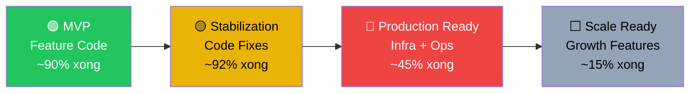

# 📊 EatFitAI — Đánh giá Production Readiness

> **Ngày đánh giá**: 2026-04-24  
> **Phương pháp**: Đọc toàn bộ 9 tài liệu trong `docs/`, scan codebase thực tế (backend 25 controllers + 37 services, mobile 37+ screens + 24 services, AI provider 6 modules), đối chiếu code với docs.

---

## 🎯 Kết luận tổng quan

| Thước đo | Tỉ lệ | Ghi chú |
|---|---:|---|
| **Code completeness** (tính năng đã implement) | **~72%** | Core features xong tốt, thiếu nhiều P1/P2 |
| **Production readiness** (sẵn sàng ship thật) | **~45-50%** | Code khá, nhưng infra/ops/observability chưa đủ |
| **Stabilization plan execution** (thực hiện kế hoạch ổn định) | **~90-92%** | Phần code-applicable gần xong, còn manual ops |

---

## 1. Phân tích chi tiết theo từng trụ cột

### 🟢 Đã hoàn thành tốt (Strengths)

| # | Hạng mục | Chi tiết | Đánh giá |
|---|---|---|---|
| 1 | **Core App Features** | Auth (email + Google), diary, food search, custom dish, water tracking, stats, achievements, notifications, profile | ✅ 100% |
| 2 | **AI Stack** | YOLO vision, Gemini nutrition/cooking/recipe, voice parse, teach-label, barcode scan | ✅ 95% |
| 3 | **Backend Architecture** | 25 controllers, 37+ services, rate limiting, health checks, retry on failure, security headers | ✅ 90% |
| 4 | **Auth Security** | JWT HMAC-SHA256, expo-secure-store, refresh token 30 ngày, access control ban/suspend | ✅ 95% |
| 5 | **Testing Infrastructure** | 26 mobile Jest tests, backend unit+integration, Appium framework, 15+ smoke scripts, release gate 5 cấp | ✅ 85% |
| 6 | **AI Logic Fixes** (từ STABILIZATION_PLAN) | Activity level mapping, goal adjustment parity, dead code cleanup, upper-bound validation, YOLO env config | ✅ Đã implement |
| 7 | **Data Integrity Fixes** | DateTimeHelper UTC+7, Supabase direct bypass removal, water target theo cân nặng, logger production-safe | ✅ Đã implement |
| 8 | **Documentation** | 9 tài liệu kỹ thuật cập nhật 2026-04-23, cấu trúc rõ ràng, quyết định kiến trúc được ghi chép | ✅ Tốt |
| 9 | **Telemetry v1** | Backend telemetry endpoint, mobile queue + batch flush, session tracking | ✅ Hoạt động |
| 10 | **Offline Cache v1** | Read-only offline cache cho profile/summary/diary/nutrition | ✅ Cơ bản |

### 🟡 Đã làm nhưng chưa đủ production-grade

| # | Hạng mục | Tình trạng hiện tại | Vấn đề | Impact |
|---|---|---|---|---|
| 1 | **Analytics / Crashlytics** | Telemetry tự build gửi về backend — **KHÔNG CÓ** Firebase Analytics hay Crashlytics | Không có crash reports từ production devices, không có funnel analytics chuẩn | 🔴 Cao |
| 2 | **Cloud Keep-Alive** | Chưa setup UptimeRobot hay Cron-job | Backend + AI provider ngủ sau 15 phút, cold-start ~60s | 🔴 Cao |
| 3 | **Full Smoke Gate** | Appium sanity launch OK, cloud smoke chưa chạy trọn | Chưa verify e2e trên production environment thật | 🔴 Cao |
| 4 | **Performance** | `useMemo/useCallback` ✅, nhưng `FlatList` chỉ dùng 2 screens, không có `expo-image`, `staleTime` hầu hết = 0 | UI lag khi list dài, ảnh không cache, API calls thừa | 🟡 Trung bình |
| 5 | **ex.Message Cleanup** | Đã sửa phần trọng yếu, nhưng ghi "~50 chỗ cần sửa" → chưa rõ xong bao nhiêu | Có thể leak internal error details cho client | 🟡 Trung bình |
| 6 | **Password Reset** | Dùng `IMemoryCache` thay vì database | Render restart → mã reset mất, multi-instance không shared | 🟡 Trung bình |
| 7 | **JWT Duplication** | `GenerateJwtToken()` copy-paste ở 2 controllers | Rủi ro khi sửa JWT logic | 🟢 Thấp (backlog) |

### 🔴 Chưa có — Critical cho Production

| # | Hạng mục | Lý do critical | Effort ước tính |
|---|---|---|---|
| 1 | **Firebase Analytics + Crashlytics thật** | Telemetry tự build chỉ gửi về backend (phụ thuộc backend sống) — không có crash reporting trên device chết | ~1-2 ngày |
| 2 | **Paid Cloud hoặc Keep-Alive hoạt động** | Free Render = 750h/tháng, 2 services = vượt budget. Chưa setup cron/monitoring | ~2 giờ setup + $7-14/tháng |
| 3 | **Full E2E Smoke trên Cloud Production** | Chưa bao giờ chạy trọn bộ smoke gate trên environment thật | ~4-8 giờ |
| 4 | **CI/CD Pipeline** | Không có GitHub Actions hay pipeline tự động. Build/test/deploy = manual | ~1 ngày |
| 5 | **Staging Environment** | Dev và production dùng chung hoặc chưa tách rõ | ~2-4 giờ |

### ⬜ Chưa có — P2/P3 Features (không block production nhưng cần cho retention)

| # | Feature | So với competitors | Priority |
|---|---|---|---|
| 1 | Favorites / Recent Foods / Same as Yesterday | Baseline ở MFP, Yazio, Lose It! | P1 |
| 2 | Meal Planner | MFP, Lifesum có | P2 |
| 3 | Grocery List | Lifesum có | P2 |
| 4 | Intermittent Fasting | Yazio, Noom có | P2 |
| 5 | Wearable / Health Connect Sync | Lifesum, Noom có | P2 |
| 6 | Progress Photos / Body Scan | Noom có | P2 |
| 7 | Buddies / Social | Yazio, Noom có | P2 |
| 8 | Premium Tiering | Tất cả competitors có | P2 |
| 9 | Micronutrient Charts | Cronometer mạnh | P3 |
| 10 | Export CSV / PDF | Cronometer, MFP có | P3 |
| 11 | Coach / Expert Dashboard | Noom có | P3 |
| 12 | Nutrition Label Scan | MFP, Yazio, Lose It! có | P2 |

---

## 2. Scorecard chi tiết — Mỗi trụ cột Production

```
┌─────────────────────────────────────┬──────────┬─────────────────────────────────────────┐
│ Trụ cột                            │ Score    │ Giải thích                              │
├─────────────────────────────────────┼──────────┼─────────────────────────────────────────┤
│ Core Features (Auth/Diary/AI/Stats) │ 90/100   │ Feature set mạnh, 3 features UNIQUE     │
│ Backend Quality                     │ 80/100   │ Architecture tốt, cần cleanup thêm      │
│ Mobile Quality                     │ 75/100   │ UI đầy đủ, performance chưa optimize    │
│ AI Reliability                     │ 78/100   │ Logic bugs đã fix, cold-start là vấn đề │
│ Security                           │ 72/100   │ Headers ✅, nhưng ex.Message và reset    │
│ Testing & QA                       │ 70/100   │ Framework tốt, chưa chạy full gate      │
│ Observability (Logging/Metrics)    │ 45/100   │ Telemetry tự build, không Firebase real  │
│ Infrastructure & DevOps            │ 30/100   │ Free tier, no CI/CD, no staging          │
│ Documentation                      │ 85/100   │ Docs chất lượng, cập nhật               │
│ Monetization / Business Readiness  │ 15/100   │ Không payment, không premium tier        │
├─────────────────────────────────────┼──────────┼─────────────────────────────────────────┤
│ 🎯 TỔNG TRUNG BÌNH                 │ ~64/100  │                                         │
└─────────────────────────────────────┴──────────┴─────────────────────────────────────────┘
```

---

## 3. Khoảng cách tới Production — Đánh giá thực tế

### App cách production bao xa?

> [!IMPORTANT]
> **App hiện ở mức "Advanced MVP / Late Alpha"** — code features nhiều và ấn tượng, nhưng infra, ops, và observability chưa đạt ngưỡng production.



### Ước tính effort để đạt Production Ready (cho soft-launch ~100 users)

| Phase | Hạng mục | Effort | Priority |
|---|---|---|---|
| **Tuần 1** | Setup keep-alive (UptimeRobot + Cron-job) | 2 giờ | P0 |
| **Tuần 1** | Nâng ít nhất 1 service lên Render Starter ($7/tháng) | 1 giờ + $7 | P0 |
| **Tuần 1** | Firebase Analytics + Crashlytics thật | 1-2 ngày | P0 |
| **Tuần 1** | Chạy full cloud smoke gate, fix issues | 1 ngày | P0 |
| **Tuần 2** | CI/CD cơ bản (GitHub Actions: lint + test + build) | 1 ngày | P1 |
| **Tuần 2** | Performance: FlatList, expo-image, staleTime | 1 ngày | P1 |
| **Tuần 2** | Password reset → database thay IMemoryCache | 0.5 ngày | P1 |
| **Tuần 2** | Hoàn tất ex.Message cleanup nếu còn sót | 0.5 ngày | P1 |
| **Tổng** | | **~6-8 ngày làm việc + $7/tháng** | |

---

## 4. So sánh với Competitors — Vị thế cạnh tranh

| Dimension | EatFitAI | MyFitnessPal | Yazio | Lose It! |
|---|---|---|---|---|
| Food DB size | Custom VN (~nhỏ) | 20M+ crowd | Curated EU | 60M+ crowd |
| AI Food Scan | ✅ YOLO custom | ✅ Passio.ai | ✅ AI | ✅ Snap It |
| Voice tiếng Việt | ✅ **UNIQUE** | ❌ | ❌ | ❌ |
| Self-learning Label | ✅ **UNIQUE** | ❌ | ❌ | ❌ |
| Cooking Instructions AI | ✅ **UNIQUE** | ❌ | ❌ | ❌ |
| Barcode | ✅ (mới thêm) | ✅ | ✅ | ✅ |
| Offline mode | ✅ Read-only | ✅ Full | ✅ Full | ✅ Full |
| Premium / Monetization | ❌ | ✅ 3 tiers | ✅ 2 tiers | ✅ 2 tiers |
| Wearable sync | ❌ | ✅ | ✅ | ✅ |
| Meal planner | ❌ | ✅ | ❌ | ❌ |

> [!TIP]
> **Lợi thế cạnh tranh chính của EatFitAI**: 3 features UNIQUE (Voice tiếng Việt, Cooking Instructions AI, Self-learning Label) + focus thị trường Việt Nam. Đây là differentiator quan trọng so với các app quốc tế.

---

## 5. Risk Matrix

| Risk | Probability | Impact | Mitigation |
|---|---|---|---|
| Server ngủ khi user mở app | 🔴 Cao (hiện tại) | 🔴 UX chết | Setup keep-alive ngay |
| Crash trên device user không ai biết | 🔴 Cao | 🔴 Mất user | Firebase Crashlytics |
| Deploy production break tính năng | 🟡 Trung bình | 🔴 Cao | CI/CD + full smoke gate |
| AI trả nutrition sai (edge case) | 🟢 Thấp (đã fix) | 🔴 Cao | Upper-bound validation đã có |
| Database password leak lần nữa | 🟢 Thấp (đã rotate) | 🔴 Cao | Secrets management đã hardened |
| Render free vượt 750h/tháng | 🟡 Trung bình | 🟡 Service down | Upgrade 1 service |

---

## 6. Kết luận & Khuyến nghị

> [!CAUTION]
> **KHÔNG nên ship cho public users (>100 người) ở trạng thái hiện tại.** Lý do: server ngủ, crash không track được, chưa chạy full E2E trên production.

> [!TIP]
> **CÓ THỂ soft-launch cho ~20-50 beta testers** sau khi hoàn thành Phase Tuần 1 (keep-alive + Firebase + smoke gate) — khoảng **3-4 ngày effort**.

### Roadmap đề xuất

```
Tuần 1-2: Production Infrastructure    → ship "real beta" cho 50-100 users
Tuần 3-4: Performance + Quick-log UX   → retention improvements  
Tháng 2:  Favorites/Recent + CI/CD     → scaling team
Tháng 3:  Premium tier + Meal planner  → monetization
```

**EatFitAI có foundation code rất mạnh và 3 lợi thế cạnh tranh UNIQUE.** Bottleneck lớn nhất không phải code mà là **infrastructure + operations**. Fix được infra → app sẵn sàng beta.
