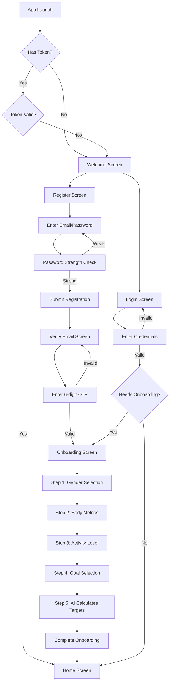
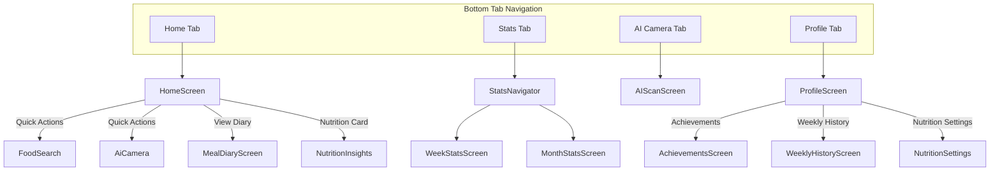
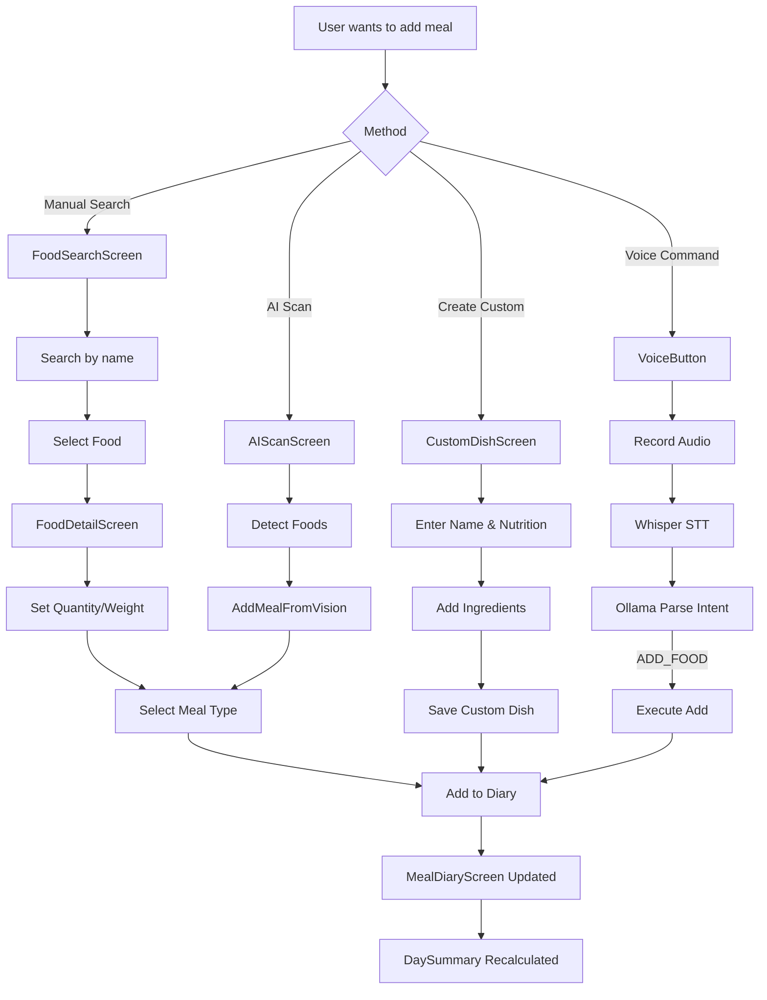
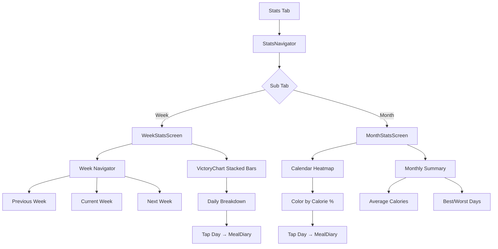
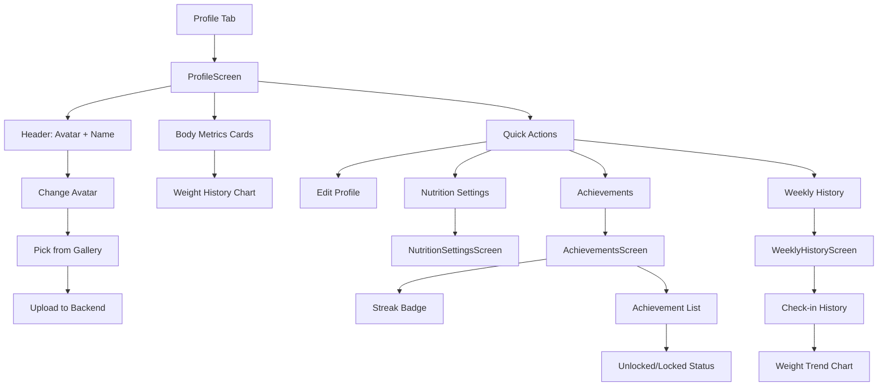

# 🗺️ EatFitAI - User Flow Documentation

> **Generated**: 2025-12-12  
> **Version**: 1.0  
> **Purpose**: Tài liệu tổng hợp toàn bộ User Flow trong project EatFitAI

---

## 📋 Mục lục

1. [Tổng quan kiến trúc](#1-tổng-quan-kiến-trúc)
2. [User Flow Authentication](#2-user-flow-authentication)
3. [User Flow Main App](#3-user-flow-main-app)
4. [User Flow AI Features](#4-user-flow-ai-features)
5. [User Flow Meal Diary](#5-user-flow-meal-diary)
6. [User Flow Statistics](#6-user-flow-statistics)
7. [User Flow Profile & Gamification](#7-user-flow-profile--gamification)
8. [Navigation Map](#8-navigation-map)

---

## 1. Tổng quan kiến trúc

### 1.1 System Overview

```
┌─────────────────────────────────────────────────────────────────────┐
│                        EATFITAI MOBILE APP                          │
│  ┌──────────┐  ┌──────────────┐  ┌─────────────┐  ┌─────────────┐  │
│  │  Auth    │  │   AI Scan    │  │  Meal Diary │  │   Profile   │  │
│  │  Screens │  │   Screens    │  │   Screens   │  │   Screens   │  │
│  └────┬─────┘  └──────┬───────┘  └──────┬──────┘  └──────┬──────┘  │
│       │               │                 │                │          │
│       └───────────────┴────────┬────────┴────────────────┘          │
│                                │                                     │
│                    ┌───────────▼───────────┐                        │
│                    │    Services Layer     │                        │
│                    │   (22 service files)  │                        │
│                    └───────────┬───────────┘                        │
└────────────────────────────────┼────────────────────────────────────┘
                                 │
              ┌──────────────────┼──────────────────┐
              │                  │                  │
       ┌──────▼──────┐    ┌──────▼──────┐   ┌──────▼──────┐
       │ .NET 9 API  │    │ AI Provider │   │   Local     │
       │ Port: 5247  │    │ Port: 5050  │   │  Storage    │
       │ 14 Contrlrs │    │ YOLOv8+LLM  │   │ SecureStore │
       └──────┬──────┘    └──────┬──────┘   └─────────────┘
              │                  │
              └──────────┬───────┘
                   ┌─────▼─────┐
                   │ SQL Server│
                   └───────────┘
```

### 1.2 Screen Inventory

| Category | Screens | Files |
|----------|---------|-------|
| **Auth** | Welcome, Login, Register, VerifyEmail, ForgotPassword, Onboarding | 6 |
| **AI** | AIScan, RecipeSuggestions, RecipeDetail, NutritionInsights, NutritionSettings, VisionHistory | 6 |
| **Diary** | MealDiary, FoodSearch, FoodDetail, CustomDish | 4 |
| **Stats** | WeekStats, MonthStats | 2 |
| **Profile** | Profile, WeeklyHistory | 2 |
| **Gamification** | Achievements | 1 |
| **Main** | Home | 1 |
| **Meals** | AddMealFromVision | 1 |
| **Total** | - | **23 screens** |

---

## 2. User Flow Authentication

### 2.1 Flow Diagram - New User Registration



### 2.2 Screen Details - Authentication Flow

#### 2.2.1 WelcomeScreen
- **Purpose**: Giới thiệu app, feature highlights
- **Actions**: Navigate to Login hoặc Register
- **Components**: Feature cards với animations

#### 2.2.2 LoginScreen
- **Purpose**: Đăng nhập user
- **Validation**: Zod schema validation
- **Features**:
  - Email/Password login
  - Google OAuth integration (prepared)
  - Forgot Password link
  - Remember me option
- **Next Screen**: AppTabs (Home) hoặc Onboarding

#### 2.2.3 RegisterScreen
- **Purpose**: Đăng ký tài khoản mới
- **Validation**:
  - Email format
  - Password strength (0-3 score)
  - Confirm password match
- **Password Strength Logic**:
```
Score 0: < 6 ký tự
Score 1: >= 6 ký tự
Score 2: >= 6 + chữ hoa + số
Score 3: >= 8 + ký tự đặc biệt
```
- **Next Screen**: VerifyEmailScreen

#### 2.2.4 VerifyEmailScreen
- **Purpose**: Xác thực email bằng OTP
- **Features**:
  - 6-digit OTP input với auto-focus
  - Resend code button (với countdown)
  - Auto-submit khi nhập đủ 6 số
- **Next Screen**: OnboardingScreen

#### 2.2.5 ForgotPasswordScreen
- **Purpose**: Khôi phục mật khẩu
- **Steps**:
  1. Enter email
  2. Receive OTP
  3. Enter new password
  4. Confirm & Reset
- **Features**: Step indicator, back navigation

#### 2.2.6 OnboardingScreen
- **Purpose**: Thu thập thông tin user để tính toán nutrition targets
- **5 Steps**:
  1. **Gender**: Male/Female selection
  2. **Body Metrics**: Height, Weight, Date of Birth
  3. **Activity Level**: Sedentary, Light, Moderate, Active, Very Active
  4. **Goal**: Lose Weight, Maintain, Gain Weight
  5. **AI Calculation**: AI calculates personalized nutrition targets
- **Output**: Calories, Protein, Carbs, Fat targets
- **Next Screen**: Home (AppTabs)

---

## 3. User Flow Main App

### 3.1 Flow Diagram - Main Navigation



### 3.2 HomeScreen

**Purpose**: Dashboard chính của app

**Components**:
- **WelcomeHeader**: Greeting dựa theo thời gian (Sáng/Chiều/Tối) + typing animation
- **StreakCard**: Hiển thị streak ngày liên tiếp
- **QuickActionCards**: 4 action buttons
  - Tìm món ăn → FoodSearch
  - Quét AI → AiCamera
  - Gợi ý công thức → RecipeSuggestions
  - Lịch sử → VisionHistory
- **TodaySummaryCard**: Tóm tắt dinh dưỡng hôm nay
- **CircularProgress**: Hiển thị % calories consumed
- **WeeklyCheckInCard**: Weekly weight check-in with AI suggestions

**State Management**: useDashboardStore, useGamificationStore

---

## 4. User Flow AI Features

### 4.1 Flow Diagram - AI Scan Feature

```mermaid
flowchart TD
    A[AIScanScreen] --> B{Select Source}
    B -->|Camera| C[Take Photo]
    B -->|Gallery| D[Pick Image]
    
    C --> E[Image Captured]
    D --> E
    
    E --> F[Send to AI Provider]
    F --> G[YOLOv8 Detection]
    G --> H{Foods Detected?}
    
    H -->|No| I[Show "No food found"]
    I --> B
    
    H -->|Yes| J[Display Detection Cards]
    J --> K[AiDetectionCard]
    K --> L{User Action}
    
    L -->|Edit| M[AIResultEditModal]
    M --> N[Adjust quantity/weight]
    N --> O[Confirm Edit]
    
    L -->|Add to Basket| P[IngredientBasketStore]
    P --> Q[IngredientBasketFab Updated]
    
    L -->|Add to Diary| R[AddMealFromVision]
    R --> S[Select Meal Type]
    S --> T[Confirm & Save to Backend]
    T --> U[MealDiary Updated]
    
    Q --> V[Open IngredientBasketSheet]
    V --> W[View All Ingredients]
    W --> X[Get Recipe Suggestions]
    X --> Y[RecipeSuggestionsScreen]
    
    L -->|Teach AI| Z[TeachLabelBottomSheet]
    Z --> AA[Select Correct Food Item]
    AA --> AB[Save Mapping to Backend]
```

### 4.2 Screen Details - AI Features

#### 4.2.1 AIScanScreen
- **Purpose**: Quét ảnh thức ăn bằng AI
- **Features**:
  - Camera capture hoặc Gallery pick
  - Real-time YOLOv8 detection
  - Multiple food detection
  - Confidence score display
  - ScanFrameOverlay với pulse animation
- **API Call**: `POST /detect` → AI Provider (Port 5050)
- **Output**: List of detected foods với confidence

#### 4.2.2 RecipeSuggestionsScreen
- **Purpose**: Gợi ý công thức từ nguyên liệu
- **Input**: List ingredients từ IngredientBasket
- **Features**:
  - 11 preset ingredients + custom
  - AI-powered recipe matching
  - Filter by calories/cooking time
- **API Call**: `POST /api/ai/recipes/suggest` → Backend

#### 4.2.3 RecipeDetailScreen
- **Purpose**: Chi tiết công thức nấu ăn
- **Features**:
  - Ingredient list với số lượng
  - AI-generated cooking instructions
  - YouTube search integration
  - Nutrition breakdown (calories, macros)
- **API Call**: `POST /api/ai/recipes/{id}/cooking-instructions` → Backend → AI Provider

#### 4.2.4 NutritionInsightsScreen
- **Purpose**: Phân tích dinh dưỡng AI
- **Features**:
  - ScoreGauge (0-100 health score)
  - Macro breakdown chart
  - AI recommendations
  - Adaptive target suggestions
- **API Call**: `GET /api/ai/insights` → Backend

#### 4.2.5 NutritionSettingsScreen
- **Purpose**: Cài đặt mục tiêu dinh dưỡng
- **Features**:
  - Manual edit calories/macros
  - AI recalculate button
  - View current vs recommended
- **API Call**: `POST /api/nutrition/recalculate` → Backend → AI Provider

#### 4.2.6 VisionHistoryScreen
- **Purpose**: Lịch sử các lần quét AI
- **Features**:
  - SectionList grouped by date
  - View past detections
  - Re-add to diary
- **API Call**: `GET /api/ai/detection-history` → Backend

---

## 5. User Flow Meal Diary

### 5.1 Flow Diagram - Add Meal



### 5.2 Screen Details - Meal Diary

#### 5.2.1 MealDiaryScreen
- **Purpose**: Xem nhật ký bữa ăn theo ngày
- **Features**:
  - DateSelector horizontal picker
  - FlashList grouped by meal type
  - Meal emojis: 🌅 Breakfast, ☀️ Lunch, 🌙 Dinner, 🍵 Snack
  - Swipe to delete
  - Day summary totals
- **API Call**: `GET /api/diary/{date}` → Backend

#### 5.2.2 FoodSearchScreen
- **Purpose**: Tìm kiếm món ăn
- **Features**:
  - Real-time search
  - Favorites filter
  - Recent items
  - Barcode scan (prepared)
- **API Call**: `GET /api/food/search?q={query}` → Backend

#### 5.2.3 FoodDetailScreen
- **Purpose**: Chi tiết món ăn
- **Features**:
  - Animated macro pie chart
  - Quantity slider/input
  - Favorite toggle với animation
  - Nutritional facts table
- **API Call**: `GET /api/food/{id}` → Backend

#### 5.2.4 CustomDishScreen
- **Purpose**: Tạo món ăn tùy chỉnh
- **Features**:
  - Enter name, description
  - Manual nutrition input
  - Add ingredients from database
  - Calculate totals automatically
- **API Call**: `POST /api/food/custom` → Backend

#### 5.2.5 AddMealFromVisionScreen
- **Purpose**: Thêm bữa ăn từ kết quả AI scan
- **Input**: Detection results từ AIScanScreen
- **Features**:
  - Edit quantities trước khi add
  - Multi-select meal type
  - Batch insert
- **API Call**: `POST /api/diary/batch` → Backend

---

## 6. User Flow Statistics

### 6.1 Flow Diagram



### 6.2 Screen Details - Statistics

#### 6.2.1 WeekStatsScreen
- **Purpose**: Thống kê tuần
- **Features**:
  - VictoryChart stacked bar chart
  - Daily calorie/macro breakdown
  - Week navigation arrows
  - Tap bar → navigate to that day's diary
- **API Call**: `GET /api/summary/week?date={monday}` → Backend

#### 6.2.2 MonthStatsScreen
- **Purpose**: Thống kê tháng
- **Features**:
  - Calendar heatmap view
  - Color gradient based on % target
  - Monthly averages
  - Tap day → navigate to diary
- **API Call**: `GET /api/summary/month?year={y}&month={m}` → Backend

---

## 7. User Flow Profile & Gamification

### 7.1 Flow Diagram



### 7.2 Screen Details - Profile

#### 7.2.1 ProfileScreen
- **Purpose**: Thông tin cá nhân user
- **Features**:
  - Avatar với image picker
  - Body metrics display
  - Navigation to sub-screens
  - Logout button
- **API Call**: `GET /api/user/profile` → Backend

#### 7.2.2 AchievementsScreen
- **Purpose**: Huy hiệu và thành tựu
- **Features**:
  - Streak counter với flame animation
  - Achievement grid với progress
  - Unlock animations
- **State**: useGamificationStore (local + SecureStore)

#### 7.2.3 WeeklyHistoryScreen
- **Purpose**: Lịch sử check-in hàng tuần
- **Features**:
  - List các lần check-in cân nặng
  - Weight trend visualization
  - AI suggestions per check-in
- **API Call**: `GET /api/weekly/history` → Backend

---

## 8. Navigation Map

### 8.1 Complete Screen Map

```
AppNavigator (Native Stack)
│
├── [UNAUTHENTICATED]
│   ├── Welcome
│   ├── Login
│   ├── Register
│   ├── VerifyEmail
│   ├── ForgotPassword
│   └── Onboarding
│
└── [AUTHENTICATED]
    ├── AppTabs (Bottom Tabs)
    │   ├── Home Tab → HomeScreen
    │   ├── Stats Tab → StatsNavigator
    │   │   ├── WeekStats
    │   │   └── MonthStats
    │   ├── AI Camera Tab → AIScanScreen
    │   └── Profile Tab → ProfileScreen
    │
    └── Modal/Push Screens
        ├── FoodSearch
        ├── FoodDetail
        ├── CustomDish
        ├── MealDiary
        ├── AddMealFromVision
        ├── VisionHistory
        ├── RecipeSuggestions
        ├── RecipeDetail
        ├── NutritionInsights
        ├── NutritionSettings
        ├── Achievements
        └── WeeklyHistory
```

### 8.2 Navigation Parameter Types

```typescript
type RootStackParamList = {
  // Auth
  Welcome: undefined;
  Login: undefined;
  Register: undefined;
  VerifyEmail: { email: string };
  ForgotPassword: undefined;
  Onboarding: undefined;
  
  // Main
  AppTabs: undefined;
  
  // Diary
  FoodSearch: { mealType?: MealType };
  FoodDetail: { foodId: number; mealType?: MealType };
  CustomDish: undefined;
  MealDiary: { date?: string };
  
  // AI
  AiCamera: undefined;
  AddMealFromVision: { detections: VisionItem[]; mealType?: MealType };
  VisionHistory: undefined;
  RecipeSuggestions: { ingredients?: string[] };
  RecipeDetail: { recipeId: number };
  NutritionInsights: undefined;
  NutritionSettings: undefined;
  
  // Profile
  Achievements: undefined;
  WeeklyHistory: undefined;
};
```

---

## 📊 Summary

**Total User Flows**: 7 major flows
1. Authentication (6 screens)
2. Main Navigation (4 tabs)
3. AI Features (6 screens)
4. Meal Diary (5 screens)
5. Statistics (2 screens)
6. Profile (3 screens)
7. Voice Commands (integrated)

**Key Integration Points**:
- AI Provider (YOLOv8 + Ollama) for detection & suggestions
- Backend .NET for business logic & data persistence
- SecureStore for token & preferences
- AsyncStorage for ingredient basket

---

> **Document maintained by**: EatFitAI Development Team  
> **Last updated**: 2025-12-12
