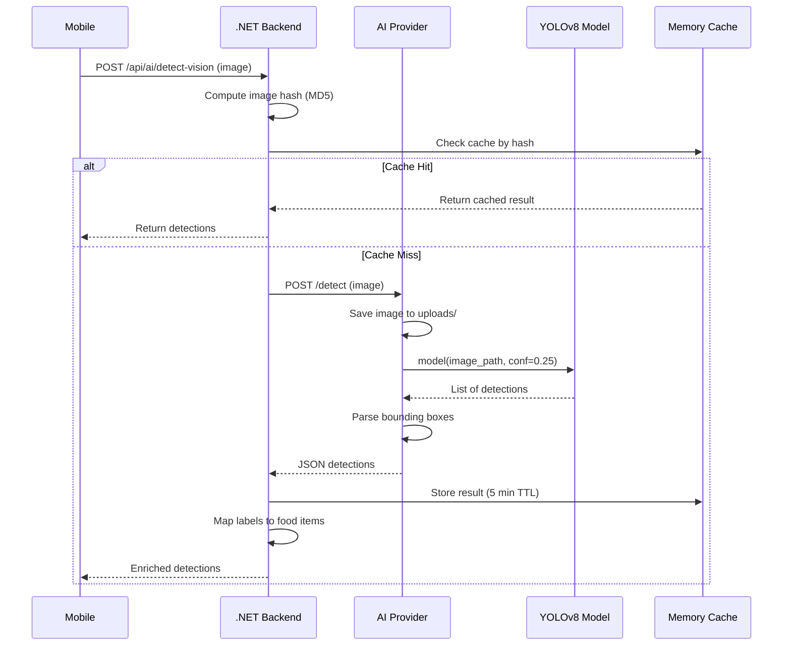
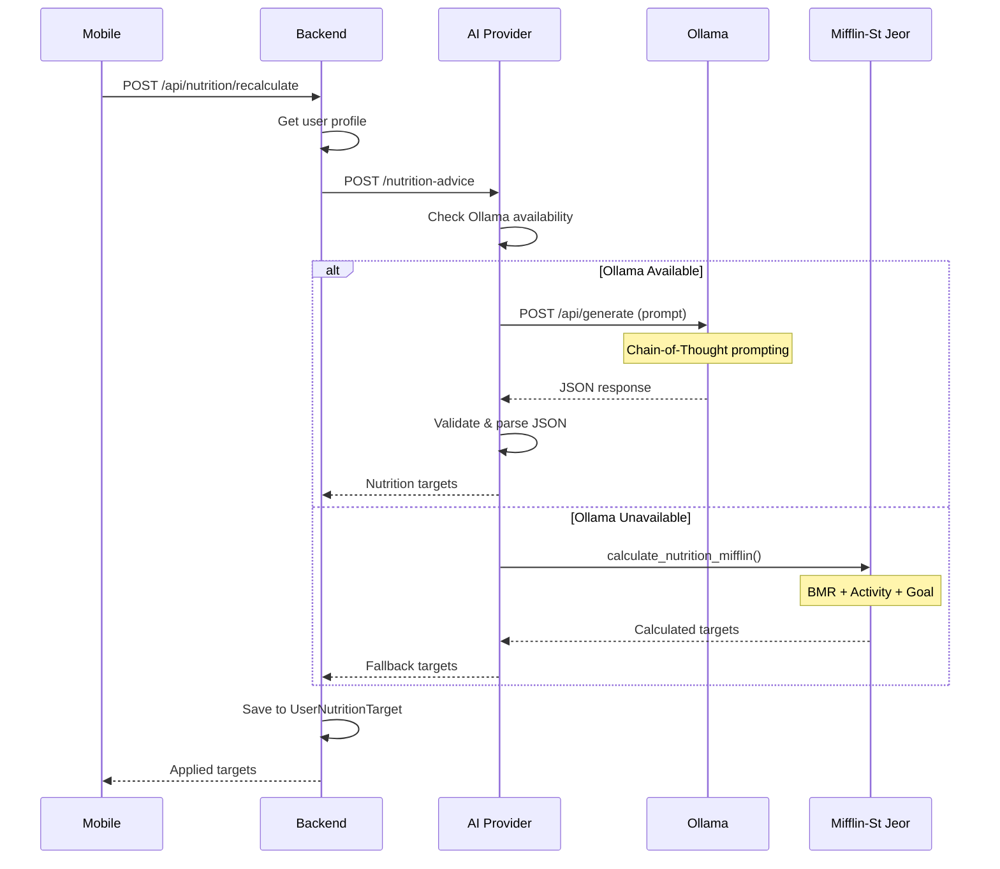
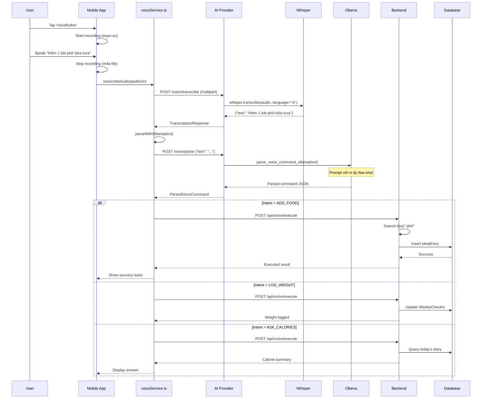
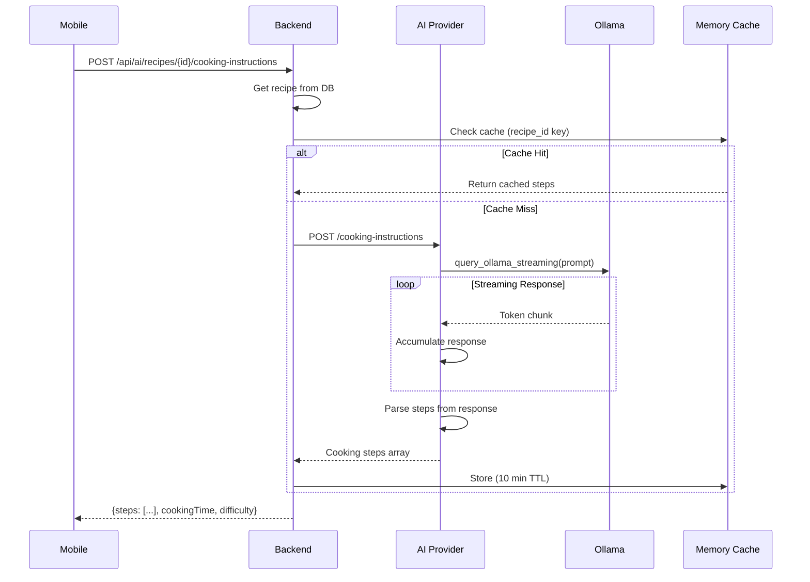

# 🤖 EatFitAI - LLM & AI Flow Documentation

> **Generated**: 2025-12-12  
> **Version**: 1.0  
> **Purpose**: Tài liệu tổng hợp toàn bộ LLM/AI Flow trong project EatFitAI

---

## 📋 Mục lục

1. [Tổng quan AI Architecture](#1-tổng-quan-ai-architecture)
2. [AI Provider Service](#2-ai-provider-service)
3. [Vision AI Flow (YOLOv8)](#3-vision-ai-flow-yolov8)
4. [Nutrition LLM Flow (Ollama)](#4-nutrition-llm-flow-ollama)
5. [Voice AI Flow (Whisper + Ollama)](#5-voice-ai-flow-whisper--ollama)
6. [Recipe Generation Flow](#6-recipe-generation-flow)
7. [API Endpoints Reference](#7-api-endpoints-reference)
8. [Fallback Strategies](#8-fallback-strategies)

---

## 1. Tổng quan AI Architecture

### 1.1 AI System Overview

```
┌─────────────────────────────────────────────────────────────────────────┐
│                         MOBILE APP (React Native)                        │
│  ┌──────────────┐  ┌──────────────┐  ┌──────────────┐  ┌─────────────┐  │
│  │  aiService   │  │ voiceService │  │ diaryService │  │ profileSvc  │  │
│  └──────┬───────┘  └──────┬───────┘  └──────┬───────┘  └──────┬──────┘  │
└─────────┼─────────────────┼─────────────────┼─────────────────┼─────────┘
          │                 │                 │                 │
          │    Direct AI    │                 │                 │
          │    Requests     │                 │                 │
          │  ┌──────────────┘                 │                 │
          │  │                                │                 │
          ▼  ▼                                ▼                 ▼
┌─────────────────────┐                ┌─────────────────────────────────┐
│   AI PROVIDER       │                │        .NET BACKEND API         │
│   (Flask - Port 5050)│◄──────────────│       (Port 5247)               │
│                     │   Proxy        │                                 │
│  ┌─────────────────┐│   Requests     │  ┌───────────────────────────┐  │
│  │    YOLOv8       ││                │  │      AIController         │  │
│  │  (best.pt or   ││                │  │  - DetectVision           │  │
│  │   yolov8s.pt)  ││                │  │  - SuggestRecipes         │  │
│  └─────────────────┘│                │  │  - GetNutritionInsights   │  │
│                     │                │  │  - GetCookingInstructions │  │
│  ┌─────────────────┐│                │  │  - TeachLabel             │  │
│  │     Ollama      ││                │  └───────────────────────────┘  │
│  │  (llama3.2:3b)  ││                │                                 │
│  └─────────────────┘│                │  ┌───────────────────────────┐  │
│                     │                │  │     VoiceController       │  │
│  ┌─────────────────┐│                │  │  - ProcessVoiceText       │  │
│  │    Whisper      ││                │  │  - ExecuteCommand         │  │
│  │  (medium model) ││                │  └───────────────────────────┘  │
│  └─────────────────┘│                │                                 │
└─────────────────────┘                │  ┌───────────────────────────┐  │
                                       │  │  NutritionController      │  │
                                       │  │  - Suggest                │  │
                                       │  │  - Apply                  │  │
                                       │  └───────────────────────────┘  │
                                       └─────────────────────────────────┘
```

### 1.2 AI Components Summary

| Component | Technology | Model | Purpose | Port |
|-----------|------------|-------|---------|------|
| **Vision AI** | YOLOv8 (Ultralytics) | best.pt / yolov8s.pt | Food detection từ ảnh | 5050 |
| **Nutrition LLM** | Ollama | llama3.2:3b | Tính toán nutrition, insights | 5050 (local 11434) |
| **Voice STT** | OpenAI Whisper | medium | Speech-to-Text tiếng Việt | 5050 |
| **Intent Parser** | Ollama | llama3.2:3b | Parse voice commands | 5050 |
| **Recipe Generator** | Ollama | llama3.2:3b | Cooking instructions | 5050 |

### 1.3 Tech Stack Details

```python
# AI Provider Dependencies (requirements.txt)
flask==3.0.0
ultralytics==8.0.227      # YOLOv8
torch>=2.0.0              # CUDA support for GPU
openai-whisper==20231117  # Speech-to-Text
requests==2.31.0          # Ollama API calls
gunicorn==21.2.0          # Production server
```

---

## 2. AI Provider Service

### 2.1 Architecture (app.py)

```python
# === AI PROVIDER MAIN COMPONENTS ===

# 1. Flask App Setup
app = Flask(__name__)

# 2. Model Loading Priority
if os.path.exists("best.pt"):
    model = YOLO("best.pt")      # Custom trained
else:
    model = YOLO("yolov8s.pt")   # Fallback pretrained

# 3. Device Selection (GPU preferred)
DEVICE = "cuda" if torch.cuda.is_available() else "cpu"
model.to(DEVICE)

# 4. Ollama Auto-Start
def start_ollama_if_needed():
    """Tự động khởi động Ollama nếu chưa chạy"""
    try:
        requests.get("http://localhost:11434", timeout=2)
    except:
        subprocess.Popen(["ollama", "serve"])
        time.sleep(3)
```

### 2.2 Endpoints Overview

| Endpoint | Method | Purpose |
|----------|--------|---------|
| `/` | GET | Service info |
| `/healthz` | GET | Model + GPU status |
| `/detect` | POST | YOLOv8 food detection |
| `/nutrition-advice` | POST | AI nutrition calculation |
| `/meal-insight` | POST | Meal analysis & scoring |
| `/cooking-instructions` | POST | Recipe steps generation |
| `/voice/parse` | POST | Parse Vietnamese voice command |
| `/voice/transcribe` | POST | Whisper STT |

---

## 3. Vision AI Flow (YOLOv8)

### 3.1 Detection Flow Diagram



### 3.2 YOLOv8 Detection Logic

```python
# === VISION DETECTION (app.py: detect()) ===

@app.route("/detect", methods=["POST"])
def detect():
    # 1. Validate file
    if "file" not in request.files:
        return jsonify({"error": "No file provided"}), 400
    
    file = request.files["file"]
    if not allowed_file(file.filename):
        return jsonify({"error": "Invalid file type"}), 400
    
    # 2. Save temporary file
    filename = f"{uuid4()}.jpg"
    path = os.path.join("uploads", filename)
    file.save(path)
    
    # 3. Run YOLOv8 inference
    results = model(path, conf=0.25)  # confidence threshold 0.25
    
    # 4. Extract detections
    names = model.names
    detections = []
    for box in results[0].boxes:
        detections.append({
            "label": names[int(box.cls)],
            "confidence": float(box.conf),
            "bbox": box.xyxy[0].tolist()  # [x1, y1, x2, y2]
        })
    
    # 5. Cleanup
    os.remove(path)
    
    return jsonify({
        "success": True,
        "detections": detections,
        "device": str(DEVICE),
        "model": model_file
    })
```

### 3.3 Backend Label Mapping

```csharp
// === LABEL TO FOOD MAPPING (AIController.cs) ===

// After receiving detections from AI Provider,
// map AI labels to database FoodItems

private async Task<List<DetectionWithFood>> MapLabelsToFood(
    List<Detection> detections)
{
    var result = new List<DetectionWithFood>();
    
    foreach (var det in detections)
    {
        // 1. Check AI-Food mapping table
        var mapping = await _aiFoodMapService
            .GetMappingAsync(det.Label);
        
        if (mapping != null)
        {
            // 2. Get food item from database
            var food = await _context.FoodItems
                .FindAsync(mapping.FoodItemId);
            
            det.FoodItem = food;
            det.IsMapped = true;
        }
        else
        {
            det.IsMapped = false;
            det.SuggestedFoods = await _aiFoodMapService
                .SuggestFoodsForLabel(det.Label);
        }
        
        result.Add(det);
    }
    
    return result;
}
```

### 3.4 Teach Label Flow

```mermaid
flowchart TD
    A[User sees unmapped label] --> B[Tap "Teach AI"]
    B --> C[TeachLabelBottomSheet opens]
    C --> D[Search food items]
    D --> E[Select correct food]
    E --> F[POST /api/ai/teach-label]
    F --> G[Save to AiFoodMap table]
    G --> H[Future detections use this mapping]
```

---

## 4. Nutrition LLM Flow (Ollama)

### 4.1 Nutrition Calculation Flow



### 4.2 Ollama Query Logic

```python
# === NUTRITION LLM (nutrition_llm.py) ===

OLLAMA_URL = "http://localhost:11434"
OLLAMA_MODEL = "llama3.2:3b"

def query_ollama(prompt: str, model: str = None) -> str | None:
    """Query Ollama local LLM"""
    try:
        response = requests.post(
            f"{OLLAMA_URL}/api/generate",
            json={
                "model": model or OLLAMA_MODEL,
                "prompt": prompt,
                "stream": False,
                "options": {
                    "temperature": 0.3,  # Low for consistency
                    "num_predict": 500
                }
            },
            timeout=30
        )
        
        if response.status_code == 200:
            return response.json().get("response", "")
        return None
    except Exception as e:
        logger.error(f"Ollama query failed: {e}")
        return None
```

### 4.3 Chain-of-Thought Prompting

```python
def get_nutrition_advice_ollama(
    gender: str,
    age: int,
    height_cm: float,
    weight_kg: float,
    activity_level: str,
    goal: str
) -> dict:
    """Get nutrition advice using Chain-of-Thought prompting"""
    
    prompt = f"""Bạn là chuyên gia dinh dưỡng AI. Hãy tính toán mục tiêu dinh dưỡng.

THÔNG TIN NGƯỜI DÙNG:
- Giới tính: {gender}
- Tuổi: {age}
- Chiều cao: {height_cm} cm
- Cân nặng: {weight_kg} kg
- Mức độ vận động: {activity_level}
- Mục tiêu: {goal}

HƯỚNG DẪN TÍNH TOÁN (Chain-of-Thought):

Bước 1: Tính BMR (Mifflin-St Jeor)
- Nam: BMR = 10×weight + 6.25×height - 5×age + 5
- Nữ: BMR = 10×weight + 6.25×height - 5×age - 161

Bước 2: Tính TDEE = BMR × Activity Multiplier
- Ít vận động: 1.2
- Nhẹ: 1.375
- Trung bình: 1.55
- Cao: 1.725
- Rất cao: 1.9

Bước 3: Điều chỉnh theo mục tiêu
- Giảm cân: TDEE × 0.85 (giảm 15%)
- Duy trì: TDEE
- Tăng cân: TDEE × 1.15 (tăng 15%)

Bước 4: Tính macros (theo gram)
- Protein: 25% calories ÷ 4
- Carbs: 50% calories ÷ 4
- Fat: 25% calories ÷ 9

TRẢ LỜI ĐÚNG ĐỊNH DẠNG JSON (không giải thích):
{{"calories": <số>, "protein": <số>, "carbs": <số>, "fat": <số>, "explanation": "<giải thích ngắn>"}}
"""
    
    response = query_ollama(prompt)
    
    if response:
        # Parse JSON from response
        try:
            # Extract JSON from response text
            import re
            json_match = re.search(r'\{[^{}]+\}', response)
            if json_match:
                return json.loads(json_match.group())
        except:
            pass
    
    # Fallback to formula calculation
    return calculate_nutrition_mifflin(
        gender, age, height_cm, weight_kg, activity_level, goal
    )
```

### 4.4 Mifflin-St Jeor Fallback

```python
def calculate_nutrition_mifflin(
    gender: str,
    age: int,
    height_cm: float,
    weight_kg: float,
    activity_level: str,
    goal: str
) -> dict:
    """Fallback: Mifflin-St Jeor equation"""
    
    # 1. Calculate BMR
    if gender.lower() in ["male", "nam"]:
        bmr = 10 * weight_kg + 6.25 * height_cm - 5 * age + 5
    else:
        bmr = 10 * weight_kg + 6.25 * height_cm - 5 * age - 161
    
    # 2. Apply activity multiplier
    multipliers = {
        "sedentary": 1.2,
        "light": 1.375,
        "moderate": 1.55,
        "active": 1.725,
        "very_active": 1.9
    }
    tdee = bmr * multipliers.get(activity_level, 1.55)
    
    # 3. Adjust for goal
    if "lose" in goal.lower() or "giảm" in goal.lower():
        calories = int(tdee * 0.85)
    elif "gain" in goal.lower() or "tăng" in goal.lower():
        calories = int(tdee * 1.15)
    else:
        calories = int(tdee)
    
    # 4. Calculate macros
    protein = int(calories * 0.25 / 4)
    carbs = int(calories * 0.50 / 4)
    fat = int(calories * 0.25 / 9)
    
    return {
        "calories": calories,
        "protein": protein,
        "carbs": carbs,
        "fat": fat,
        "explanation": f"BMR={int(bmr)}, TDEE={int(tdee)}, adjusted for {goal}"
    }
```

### 4.5 Meal Insight Analysis

```python
def get_meal_insight_gemini(
    meal_items: list,
    total_calories: int,
    target_calories: int,
    current_macros: dict,
    target_macros: dict
) -> dict:
    """Analyze meal and provide AI insights"""
    
    prompt = f"""Phân tích bữa ăn và đưa ra nhận xét dinh dưỡng.

BỮA ĂN:
{json.dumps(meal_items, ensure_ascii=False)}

DINH DƯỠNG:
- Calories: {total_calories} / {target_calories} mục tiêu
- Protein: {current_macros.get('protein', 0)}g / {target_macros.get('protein', 0)}g
- Carbs: {current_macros.get('carbs', 0)}g / {target_macros.get('carbs', 0)}g
- Fat: {current_macros.get('fat', 0)}g / {target_macros.get('fat', 0)}g

TRẢ LỜI JSON:
{{
  "score": <0-100>,
  "summary": "<tóm tắt 1 câu>",
  "positives": ["<điểm tốt 1>", ...],
  "improvements": ["<cần cải thiện 1>", ...],
  "recommendation": "<khuyến nghị cho bữa tiếp theo>"
}}
"""
    
    response = query_ollama(prompt)
    # ... parse response similar to nutrition advice
```

---

## 5. Voice AI Flow (Whisper + Ollama)

### 5.1 Complete Voice Flow



### 5.2 Whisper STT Implementation

```python
# === WHISPER SPEECH-TO-TEXT (app.py) ===

import whisper

# Load Whisper model (medium for Vietnamese)
WHISPER_MODEL = whisper.load_model("medium")
WHISPER_AVAILABLE = True

@app.route("/voice/transcribe", methods=["POST"])
def transcribe_audio():
    """Transcribe audio file to Vietnamese text"""
    
    if "audio" not in request.files:
        return jsonify({"success": False, "error": "No audio file"}), 400
    
    audio_file = request.files["audio"]
    
    # Save temporary file
    temp_path = f"uploads/audio_{uuid4()}.m4a"
    audio_file.save(temp_path)
    
    try:
        # Transcribe with Vietnamese language hint
        result = WHISPER_MODEL.transcribe(
            temp_path,
            language="vi",
            task="transcribe"
        )
        
        return jsonify({
            "success": True,
            "text": result["text"].strip(),
            "language": result.get("language", "vi"),
            "duration": result.get("duration", 0)
        })
    except Exception as e:
        return jsonify({
            "success": False,
            "error": str(e)
        }), 500
    finally:
        os.remove(temp_path)
```

### 5.3 Voice Command Parsing

```python
# === VOICE COMMAND PARSER (nutrition_llm.py) ===

def parse_voice_command_ollama(text: str) -> dict:
    """Parse Vietnamese voice command using Ollama LLM"""
    
    prompt = f"""Bạn là parser lệnh giọng nói cho app dinh dưỡng.

ĐỊNH DẠNG LỆNH HỢP LỆ:
1. ADD_FOOD: "thêm [số lượng] [món ăn] [khối lượng] [bữa]"
   Ví dụ: "thêm 1 bát phở 300g bữa trưa"
   
2. LOG_WEIGHT: "ghi cân nặng [số] kg"
   Ví dụ: "ghi cân nặng 65 kg"
   
3. ASK_CALORIES: "hôm nay ăn bao nhiêu calo?"
   Ví dụ: "hôm nay tôi đã ăn bao nhiêu calories"
   
4. ASK_NUTRITION: "dinh dưỡng của [món]?"
   Ví dụ: "phở có bao nhiêu calo"

5. UNKNOWN: Không hiểu lệnh

LỆNH NGƯỜI DÙNG: "{text}"

TRẢ LỜI JSON:
{{
  "intent": "<ADD_FOOD|LOG_WEIGHT|ASK_CALORIES|ASK_NUTRITION|UNKNOWN>",
  "entities": {{
    "foodName": "<tên món nếu có>",
    "quantity": <số lượng nếu có>,
    "weight": <khối lượng gram nếu có>,
    "mealType": "<breakfast|lunch|dinner|snack nếu có>"
  }},
  "confidence": <0-1>,
  "rawText": "{text}"
}}
"""
    
    response = query_ollama(prompt)
    
    if response:
        try:
            # Parse JSON from response
            import re
            json_match = re.search(r'\{[\s\S]*\}', response)
            if json_match:
                parsed = json.loads(json_match.group())
                parsed["source"] = "ollama"
                return parsed
        except:
            pass
    
    # Fallback: Unknown intent
    return {
        "intent": "UNKNOWN",
        "entities": {},
        "confidence": 0,
        "rawText": text,
        "source": "fallback"
    }
```

### 5.4 Backend Command Execution

```csharp
// === VOICE COMMAND EXECUTION (VoiceController.cs) ===

[HttpPost("execute")]
public async Task<IActionResult> ExecuteCommand(
    [FromBody] ParsedVoiceCommand command)
{
    switch (command.Intent)
    {
        case "ADD_FOOD":
            return await ExecuteAddFood(command);
            
        case "LOG_WEIGHT":
            return await ExecuteLogWeight(command);
            
        case "ASK_CALORIES":
            return await ExecuteAskCalories();
            
        case "ASK_NUTRITION":
            return await ExecuteAskNutrition(command);
            
        default:
            return Ok(new {
                success = false,
                error = "Không hiểu lệnh. Hãy thử lại."
            });
    }
}

private async Task<IActionResult> ExecuteAddFood(ParsedVoiceCommand cmd)
{
    var userId = GetUserIdFromToken();
    
    // 1. Search for food by name
    var food = await _context.FoodItems
        .Where(f => f.Name.Contains(cmd.Entities.FoodName))
        .FirstOrDefaultAsync();
    
    if (food == null)
    {
        return Ok(new {
            success = false,
            error = $"Không tìm thấy món '{cmd.Entities.FoodName}'"
        });
    }
    
    // 2. Calculate nutrition based on quantity
    var weight = cmd.Entities.Weight ?? 100;
    var multiplier = weight / 100.0;
    
    // 3. Create meal entry
    var entry = new MealEntry
    {
        UserId = userId,
        FoodItemId = food.Id,
        MealType = ParseMealType(cmd.Entities.MealType),
        Quantity = weight,
        Calories = (int)(food.CaloriesPer100g * multiplier),
        Protein = (int)(food.ProteinPer100g * multiplier),
        Carbs = (int)(food.CarbsPer100g * multiplier),
        Fat = (int)(food.FatPer100g * multiplier),
        Date = DateTime.Today
    };
    
    _context.MealEntries.Add(entry);
    await _context.SaveChangesAsync();
    
    return Ok(new {
        success = true,
        executedAction = new {
            type = "ADD_FOOD",
            details = $"Đã thêm {weight}g {food.Name} vào {cmd.Entities.MealType}"
        }
    });
}
```

---

## 6. Recipe Generation Flow

### 6.1 Cooking Instructions Flow



### 6.2 Recipe Instruction Generation

```python
# === COOKING INSTRUCTIONS (nutrition_llm.py) ===

def get_cooking_instructions(
    recipe_name: str,
    ingredients: list[dict],
    description: str = ""
) -> dict:
    """Generate AI cooking instructions"""
    
    # Format ingredients list
    ingredients_text = "\n".join([
        f"- {ing['foodName']}: {ing['grams']}g"
        for ing in ingredients
    ])
    
    prompt = f"""Bạn là đầu bếp chuyên nghiệp. Viết hướng dẫn nấu món ăn.

MÓN ĂN: {recipe_name}

NGUYÊN LIỆU:
{ingredients_text}

MÔ TẢ: {description or "Không có mô tả"}

HƯỚNG DẪN:
Viết các bước nấu ăn chi tiết, mỗi bước một dòng, đánh số.
Ước tính thời gian nấu và độ khó.

TRẢ LỜI JSON:
{{
  "steps": ["Bước 1: ...", "Bước 2: ...", ...],
  "cookingTime": "<thời gian>",
  "difficulty": "<Dễ|Trung bình|Khó>"
}}
"""
    
    # Try Ollama first
    if OLLAMA_AVAILABLE:
        response = query_ollama(prompt)
        if response:
            try:
                # Parse JSON
                import re
                json_match = re.search(r'\{[\s\S]*\}', response)
                if json_match:
                    result = json.loads(json_match.group())
                    if "steps" in result:
                        return result
            except:
                pass
    
    # Fallback: Generate basic instructions
    return _generate_fallback_instructions(recipe_name, ingredients)


def _generate_fallback_instructions(
    recipe_name: str,
    ingredients: list[dict]
) -> dict:
    """Generate basic fallback instructions"""
    
    steps = [
        f"Chuẩn bị nguyên liệu cho món {recipe_name}",
    ]
    
    for i, ing in enumerate(ingredients, 1):
        steps.append(f"Sơ chế {ing['foodName']} ({ing['grams']}g)")
    
    steps.extend([
        "Nấu theo phương pháp phù hợp với nguyên liệu",
        "Nêm nếm gia vị vừa ăn",
        "Bày ra đĩa và thưởng thức"
    ])
    
    return {
        "steps": steps,
        "cookingTime": "30-45 phút",
        "difficulty": "Trung bình"
    }
```

---

## 7. API Endpoints Reference

### 7.1 AI Provider Endpoints (Port 5050)

| Endpoint | Method | Input | Output |
|----------|--------|-------|--------|
| `/detect` | POST | `multipart: file` | `{success, detections: [{label, confidence, bbox}]}` |
| `/nutrition-advice` | POST | `{gender, age, height_cm, weight_kg, activity_level, goal}` | `{calories, protein, carbs, fat, explanation}` |
| `/meal-insight` | POST | `{meal_items, total_calories, target_calories, current_macros, target_macros}` | `{score, summary, positives, improvements}` |
| `/cooking-instructions` | POST | `{recipe_name, ingredients, description}` | `{steps, cookingTime, difficulty}` |
| `/voice/parse` | POST | `{text}` | `{intent, entities, confidence, rawText}` |
| `/voice/transcribe` | POST | `multipart: audio` | `{text, language, duration, success}` |

### 7.2 Backend AI Endpoints (Port 5247)

| Endpoint | Method | Purpose |
|----------|--------|---------|
| `POST /api/ai/detect-vision` | Image detection với caching |
| `POST /api/ai/recipes/suggest` | Recipe suggestions |
| `GET /api/ai/recipes/{id}` | Recipe detail |
| `POST /api/ai/recipes/{id}/cooking-instructions` | AI cooking steps |
| `GET /api/ai/insights` | Nutrition insights |
| `GET /api/ai/adaptive-target` | Adaptive nutrition targets |
| `POST /api/ai/teach-label` | Teach AI label mapping |
| `GET /api/ai/detection-history` | User's detection history |
| `POST /api/voice/execute` | Execute voice command |

---

## 8. Fallback Strategies

### 8.1 Fallback Hierarchy

```
┌─────────────────────────────────────────────────────────────┐
│                    AI REQUEST FLOW                          │
└─────────────────────────────────────────────────────────────┘
                            │
                            ▼
┌─────────────────────────────────────────────────────────────┐
│              TRY 1: OLLAMA LOCAL                            │
│  - Check availability: GET http://localhost:11434           │
│  - If available: POST /api/generate                         │
│  - Timeout: 30 seconds                                      │
└─────────────────────────────────────────────────────────────┘
                            │
                    ┌───────┴───────┐
                    │ Failed?       │
                    └───────┬───────┘
                            ▼
┌─────────────────────────────────────────────────────────────┐
│              TRY 2: FORMULA CALCULATION                     │
│  - Mifflin-St Jeor for nutrition                           │
│  - Basic steps for cooking instructions                     │
│  - Keyword matching for voice parsing                       │
└─────────────────────────────────────────────────────────────┘
                            │
                            ▼
┌─────────────────────────────────────────────────────────────┐
│              RESPONSE TO CLIENT                             │
│  - Include "source" field: "ollama" | "fallback"           │
│  - Maintain same response structure                         │
└─────────────────────────────────────────────────────────────┘
```

### 8.2 Fallback Code Examples

```python
def get_nutrition_advice_gemini(
    gender: str, age: int, height_cm: float,
    weight_kg: float, activity_level: str, goal: str
) -> dict:
    """Main function with fallback chain"""
    
    # Try 1: Ollama
    if OLLAMA_AVAILABLE:
        try:
            result = get_nutrition_advice_ollama(
                gender, age, height_cm, weight_kg, 
                activity_level, goal
            )
            if result and result.get("calories"):
                result["source"] = "ollama"
                return result
        except Exception as e:
            logger.warning(f"Ollama failed: {e}")
    
    # Try 2: Formula fallback
    result = calculate_nutrition_mifflin(
        gender, age, height_cm, weight_kg,
        activity_level, goal
    )
    result["source"] = "formula"
    return result
```

### 8.3 Error Handling

| Error Type | Fallback Action | User Message |
|------------|-----------------|--------------|
| Ollama connection failed | Use formula | "AI đang bận, dùng công thức chuẩn" |
| Whisper transcription failed | Return empty | "Không thể nhận dạng giọng nói" |
| YOLOv8 no detections | Show empty list | "Không phát hiện thức ăn trong ảnh" |
| Voice parse unknown | Return UNKNOWN intent | "Tôi không hiểu. Hãy thử nói lại." |

---

## 📊 Summary

**Total AI Components**: 5
1. **YOLOv8** - Vision detection (GPU accelerated)
2. **Ollama (llama3.2:3b)** - Nutrition LLM
3. **Whisper (medium)** - Vietnamese STT
4. **Recipe Generator** - Ollama-powered
5. **Voice Parser** - Intent detection

**Key Integration Points**:
- All AI runs on **AI Provider** (Port 5050)
- Backend acts as **proxy** with caching
- **Fallback chain** ensures reliability
- Responses include **source** field for transparency

**Performance Considerations**:
- YOLOv8 on GPU: ~100-200ms per image
- Ollama llama3.2:3b: ~2-5s per query
- Whisper medium: ~3-10s per audio
- Image caching: 5 min TTL
- Recipe caching: 10 min TTL

---

> **Document maintained by**: EatFitAI Development Team  
> **Last updated**: 2025-12-12
