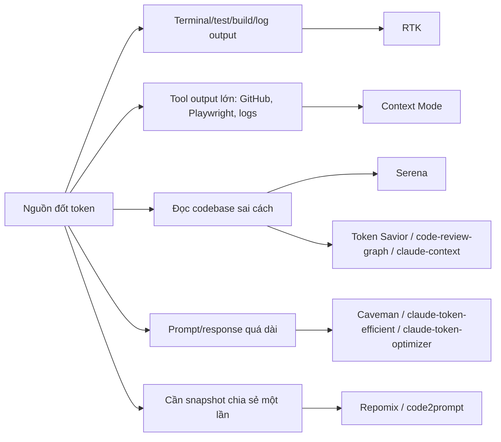

# Đánh Giá Token-Saving Tools Cho EatFitAI - 2026-04-25

Cập nhật: `2026-04-25`

Báo cáo này đánh giá các repo/token-saving tool đang được chia sẻ nhiều trên mạng xã hội, đặt trong bối cảnh thực tế của EatFitAI và workflow **Codex hiện tại trên Windows**. Mục tiêu không phải là cài thật nhiều tool, mà là giảm token/context waste nhưng vẫn giữ độ đúng, bảo mật, khả năng debug, và tiếng Việt UTF-8 an toàn.

## 1. Kết Luận Ngắn

**Không nên cài cả 10 repo.** Với EatFitAI, hướng có lợi nhất là:

| Quyết định | Tool | Kết luận |
|---|---|---|
| **Install now / giữ dùng** | Serena | Đã có `.serena`; phù hợp nhất với Codex và code navigation. Nên đánh giá mở rộng language config từ `typescript` sang `typescript`, `csharp`, `python`. |
| **Pilot có điều kiện** | RTK | Hữu ích nếu workflow thường xuyên chạy `dotnet test`, `npm test`, build/log dài. Chỉ nên pilot per-user, pin version, không hook global ngay. |
| **Pilot có điều kiện** | Context Mode | Đáng thử nếu dùng nhiều tool output lớn hoặc session dài có compact. Cần kiểm tra hook Codex trên Windows trước khi đưa vào workflow chính. |
| **Không stack mặc định** | Token Savior, code-review-graph, claude-context | Cùng nhóm semantic/indexing với Serena. Chỉ chọn tối đa 1 tool bổ sung sau benchmark, tránh nhiều index/cache cạnh tranh nhau. |
| **Skip mặc định** | Caveman, claude-token-efficient, claude-token-optimizer | Tiết kiệm chủ yếu bằng giảm output/prompt. Dễ làm báo cáo code review/debug quá cụt hoặc mất sắc thái kỹ thuật. |
| **One-off** | Repomix, code2prompt | Hữu ích khi cần đóng gói snapshot repo cho audit/chia sẻ, không nên đưa toàn repo lớn vào context mặc định. |

Nếu chỉ chọn một thay đổi: **tối ưu Serena hiện có trước**. Đây là đường ít rủi ro nhất vì repo đã có cấu hình Serena, còn các tool khác đều thêm hook, daemon, cache, vector DB, hoặc prompt overhead.

## 2. Bối Cảnh EatFitAI

Các dữ kiện local đã kiểm tra:

- Workspace là multi-stack: `eatfitai-mobile` (Expo/React Native TypeScript), `eatfitai-backend` (ASP.NET Core 9/C#), `ai-provider` (Python Flask/YOLO/Gemini/Ollama).
- `.serena/project.yml` hiện chỉ có:

```yaml
languages:
- typescript
encoding: "utf-8"
ignore_all_files_in_gitignore: true
```

- `.gitignore` đã loại nhiều nguồn token rác: `.serena/`, `_tooling/`, `_state/`, `_logs/`, `uploads/`, `node_modules/`, `bin/`, `obj/`, `.venv/`, Android build output, model `.pt`, log, SQL snapshot.
- Repo có nhiều thư mục generated/local rất lớn. Lợi ích chính không đến từ "nói ngắn lại", mà từ **không đọc nhầm build artifacts, logs, cache, venv, Android SDK, node_modules**.
- Tài liệu active dùng tiếng Việt có dấu. Bất kỳ tool nào rewrite prompt/docs cần được kiểm tra UTF-8, tránh chuỗi mojibake kiểu `l\u00c3\u00a0` hoặc `Thi\u00e1\u00ba\u00bft`.

## 3. Bản Đồ Nhóm Giải Pháp



Cách đọc sơ đồ: mỗi nhóm giải quyết một kiểu waste khác nhau. Cài nhiều tool cùng nhóm thường làm tăng cấu hình, cache, MCP manifest, và rủi ro lệch context hơn là tiết kiệm thêm.

## 4. Repo Có Thật Không, Claim Có Đáng Tin Không

Metadata lấy qua GitHub API ngày `2026-04-25`. Các phần trăm tiết kiệm trong bảng là claim từ README/site của chính repo, chưa coi là benchmark độc lập.

| Repo | Tồn tại | Sao | Last push | License | Claim chính | Độ tin cậy claim |
|---|---:|---:|---|---|---|---|
| [oraios/serena](https://github.com/oraios/serena) | Có | 23.4k | 2026-04-24 | MIT | Semantic retrieval/editing bằng LSP/IDE tools | Cao về hướng kỹ thuật; claim hiệu quả vẫn cần benchmark local |
| [rtk-ai/rtk](https://github.com/rtk-ai/rtk) | Có | 34.8k | 2026-04-24 | Apache-2.0 | Giảm 60-90% token cho command output | Hợp lý cho log/test output, nhưng cần pilot trên Codex/Windows |
| [mksglu/context-mode](https://github.com/mksglu/context-mode) | Có | 9.9k | 2026-04-24 | NOASSERTION | Sandbox tool output, SQLite session, giảm tới 98% context tool | Có lý về kiến trúc; hook Codex/Windows cần kiểm chứng |
| [tirth8205/code-review-graph](https://github.com/tirth8205/code-review-graph) | Có | 13.0k | 2026-04-21 | MIT | Tree-sitter knowledge graph, giảm 6.8x đến 49x | Hữu ích cho review/impact, nhưng overlap Serena |
| [Mibayy/token-savior](https://github.com/Mibayy/token-savior) | Có | 653 | 2026-04-24 | MIT | Symbol navigation + memory, claim 97% fewer chars | Có benchmark tác giả; repo trẻ, tool surface lớn |
| [JuliusBrussee/caveman](https://github.com/JuliusBrussee/caveman) | Có | 46.0k | 2026-04-18 | MIT | Giảm output token bằng văn phong cực ngắn | Có thể giảm output; không giải quyết code navigation |
| [JuliusBrussee/caveman-claude](https://github.com/JuliusBrussee/caveman-claude) | Không | - | - | - | Link trong post không đúng | Dùng repo thật là `JuliusBrussee/caveman` |
| [drona23/claude-token-efficient](https://github.com/drona23/claude-token-efficient) | Có | 4.9k | 2026-04-22 | MIT | Một `CLAUDE.md` làm output gọn hơn | Tác giả tự ghi net saving chỉ dương khi output đủ dài |
| [ooples/token-optimizer-mcp](https://github.com/ooples/token-optimizer-mcp) | Có | 287 | 2026-04-20 | MIT | Cache/compress/tool intelligence, claim 95%+ | Claim mạnh nhưng adoption nhỏ; cần audit kỹ trước khi dùng |
| [nadimtuhin/claude-token-optimizer](https://github.com/nadimtuhin/claude-token-optimizer) | Có | 273 | 2025-11-10 | MIT | Prompt/setup reuse, case giảm docs 11k xuống 1.3k | Hữu ích như template prompt, không phải runtime infra |
| [alexgreensh/token-optimizer](https://github.com/alexgreensh/token-optimizer) | Có | 646 | 2026-04-24 | NOASSERTION | Tìm ghost tokens, dashboard local | Có ích để audit context hygiene, không thay Serena/RTK |
| [zilliztech/claude-context](https://github.com/zilliztech/claude-context) | Có | 9.1k | 2026-04-24 | MIT | Hybrid search BM25 + dense vector | Mạnh cho semantic search, nhưng có chi phí embedding/vector infra |
| [yamadashy/repomix](https://github.com/yamadashy/repomix) | Có | 23.8k | 2026-04-25 | MIT | Pack repo thành file AI-friendly | Tốt cho snapshot one-off, không phải giảm context mặc định |
| [mufeedvh/code2prompt](https://github.com/mufeedvh/code2prompt) | Có | 7.3k | 2026-04-14 | MIT | Pack codebase + token counting | Tốt cho audit/prompt export nhỏ, nguy hiểm nếu pack repo lớn |
| [Aider-AI/aider](https://github.com/Aider-AI/aider) | Có | 43.9k | 2026-04-25 | Apache-2.0 | Repo map Tree-sitter trong token budget | Ý tưởng repo-map đã trưởng thành, nhưng đổi agent/toolchain là quyết định lớn |

Nhận xét quan trọng: các repo viral có nhiều sao và activity thật, nhưng đa số benchmark là self-reported. Với EatFitAI, cần đo bằng task thật, không dùng con số 60-98% như bảo chứng.

## 5. Chấm Điểm Hữu Dụng Cho EatFitAI/Codex

Thang điểm 1-5:

- `Token`: khả năng giảm token thực tế trong workflow EatFitAI.
- `Setup`: ít rủi ro setup hơn thì điểm cao hơn.
- `Codex`: hợp với Codex hiện tại trên Windows hơn thì điểm cao hơn.
- `Local`: local-first, ít secret/network/service phụ hơn thì điểm cao hơn.
- `Overlap`: ít trùng Serena hơn thì điểm cao hơn.

| Tool | Token | Setup | Codex | Local | Overlap | Tổng | Quyết định |
|---|---:|---:|---:|---:|---:|---:|---|
| Serena | 4 | 4 | 5 | 5 | 5 | **23** | **Install now / giữ dùng** |
| RTK | 4 | 3 | 3 | 5 | 5 | **20** | **Pilot** |
| Context Mode | 4 | 2 | 3 | 4 | 4 | **17** | **Pilot nếu session/tool output nặng** |
| Token Optimizer dashboard | 2 | 3 | 3 | 4 | 4 | **16** | Audit one-off |
| Repomix | 3 | 4 | 4 | 4 | 3 | **18** | One-off |
| code2prompt | 2 | 4 | 4 | 4 | 3 | **17** | One-off nhỏ |
| code-review-graph | 4 | 3 | 3 | 5 | 2 | **17** | Chỉ thử nếu Serena thiếu impact graph |
| Token Savior | 4 | 2 | 3 | 4 | 2 | **15** | Không cài mặc định |
| claude-context | 4 | 2 | 3 | 2 | 2 | **13** | Không ưu tiên cho repo này |
| Caveman | 2 | 4 | 3 | 5 | 4 | **18** | Skip mặc định, dùng bằng yêu cầu "trả lời ngắn" là đủ |
| claude-token-efficient | 2 | 5 | 2 | 5 | 4 | **18** | Skip mặc định vì thêm prompt overhead |
| claude-token-optimizer | 1 | 5 | 2 | 5 | 4 | **17** | Chỉ tham khảo prompt |
| token-optimizer-mcp | 3 | 2 | 2 | 3 | 3 | **13** | Không ưu tiên |

Điểm số không phải "tool nào nhiều sao hơn". Đây là điểm phù hợp với EatFitAI, Codex, Windows, repo multi-stack, và yêu cầu giữ an toàn regression.

## 6. Phân Tích Theo Nhóm

### 6.1 Serena - nên giữ và tối ưu trước

Serena có giá trị vì nó giảm kiểu waste đắt nhất trong repo này: agent đọc nguyên file hoặc grep vòng quanh thay vì đi theo symbol/reference.

Điểm mạnh:

- Đã có cấu hình local, không cần thêm nền tảng mới ngay.
- Dùng LSP/symbolic tools, hợp với code navigation và refactor nhỏ.
- Không cần embedding API hoặc vector DB để bắt đầu.
- Hợp với Codex hơn các prompt-only trick.

Điểm yếu hiện tại:

- `.serena/project.yml` chỉ bật `typescript`, nên backend C# và AI provider Python chưa được hưởng semantic navigation đầy đủ.
- Nếu thêm `csharp`, `python` cần kiểm tra language server dependency, tốc độ index, và symbol accuracy trên Windows.

Khuyến nghị:

1. Không đổi `.serena` trong lúc working tree đang nhiều thay đổi.
2. Tạo nhánh/worktree riêng khi triển khai.
3. Pilot config:

```yaml
languages:
- typescript
- csharp
- python
```

4. Chạy lại onboarding/index và benchmark 3 task trước khi coi là chuẩn.

### 6.2 RTK - đáng pilot cho command output

RTK giải quyết vấn đề cụ thể: lệnh test/build/log đổ quá nhiều text vào context.

Hợp với EatFitAI khi:

- Chạy `dotnet test` backend nhiều.
- Chạy `npm test`, `npm run lint`, `npm run typecheck` mobile.
- Đọc log Render, Android logcat, AI provider stack trace dài.

Rủi ro:

- Có thể lọc mất dòng quan trọng nếu heuristic không hiểu đúng output Windows/PowerShell/.NET/Expo.
- Hook global có thể làm agent/debugger thấy output khác người thật.
- Codex hook support đang thay đổi nhanh, cần test theo client hiện tại.

Khuyến nghị pilot:

- Không dùng `curl | sh`.
- Pin version hoặc commit.
- Bắt đầu bằng wrapper lệnh riêng, ví dụ chỉ áp dụng cho `test/build/log` trong session thử nghiệm.
- Điều kiện pass: giảm ít nhất 40% output trên 2/3 command dài mà không mất error/failure line.

### 6.3 Context Mode - mạnh nhưng nhiều moving parts

Context Mode có ý tưởng đúng: raw tool output nên nằm trong SQLite/index, không đổ hết vào LLM context. Đây là hướng tốt khi session dài và có nhiều tool output lớn.

Hợp với EatFitAI khi:

- Một task kéo dài nhiều giờ và bị compact.
- Dùng browser/Playwright/GitHub/log tools nhiều.
- Cần session continuity tốt hơn transcript thuần.

Rủi ro:

- Cần hook lifecycle đúng với Codex hiện tại.
- Thêm database/session state mới, phải biết dọn khi sai.
- Có nguy cơ làm debugging khó hơn nếu agent chỉ thấy summary quá gọn.

Khuyến nghị:

- Pilot sau Serena/RTK, không cài cùng lúc nhiều tool.
- Chỉ cấu hình per-user, không commit config/cache vào repo.
- Kiểm tra luồng: start session -> run tool output lớn -> compact/resume -> verify agent nhớ đúng file/task/decision.

### 6.4 Token Savior, code-review-graph, claude-context - chỉ chọn nếu Serena thiếu

Ba tool này cùng nhóm "đọc codebase thông minh". Chúng không nên cài đồng thời với Serena như default stack.

| Tool | Khi đáng thử | Lý do chưa ưu tiên |
|---|---|---|
| code-review-graph | Cần review blast-radius, call/dependency graph rõ hơn Serena | Thêm graph/index riêng, overlap code navigation |
| Token Savior | Cần persistent memory + symbol tools trong một MCP | Tool surface lớn, repo trẻ, trùng Serena và memory hiện có |
| claude-context | Cần natural-language semantic search toàn repo | Có chi phí embedding/vector infra, rủi ro secret/network cao hơn |

Nguyên tắc: nếu Serena sau khi bật C#/Python vẫn yếu ở "impact analysis", lúc đó mới benchmark `code-review-graph` trên 1 PR thật.

### 6.5 Caveman và prompt-only optimizer - không nên mặc định

Các tool này giảm output token bằng cách ép agent nói cực ngắn hoặc dùng file instruction gọn. Chúng có thể tiết kiệm khi bạn cần câu trả lời ngắn, nhưng không giải quyết nguyên nhân lớn nhất trong repo này: đọc nhầm context, log quá dài, generated files.

Rủi ro với EatFitAI:

- Code review/debug cần giải thích đủ root cause, regression risks, tests to run.
- Báo cáo tiếng Việt cần dễ hiểu, không quá cụt.
- Một file instruction thêm vào mỗi session cũng là input token overhead.

Khuyến nghị: dùng prompt trực tiếp khi cần, ví dụ "trả lời ngắn, chỉ bullet chính", không cài thành rule mặc định.

### 6.6 Repomix/code2prompt - tool đóng gói one-off

Repomix và code2prompt hữu ích khi cần:

- Gửi snapshot nhỏ cho reviewer ngoài Codex.
- Audit nhanh một folder cụ thể.
- Đếm token hoặc tạo context pack có kiểm soát.

Không nên:

- Pack nguyên EatFitAI workspace vì có nhiều generated/local artifacts.
- Dùng thay semantic retrieval hằng ngày.
- Commit output pack nếu có nguy cơ chứa secrets, logs, screenshots, hoặc user data.

## 7. Kế Hoạch Benchmark Trước Khi Cài

Chạy baseline bằng Codex hiện tại trước, rồi chỉ bật một tool mỗi lần.

### Task A - Tìm auth/API flow

Prompt mẫu:

```text
Tìm luồng Google auth từ mobile đến backend trong EatFitAI. Chỉ ra file chính, API endpoint, DTO/model liên quan, và regression risks nếu sửa token validation.
```

Đo:

- Số tool calls.
- Số file đọc.
- Agent có tìm đúng mobile auth entry, backend controller/service, DTO/model không.
- Có bỏ sót boundary mobile -> backend không.

Tool cần so:

- Baseline Codex.
- Serena TypeScript-only hiện tại.
- Serena mở rộng `typescript,csharp,python`.
- Chỉ nếu cần: code-review-graph.

### Task B - Phân tích AI provider runtime status

Prompt mẫu:

```text
Phân tích luồng backend lấy AI runtime status và health AI provider. Chỉ ra endpoint, service, cache, fallback, và test hiện có.
```

Đo:

- Agent có đi qua backend C# và Python provider đúng không.
- Có đọc quá nhiều file không liên quan không.
- Có giữ đúng contract API không.

Tool cần so:

- Baseline Codex.
- Serena mở rộng.
- Token Savior chỉ nếu cần memory/symbol alternative.

### Task C - Command output dài

Command baseline:

```powershell
dotnet test .\eatfitai-backend\EatFitAI.API.Tests.csproj
npm --prefix .\eatfitai-mobile run lint
npm --prefix .\eatfitai-mobile run typecheck
npm --prefix .\eatfitai-mobile run test
```

Đo:

- Ký tự/token output thô.
- Agent có thấy đủ failing test/error line không.
- Có mất warning quan trọng không.
- Thời gian đọc/summarize.

Tool cần so:

- Baseline raw output.
- RTK wrapper cho lệnh dài.
- Context Mode nếu output được đưa qua sandbox/index.

## 8. Quy Tắc Cài Đặt An Toàn Nếu Triển Khai

Không cài tool nào theo kiểu "viral one-liner" vào repo production. Dùng quy tắc sau:

1. Pin version/commit, ghi lại nguồn.
2. Cài per-user hoặc worktree thử nghiệm, không commit cache/session DB.
3. Không chạy install script remote trực tiếp.
4. Không cấp secret/API key cho tool indexing nếu chưa audit.
5. Kiểm tra `.gitignore` trước khi tool sinh file.
6. Chạy benchmark 3 task và ghi kết quả vào docs.
7. Nếu tool làm agent bỏ sót lỗi hoặc đọc nhầm context, rollback ngay.
8. Kiểm tra UTF-8 bằng cách đọc lại docs tiếng Việt sau mọi thay đổi.

## 9. Khuyến Nghị Triển Khai Theo Pha

### Pha 0 - Context hygiene

- Giữ `.gitignore` hiện có.
- Không đưa `_tooling`, `_state`, `_logs`, `uploads`, `android/build`, `.venv`, `node_modules` vào context.
- Khi cần log, trích đoạn lỗi/failure thay vì paste toàn bộ.

### Pha 1 - Serena

- Tạo nhánh/worktree riêng.
- Mở rộng `languages` sang `typescript`, `csharp`, `python`.
- Re-index/onboarding.
- Chạy Task A và Task B.
- Chỉ giữ config nếu kết quả tốt hơn baseline và không làm tool chậm/loạn symbol.

### Pha 2 - RTK

- Pilot cho command output dài.
- Chạy Task C.
- Giữ nếu output giảm rõ và failure lines vẫn đầy đủ.

### Pha 3 - Context Mode

- Chỉ thử nếu session dài/tool output lớn vẫn là vấn đề sau Pha 1-2.
- Test compact/resume và dọn session DB.
- Không đưa vào workflow chính nếu hook Codex/Windows chưa ổn.

### Pha 4 - Không mở rộng thêm nếu không có bằng chứng

- Không thêm Token Savior/code-review-graph/claude-context nếu Serena đã đủ.
- Không thêm Caveman/CLAUDE prompt optimizer làm default.
- Dùng Repomix/code2prompt chỉ cho snapshot có phạm vi nhỏ.

## 10. Nguồn Tham Khảo

- Serena: <https://github.com/oraios/serena>
- RTK: <https://github.com/rtk-ai/rtk>
- Context Mode: <https://github.com/mksglu/context-mode>
- code-review-graph: <https://github.com/tirth8205/code-review-graph>
- Token Savior: <https://github.com/Mibayy/token-savior>
- Caveman: <https://github.com/JuliusBrussee/caveman>
- claude-token-efficient: <https://github.com/drona23/claude-token-efficient>
- token-optimizer-mcp: <https://github.com/ooples/token-optimizer-mcp>
- claude-token-optimizer: <https://github.com/nadimtuhin/claude-token-optimizer>
- token-optimizer: <https://github.com/alexgreensh/token-optimizer>
- claude-context: <https://github.com/zilliztech/claude-context>
- Repomix: <https://github.com/yamadashy/repomix>
- code2prompt: <https://github.com/mufeedvh/code2prompt>
- Aider repo map: <https://aider.chat/2023/10/22/repomap.html>

## 11. Quyết Định Cuối Cùng

**Nên cài cho dự án không?**

- **Có, nhưng chỉ với Serena hiện có và theo hướng tối ưu cấu hình.**
- **Chưa nên cài thêm RTK/Context Mode vào repo ngay.** Hãy pilot per-user sau khi có benchmark.
- **Không nên cài cả list viral.** Repo EatFitAI cần context chính xác hơn là nhiều layer tối ưu token chồng nhau.

Một câu ngắn gọn: **Serena trước, RTK sau nếu log/test output thật sự đốt token, Context Mode chỉ khi session dài bị compact; còn lại để one-off hoặc bỏ qua.**
