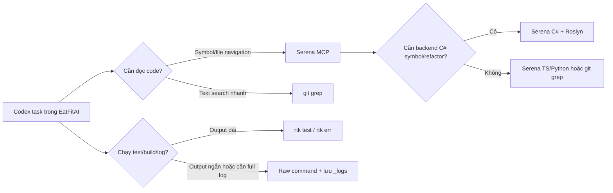

# Token Tooling Pilot Results - 2026-04-25

## Tóm tắt quyết định

Pilot đã được chạy trên Windows tại `E:\tool edit\eatfitai_v1`. Kết luận thực dụng cho EatFitAI:

| Tool | Trạng thái sau pilot | Quyết định | Lý do ngắn |
|---|---:|---|---|
| Serena | Đã cài và nối Codex MCP | **Keep** | Hợp nhất với Codex để đọc symbol/file có kiểm soát. Chạy ổn cho TypeScript + C# + Python sau pilot .NET local. |
| RTK | Đã cài release ZIP v0.37.2 | **Keep as explicit wrapper** | Giảm output rõ nhất cho npm/Jest, không cần hook global. |
| Codebase-Memory MCP | Đã cài thử, benchmark, sau đó remove khỏi Codex MCP và xóa binary/cache | **Remove** | Graph nhanh nhưng chưa đủ ổn trên Windows path có khoảng trắng; không đáng giữ trong setup mặc định. |
| Context Mode | Chưa cài | **Defer** | Chưa cần ở pass đầu; tránh thêm hook/session state khi RTK đã xử lý output tốt. |
| Prompt/output optimizer viral tools | Không cài | **Skip** | Giảm verbosity nhưng dễ làm mất độ rõ khi debug/code review. |

## Sơ đồ workflow đề xuất



## Những gì đã thay đổi

| Khu vực | Thay đổi | Rollback |
|---|---|---|
| `C:\Users\pc2\.codex\config.toml` | Giữ MCP `serena`; đã remove `codebase-memory` | Restore từ `_logs/token-tooling-final-trim/20260425-130531/backups/codex-config.toml.bak` |
| `.serena/project.yml` | Chuyển từ `typescript` sang `typescript` + `csharp` + `python` | Restore từ `_logs/dotnet10-serena-pilot/20260425-121900/backups/serena-project.yml.bak` |
| `C:\Users\pc2\.local\bin\rtk.exe` | Cài RTK v0.37.2 từ Windows release ZIP | Xóa `rtk.exe` khỏi user bin |
| `C:\Users\pc2\.local\bin\codebase-memory-mcp.exe` | Đã xóa sau final trim | Tải lại từ release nếu muốn pilot lại |
| `C:\Users\pc2\.dotnet-serena10\` | User-local .NET Runtime 10.0.7 + SDK 9.0.306 cho Serena C# | Xóa thư mục và rollback Serena C# |
| `C:\Users\pc2\.cache\codebase-memory-mcp\E-tool edit-eatfitai_v1.db` | Đã xóa sau final trim | Index lại nếu muốn pilot lại |
| `_logs/token-tooling-pilot/20260425-114731/` | Evidence benchmark, output raw/RTK/query | Đã nằm trong `_logs/`, không stage |

Không sửa logic app/backend/mobile trong pilot này.

## Serena

### Setup

- Installed package: `serena-agent==1.1.2`
- Command: `uv tool install -p 3.13 serena-agent@latest --prerelease=allow`
- Codex MCP:

```toml
[mcp_servers.serena]
startup_timeout_sec = 15
command = "serena"
args = ["start-mcp-server", "--context=codex", "--project-from-cwd"]
```

### Kết quả

| Check | Kết quả |
|---|---|
| `serena init` | OK |
| `serena setup codex` | OK |
| `codex mcp list` | Thấy `serena` enabled |
| Health check `typescript + python` | Exit 0, passed |
| Health check khi thêm `csharp` trước .NET 10 | Failed |
| Health check `typescript + csharp + python` sau .NET local | Passed, 35.429s |

Serena C# ban đầu bị chặn bởi runtime requirement của language server:

```text
Required .NET runtime version 10.0 not found (installed versions: [8.0.19, 8.0.21, 9.0.10]).
```

Đã triển khai tiếp theo:

- Cài runtime-only .NET `10.0.7` vào `C:\Users\pc2\.dotnet-serena10`.
- Prefetch Roslyn language server `roslyn-language-server.win-x64 5.5.0-2.26078.4` từ NuGet và verify SHA-256 `7F3D4119E75305399E6FAA81A68240B33C48B94AD523A904594ABD00DB95572A`.
- Bổ sung SDK `9.0.306` user-local vào cùng thư mục vì runtime-only không load được project theo `global.json`.
- Cập nhật Codex MCP `serena` để start qua wrapper có `DOTNET_ROOT`/`PATH` trỏ vào user-local dotnet.

`.serena/project.yml` đang để:

```yaml
languages:
- typescript
- csharp
- python
```

Đánh giá: **Keep Serena với C# enabled**, nhưng cần hiểu chi phí startup. C# language server load được `EatFitAI.API.csproj` và `EatFitAI.API.Tests.csproj`; vẫn có warning từ `eatfitai-mobile/node_modules/react-native-view-shot/windows/RNViewShot.csproj`, không chặn backend symbol.

### Serena C# performance follow-up

| Check | Kết quả |
|---|---:|
| Health-check TS+C#+Python sau SDK local | 35.429s |
| C# startup trong log | 24.526s |
| C# load backend/test csproj | 2.344s |
| `index-file AiRuntimeStatusService.cs` | 33.791s, 17 C# symbols |
| `index-file Program.cs` | 40.857s, có warning node_modules |
| `index-file AiRuntimeStatusServiceTests.cs` | 36.472s |
| `git grep AiRuntimeStatusService` | 0.038s, 14 matches |
| `git grep GetSnapshotAsync` | 0.040s, 9 matches |
| `git grep /internal/runtime/status` | 0.031s, 2 matches |

Kết luận hiệu suất: Serena C# không thay thế `git grep` cho tìm text nhanh. Giá trị của nó là symbol/method/reference/refactor có cấu trúc sau khi MCP server đã sống. Với EatFitAI, C# nên giữ nếu session Codex dài và hay đọc backend; nếu chỉ sửa nhỏ một file, `git grep` + đọc file vẫn nhanh hơn.

## RTK benchmark

### Setup

- Installed version: `rtk 0.37.2`
- Source: official Windows release `rtk-x86_64-pc-windows-msvc.zip`
- Release tag: `v0.37.2`
- Commit: `80a6fe606f73b19e52b0b330d242e62a6c07be42`
- SHA-256 local binary: `98CD9E7C0A12F817C02510CB546F3D0042404D96EA5FC3942ACD3E7FA041C384`
- Cargo install was attempted first but failed because MSVC `link.exe` is not installed. No Visual Studio Build Tools were installed.

### Raw vs RTK

| Command | Raw bytes | RTK bytes | Giảm | Raw time | RTK time | Exit raw/RTK |
|---|---:|---:|---:|---:|---:|---:|
| `dotnet test .\eatfitai-backend\EatFitAI.API.Tests.csproj` | 1,344 | 1,168 | 13.1% | 19.905s | 19.738s | 0/0 |
| `npm --prefix .\eatfitai-mobile run lint` | 560 | 100 | 82.1% | 11.395s | 11.219s | 0/0 |
| `npm --prefix .\eatfitai-mobile run typecheck` | 112 | 100 | 10.7% | 2.635s | 2.121s | 0/0 |
| `npm --prefix .\eatfitai-mobile run test` | 9,832 | 662 | 93.3% | 305.452s | 303.138s | 0/0 |

`rtk gain` sau 4 command báo token saving ước tính `87.8%`. Tool cũng cảnh báo chưa cài hook global, đúng với mục tiêu pilot:

```text
[warn] No hook installed - run `rtk init -g` for automatic token savings
```

Đánh giá: **Keep RTK dạng explicit wrapper**. Không bật `rtk init -g --codex` ở pass này. Các lệnh nên dùng:

```powershell
rtk test dotnet test .\eatfitai-backend\EatFitAI.API.Tests.csproj
rtk err npm --prefix .\eatfitai-mobile run lint
rtk err npm --prefix .\eatfitai-mobile run typecheck
rtk test npm --prefix .\eatfitai-mobile run test
```

## Codebase-Memory benchmark đã loại

### Setup

- Installed version: `codebase-memory-mcp 0.6.0`
- Source: official Windows release `codebase-memory-mcp-windows-amd64.zip`
- Release tag: `v0.6.0`
- Checksum: verified against official `checksums.txt`
- SHA-256 local binary: `DD828EE0D790F9D81C9BDE348DB8D5681D624F786BBA0E1B5E6C9409534C7A28`
- Final trim: removed from Codex MCP, deleted binary, deleted local graph DB.

### Index result

PowerShell 5 làm mất dấu nháy khi truyền JSON trực tiếp cho native exe, nên CLI phải gọi qua Node `spawnSync` để truyền argv đúng.

| Metric | Kết quả |
|---|---:|
| Project name | `E-tool edit-eatfitai_v1` |
| Index time | 2.449s |
| Files discovered | 1,194 |
| Nodes | 13,939 |
| Edges | 22,560 |
| DB size | 27,852,800 bytes |
| Cache location | `C:\Users\pc2\.cache\codebase-memory-mcp\E-tool edit-eatfitai_v1.db` |

### Query result

| Query | Kết quả | Nhận xét |
|---|---|---|
| `get_architecture` | Trả node labels, edge types, route count | Hữu ích để xem topology nhanh |
| `search_graph .*Runtime.*Status.*` | Tìm được `/internal/runtime/status` trong `ai-provider/app.py` và `AiRuntimeStatusService.cs` | Có ích cho map AI runtime |
| `search_graph label=Route` | Tìm 63 route | Có ích cho API surface |
| `query_graph runtime routes` | Trả đúng `/internal/runtime/status` | Query graph nhanh |
| `trace_call_path AiRuntimeStatusService` | Callees/callers rỗng | Chưa đủ tốt để thay code review impact |
| `trace_call_path GetStatusAsync` | `function not found` | Có thể parser/qualified name chưa tốt cho C# method |
| `search_code pattern=Google` | 0 result + `The system cannot find the path specified.` | Có bug/giới hạn với repo path Windows có khoảng trắng |
| `detect_changes` | 357 KB output | Rất dễ đốt context nếu gọi trực tiếp trong MCP |

Đánh giá cuối sau trim: **Remove khỏi setup mặc định**. Codebase-Memory có dữ liệu graph nhanh, nhưng chưa đủ tin để dùng làm nguồn impact analysis chính trên Windows/path có khoảng trắng. Với EatFitAI hiện tại, Serena + `git grep` đáng tin hơn và ít state hơn.

## Quy tắc dùng từ giờ

### Mặc định

1. Dùng Serena cho đọc code có hệ thống: symbol overview, find symbol, references.
2. Dùng RTK wrapper khi chạy command sinh output dài.
3. Dùng `git grep` cho tìm text nhanh trong repo.
4. Không dùng Codebase-Memory làm MCP mặc định.

### Khi bắt đầu session Codex mới

```text
/mcp
Activate the current dir as project using serena
```

Sau đó thử một prompt nhỏ:

```text
Dùng Serena tìm AiRuntimeStatusService và route /internal/runtime/status; nếu chỉ cần text search nhanh thì dùng git grep.
```

## Kết luận

Stack tốt nhất sau pilot:

- **Install now / keep:** Serena với TypeScript + C# + Python, RTK explicit wrapper.
- **Use as baseline:** `git grep` cho text search nhanh.
- **Remove:** Codebase-Memory MCP khỏi Codex active config, binary, và local graph DB.
- **Defer:** Context Mode.
- **Skip:** các prompt optimizer/verbosity tool trong list viral.

Điểm quan trọng nhất: RTK cho lợi ích token đo được ngay, Serena giúp đọc code sạch hơn, còn `git grep` vẫn là đường nhanh nhất cho text search. Codebase-Memory có tiềm năng nhưng chưa đủ hiệu quả thực tế để giữ trong stack mặc định.

## Evidence và nguồn

- Local logs: `_logs/token-tooling-pilot/20260425-114731/`
- Serena docs: <https://oraios.github.io/serena/>
- RTK repo/release: <https://github.com/rtk-ai/rtk>
- Codebase-Memory repo: <https://github.com/DeusData/codebase-memory-mcp>
- Codebase-Memory release v0.6.0: <https://github.com/DeusData/codebase-memory-mcp/releases/tag/v0.6.0>
- Codebase-Memory paper link from README: <https://arxiv.org/abs/2603.27277>
