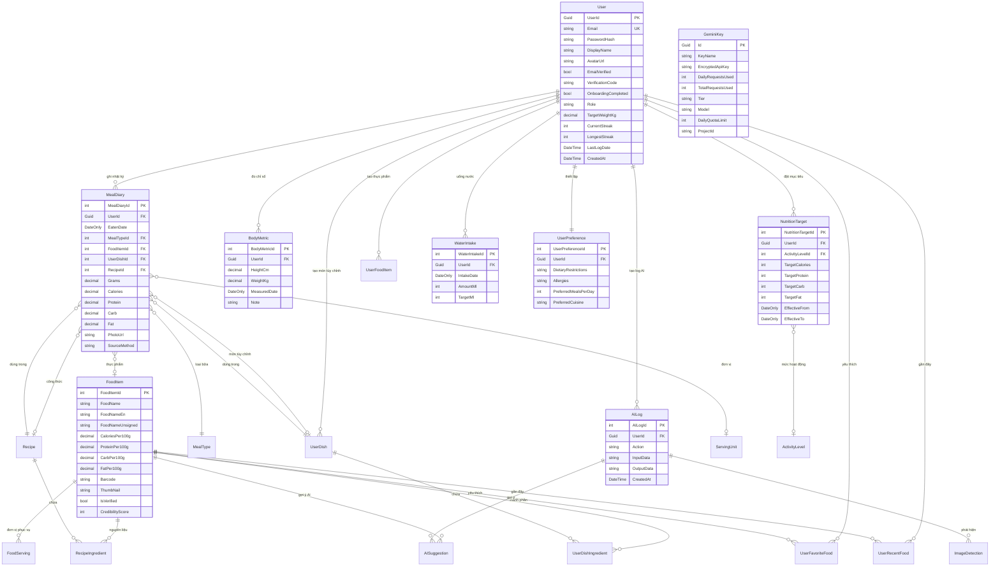
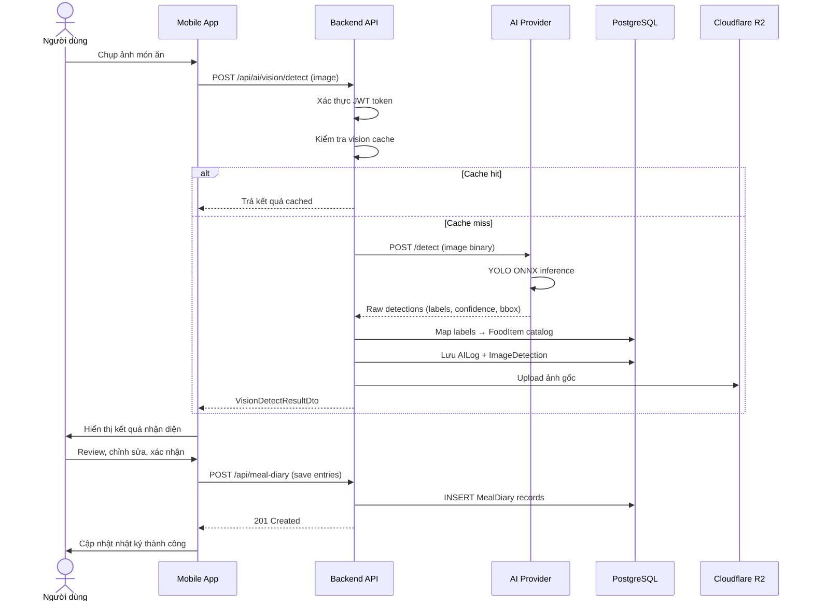
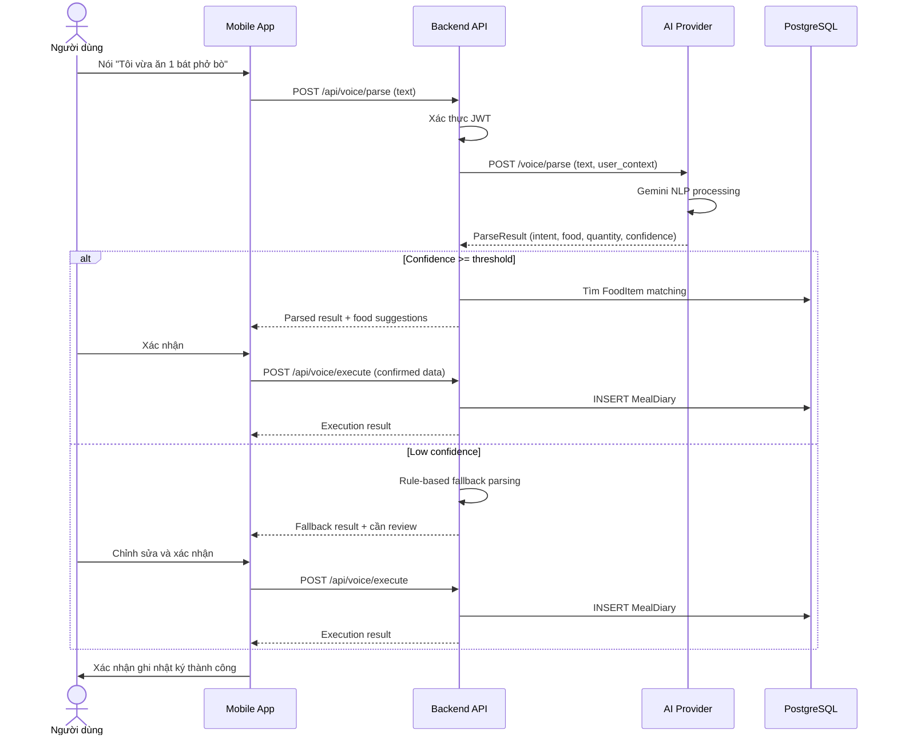
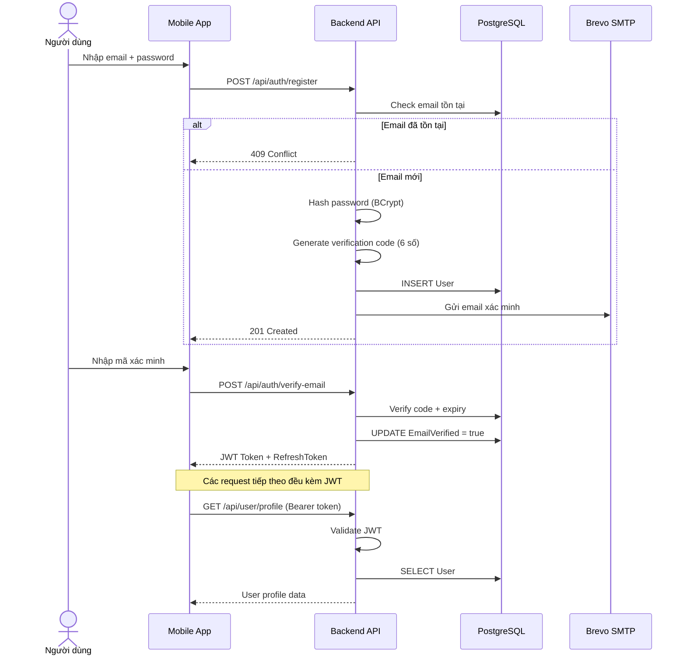
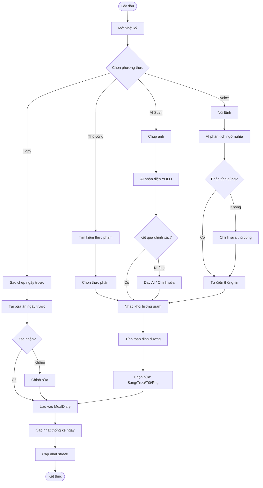
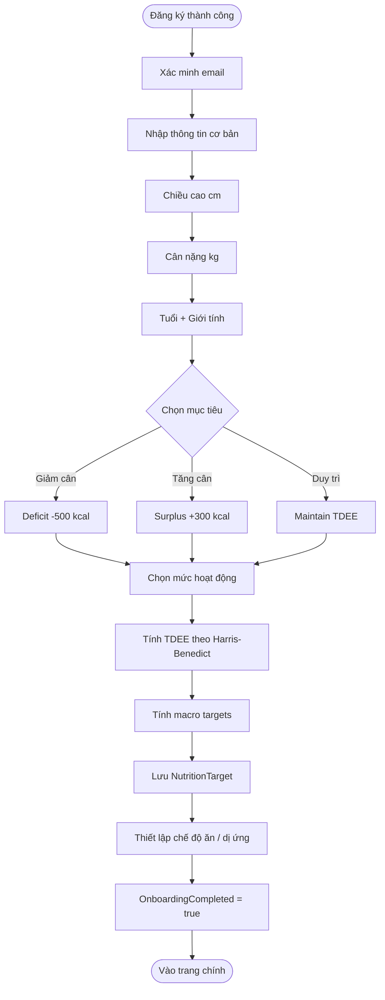
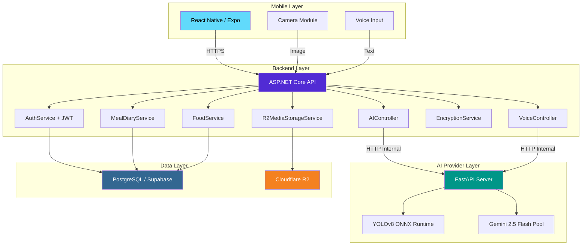
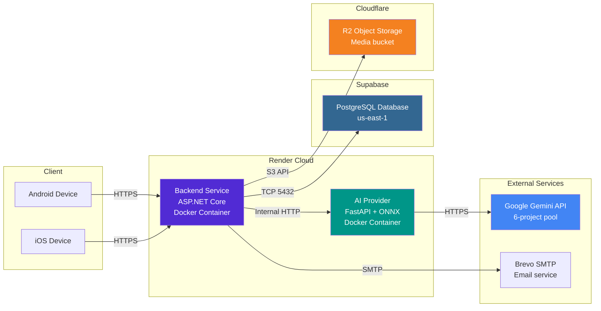

# 📐 EatFitAI — UML Diagrams

> Updated: `2026-04-28` | Dùng cho báo cáo tốt nghiệp

---

## 1. ERD — Entity Relationship Diagram

---

## 2. Use Case Diagram

```mermaid
graph TB
    subgraph "EatFitAI System"
        subgraph "Authentication"
            UC1["Đăng ký tài khoản"]
            UC2["Đăng nhập"]
            UC3["Xác minh Email"]
            UC4["Quên mật khẩu"]
            UC5["Đăng nhập Google"]
            UC6["Onboarding"]
        end

        subgraph "Nhật ký dinh dưỡng"
            UC10["Thêm bữa ăn thủ công"]
            UC11["Tìm kiếm thực phẩm"]
            UC12["Xem chi tiết thực phẩm"]
            UC13["Tạo món tùy chỉnh"]
            UC14["Sao chép bữa ngày trước"]
            UC15["Xóa/sửa bữa ăn"]
            UC16["Ghi lượng nước uống"]
        end

        subgraph "AI Features"
            UC20["Scan ảnh nhận diện món ăn"]
            UC21["Voice input ghi nhật ký"]
            UC22["Gợi ý công thức nấu ăn"]
            UC23["Hướng dẫn nấu ăn AI"]
            UC24["Phân tích dinh dưỡng AI"]
            UC25["Dạy AI nhận diện mới"]
        end

        subgraph "Thống kê & Mục tiêu"
            UC30["Xem thống kê ngày"]
            UC31["Xem thống kê tuần"]
            UC32["Xem thống kê tháng"]
            UC33["Đặt mục tiêu calo/macro"]
            UC34["Theo dõi cân nặng"]
        end

        subgraph "Hồ sơ"
            UC40["Chỉnh sửa hồ sơ"]
            UC41["Cập nhật chỉ số cơ thể"]
            UC42["Đổi mật khẩu"]
            UC43["Quản lý thông báo"]
            UC44["Thiết lập chế độ ăn"]
        end

        subgraph "Admin"
            UC50["Quản lý người dùng"]
            UC51["Quản lý thực phẩm"]
            UC52["Quản lý Gemini Keys"]
            UC53["Xem AI Logs"]
            UC54["Dashboard thống kê"]
        end
    end

    User((Người dùng))
    Admin((Admin))
    AIProvider[/"AI Provider"/]

    User --> UC1 & UC2 & UC3 & UC4 & UC5 & UC6
    User --> UC10 & UC11 & UC12 & UC13 & UC14 & UC15 & UC16
    User --> UC20 & UC21 & UC22 & UC23 & UC24 & UC25
    User --> UC30 & UC31 & UC32 & UC33 & UC34
    User --> UC40 & UC41 & UC42 & UC43 & UC44

    Admin --> UC50 & UC51 & UC52 & UC53 & UC54

    UC20 -.-> AIProvider
    UC21 -.-> AIProvider
    UC22 -.-> AIProvider
    UC23 -.-> AIProvider
    UC24 -.-> AIProvider
```

---

## 3. Sequence Diagram — AI Vision Scan Flow

---

## 4. Sequence Diagram — Voice Input Flow

---

## 5. Sequence Diagram — Authentication Flow

---

## 6. Activity Diagram — Diary Entry Flow

---

## 7. Activity Diagram — Onboarding Flow

---

## 8. Component Diagram — System Architecture

---

## 9. Deployment Diagram

