# EatFitAI - Product, System, AI Flow & Infrastructure Architecture

Ngày cập nhật: `2026-05-01`

Tài liệu này mô tả cực chi tiết hiện trạng luồng sản phẩm, luồng chức năng thường, luồng AI, dữ liệu và hạ tầng đi kèm của EatFitAI. Đối tượng đọc chính là Product Manager, System Architect, Tech Lead, QA Lead và người mới tiếp quản hệ thống.

## 1. Executive Summary

EatFitAI hiện là một hệ thống mobile-first gồm:

- Mobile app Expo / React Native: trải nghiệm người dùng, camera scan, voice, diary, stats, profile.
- Backend ASP.NET Core 9: API chính, auth, business logic, database orchestration, AI orchestration, rate limit, media storage, admin/runtime governance.
- AI Provider Flask Python: chạy YOLO ONNX cho vision và Gemini cho nutrition, cooking, voice parse, voice transcription.
- PostgreSQL/Supabase: database production chính cho user, diary, food catalog, AI logs, nutrition targets, admin governance, telemetry.
- Cloudflare R2: media storage production cho ảnh scan, avatar, ảnh món tự tạo, audio voice.
- Render: runtime production cho backend và AI provider.

Luồng chuẩn hiện tại:

```text
Mobile App -> Backend API -> PostgreSQL/Supabase
Mobile App -> Backend API -> Cloudflare R2
Mobile App -> Backend API -> AI Provider -> Gemini / YOLO ONNX
```

Mobile không gọi trực tiếp AI Provider. Backend là lớp kiểm soát duy nhất cho auth, rate limit, object ownership, media URL, AI provider token, fallback và logging.

## 2. Product Capability Map

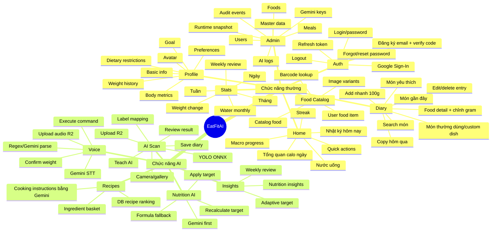

## 3. Runtime Context

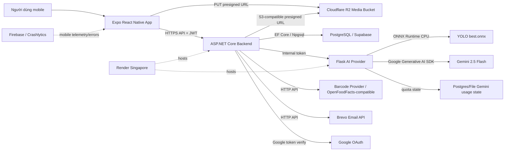

## 4. Source of Truth Trong Repo

| Layer | File/thư mục chính | Vai trò |
|---|---|---|
| Mobile navigation | `eatfitai-mobile/src/app/navigation/AppNavigator.tsx` | Điều hướng auth/app stack |
| Mobile tabs | `eatfitai-mobile/src/app/navigation/AppTabs.tsx` | 5 tab chính: Home, AI Scan, Voice, Stats, Profile |
| Mobile API client | `eatfitai-mobile/src/services/apiClient.ts` | Base URL, auth interceptor, refresh token, AI timeout |
| Auth mobile | `eatfitai-mobile/src/store/useAuthStore.ts` | Session store, login, Google, logout, onboarding state |
| Diary mobile | `eatfitai-mobile/src/services/diaryService.ts` | Summary, entries, offline fallback |
| Food mobile | `eatfitai-mobile/src/services/foodService.ts` | Search, favorites, barcode, custom dish, user foods |
| AI mobile | `eatfitai-mobile/src/services/aiService.ts` | Vision, nutrition, recipes, cooking, AI status |
| Voice mobile | `eatfitai-mobile/src/services/voiceService.ts` | Voice transcribe/parse/execute |
| Backend startup | `eatfitai-backend/Program.cs` | DI, DB, auth, rate limit, health, storage, middleware |
| Backend API | `eatfitai-backend/Controllers` | HTTP endpoints |
| Backend services | `eatfitai-backend/Services` | Business logic |
| AI provider | `ai-provider/app.py` | Flask routes, YOLO detect, Gemini routes |
| Deploy | `render.yaml` | Render blueprint cho backend + AI provider |

## 5. Mobile Application Shell

### 5.1 Navigation State

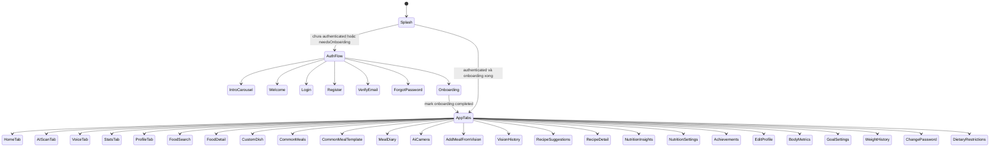

### 5.2 Mobile State & Data Patterns

| Pattern | Hiện trạng |
|---|---|
| Server state | React Query cho nhiều màn hình như Home, Diary, Stats, water |
| Local app state | Zustand stores: auth, diary, profile, stats, gamification, ingredient basket, voice |
| Token storage | SecureStore/AsyncStorage wrapper qua `secureStore.ts`, access token giữ thêm trong memory |
| API retry | Axios interceptor tự attach Bearer token, refresh một lần khi 401 |
| Raw fetch retry | `fetchWithAuthRetry` dùng cho upload/AI/cooking/telemetry |
| Offline fallback | `offlineCache.ts` dùng cho diary/profile/summary khi network lỗi |
| Backend discovery | Dev/local có `ipScanner.ts` scan `/discovery`, cache URL backend |
| AI timeout | `apiClient` thường khoảng 10s, `aiApiClient` dài hơn cho AI |

## 6. Luồng Khởi Động App & Backend Discovery

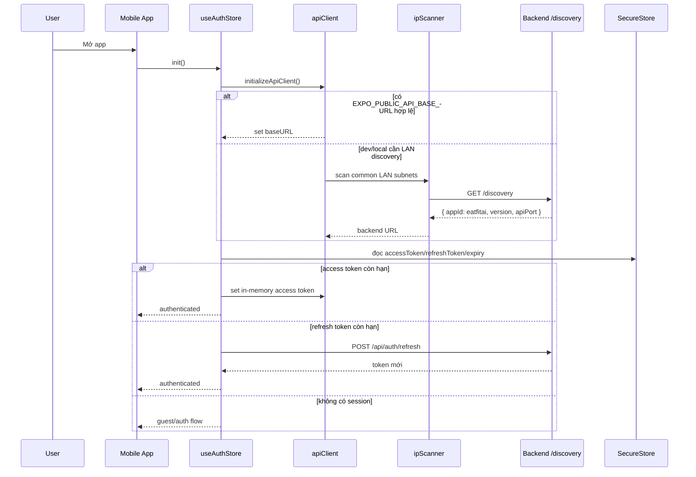

Điểm kiến trúc quan trọng:

- API URL phải là backend URL, không phải AI provider URL.
- Mobile có guard `guard:no-direct-ai-provider`.
- Auth bootstrap không chặn UI quá lâu: có startup timeout để app vẫn vào guest flow nếu API init chậm.

## 7. Chức Năng Thường - Auth

### 7.1 Email Register + Verify

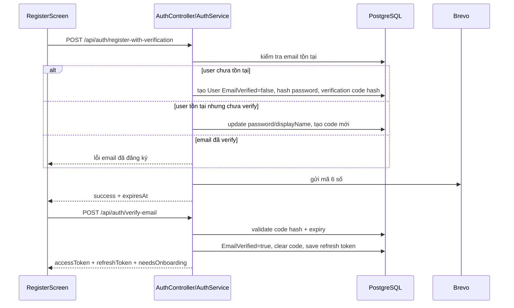

Backend dùng PBKDF2 cho password mới, có fallback verify SHA-256 legacy rồi rehash khi login thành công.

### 7.2 Login / Refresh / Logout

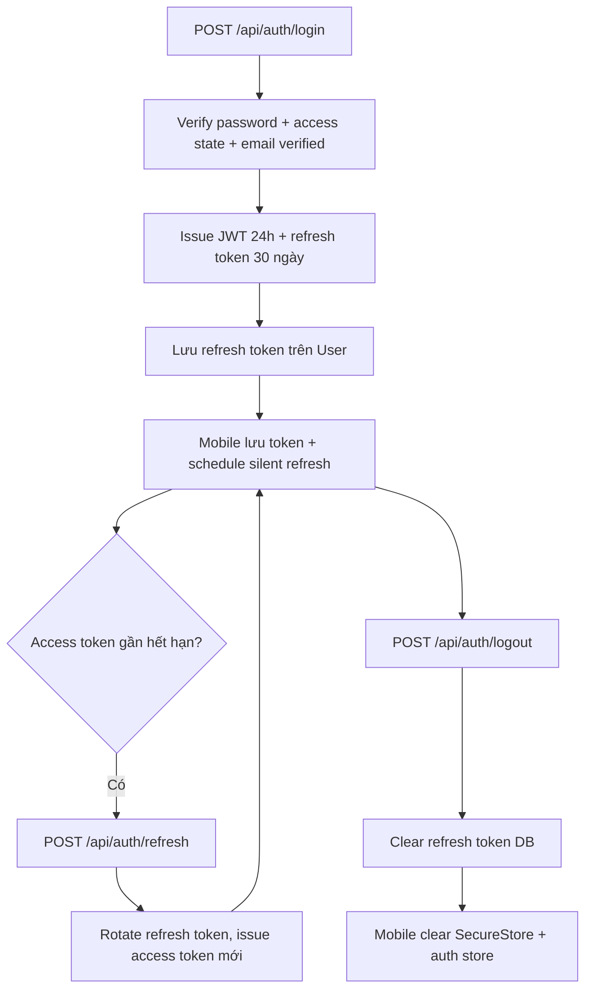

### 7.3 Forgot / Reset Password

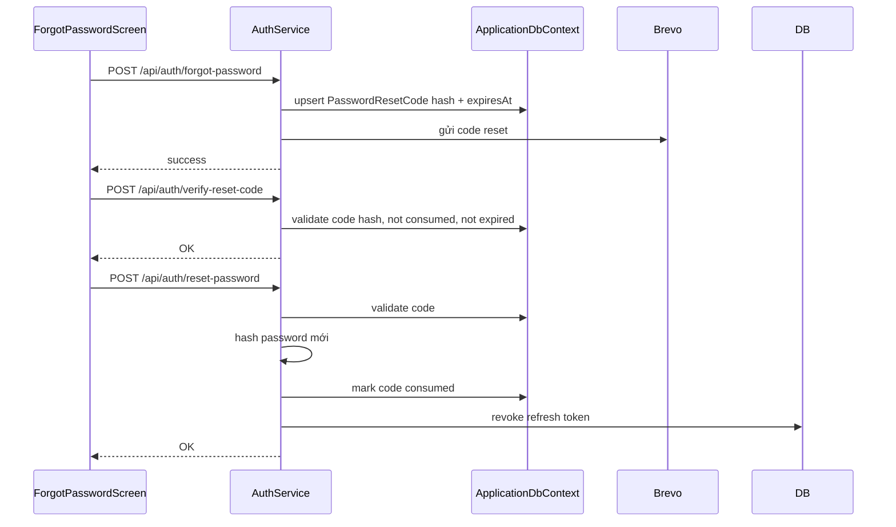

### 7.4 Google Sign-In

```text
Mobile Google native sign-in
-> lấy idToken
-> POST /api/auth/google/signin
-> Backend verify token với Google client IDs
-> tạo/link user
-> trả accessToken/refreshToken/needsOnboarding
```

Endpoint canonical:

- `POST /api/auth/google/signin`
- `POST /api/auth/google/link`

## 8. Chức Năng Thường - Home

HomeScreen là dashboard ngày. Nó gom nhiều nguồn:

- `GET /api/summary/day` để lấy calories/macro/target/meals.
- `GET /api/water-intake` để lấy nước hôm nay.
- `healthService.warmUpBackend()` để phát hiện backend ngủ/cold start.
- gamification store để lấy streak/weekly logs.
- navigation tới notification/profile/diary.

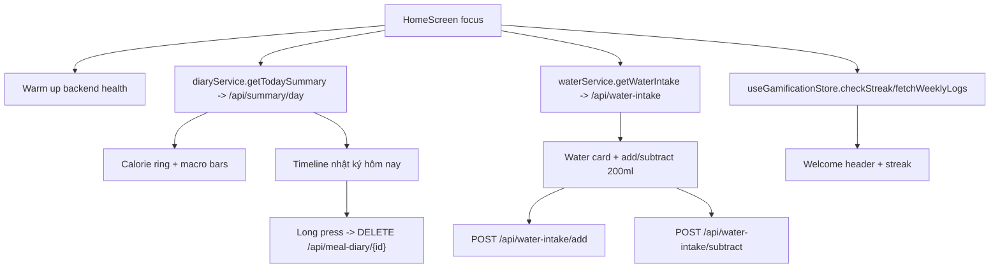

Water có optimistic update ở mobile. Backend dùng upsert SQL cho add và `GREATEST(amount - 200, 0)` cho subtract.

## 9. Chức Năng Thường - Diary

### 9.1 Diary Overview

Meal Diary là trung tâm lưu bữa ăn. Entry có thể đến từ 4 nguồn:

- Catalog `FoodItem`
- User-created food `UserFoodItem`
- Custom dish/common meal `UserDish`
- Recipe `Recipe`

Backend enforce mỗi `MealDiary` phải reference đúng một nguồn. Nếu không đúng, service ném lỗi.

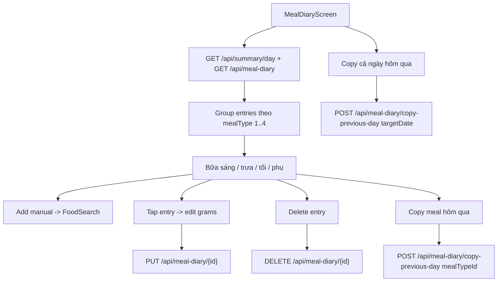

### 9.2 Macro Computation

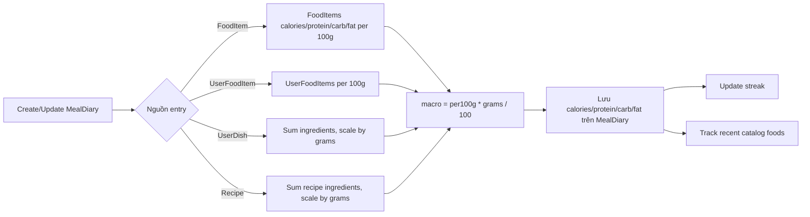

Điểm đáng chú ý:

- Delete là soft-delete `IsDeleted=true`.
- Với PostgreSQL, delete dùng `ExecuteUpdateAsync` để tránh load entity không cần thiết.
- Copy hôm qua từ chối nếu scope target đã có entry, tránh duplicate không chủ ý.

## 10. Chức Năng Thường - Food Search, Favorites, Recent Foods

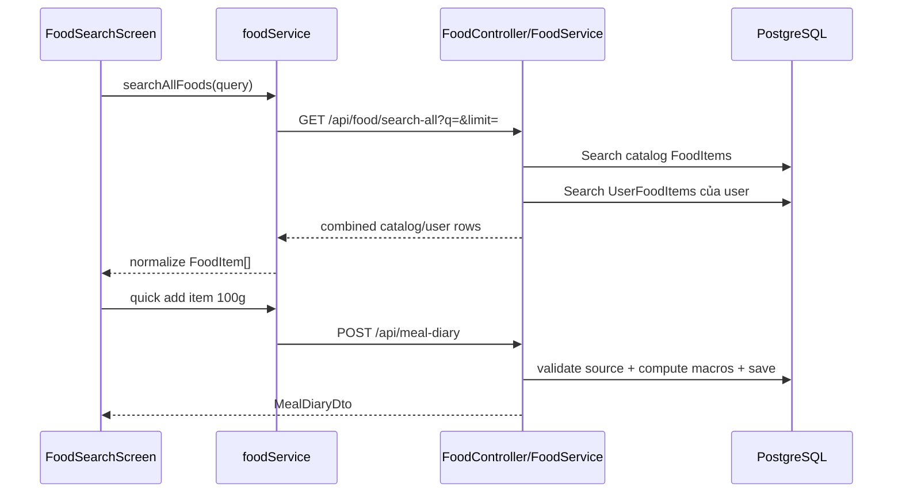

FoodSearch hiện có:

- Tab `Tất cả`.
- Tab `Món yêu thích`.
- Tìm kiếm gần đây lưu local AsyncStorage.
- Món gần đây từ backend `GET /api/food/recent`.
- Món thường dùng từ `GET /api/custom-dishes`.
- Filter theo dietary preferences trên mobile.

Favorites:

```text
GET  /api/favorites
POST /api/favorites                 toggle
GET  /api/favorites/check/{foodId}
```

Recent foods:

- Catalog recent đến từ bảng `UserRecentFoods`.
- User food recent được suy ra từ `MealDiaries` có `UserFoodItemId`.

## 11. Chức Năng Thường - Food Detail & Add Meal

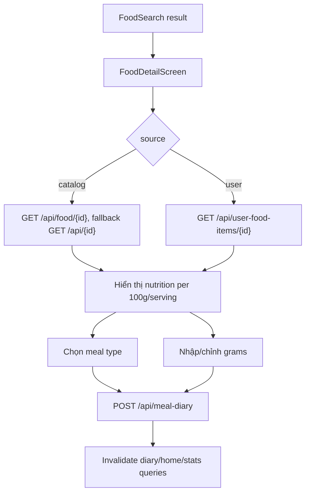

## 12. Chức Năng Thường - Custom Dish / Common Meal

Custom dish là món thường dùng do user tự tạo từ nhiều ingredient catalog.

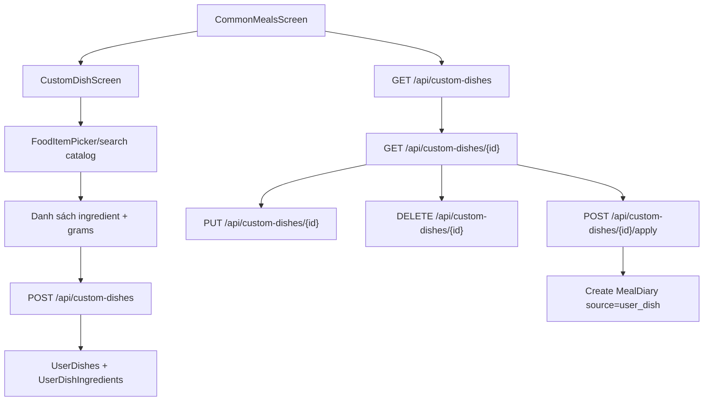

Backend validate:

- Dish phải có ít nhất một ingredient.
- Mỗi ingredient grams > 0.
- FoodItem phải active và chưa deleted.
- Khi apply vào diary, macro được tính bằng tổng ingredient rồi scale theo grams.

## 13. Chức Năng Thường - User Food Items

User food là món người dùng tự định nghĩa trực tiếp với nutrition per 100g.

```text
GET    /api/user-food-items?q=&page=&pageSize=
GET    /api/user-food-items/{id}
POST   /api/user-food-items              multipart/form-data
PUT    /api/user-food-items/{id}          multipart/form-data
DELETE /api/user-food-items/{id}
```

Ảnh user food:

- Chỉ nhận `image/jpeg`, `image/jpg`, `image/png`, `image/webp`.
- Production bắt buộc cloud storage configured.
- Backend tạo thumb/medium webp variants.
- Upload qua media storage service, production dùng Cloudflare R2.
- Nếu local/dev không có R2, fallback filesystem.

## 14. Chức Năng Thường - Barcode Lookup

Barcode nằm trong màn AI Scan nhưng không phải AI vision.

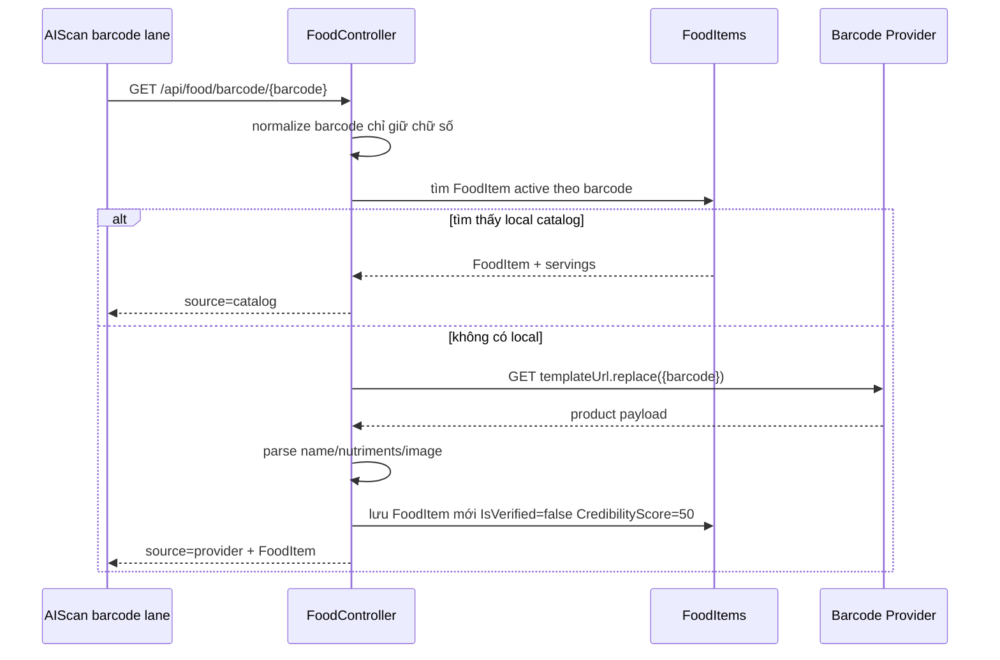

Rủi ro hiện tại: `FoodController.cs` có một số chuỗi tiếng Việt bị mojibake/corrupt ở nhánh barcode/error message. Cần sửa từ ý nghĩa gốc, không tự "đoán dấu" bằng công cụ encode hàng loạt.

## 15. Chức Năng Thường - Profile, Body Metrics, Goal

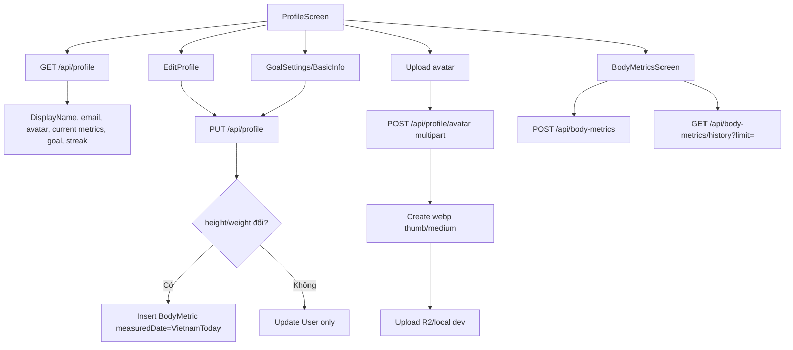

Profile fields quan trọng cho AI nutrition:

- gender
- dateOfBirth / age
- activityLevelId / activityFactor
- goal
- height/weight
- targetWeightKg

## 16. Chức Năng Thường - Dietary Restrictions & Preferences

Preferences API:

```text
GET  /api/user/preferences
POST /api/user/preferences
```

Dữ liệu:

- dietaryRestrictions: JSON list
- allergies: JSON list
- preferredMealsPerDay
- preferredCuisine

Hiện tại preferences được dùng ở mobile để filter FoodSearch results và trong recipe suggestion backend để tránh món không phù hợp/allergy.

## 17. Chức Năng Thường - Water Tracking

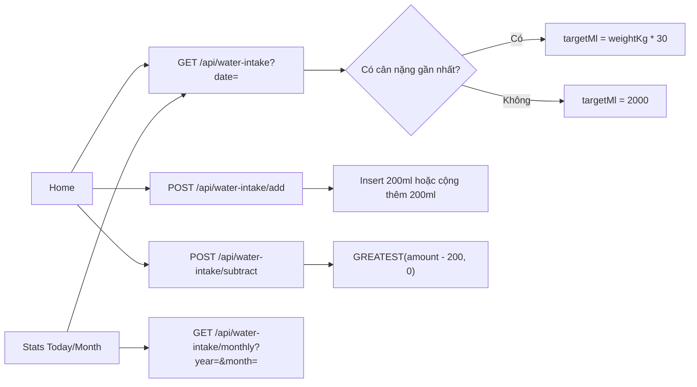

Water data hiện nằm trong `ApplicationDbContext`, không phải scaffold-only context.

## 18. Chức Năng Thường - Stats & Analytics

Stats có 3 tab:

- Ngày: calorie ring, macros, phân bổ bữa ăn, nước uống.
- Tuần: weekly summary, bars, protein/macro cards, weekly review.
- Tháng: nutrition summary range, heatmap/calendar, water average, weight change.

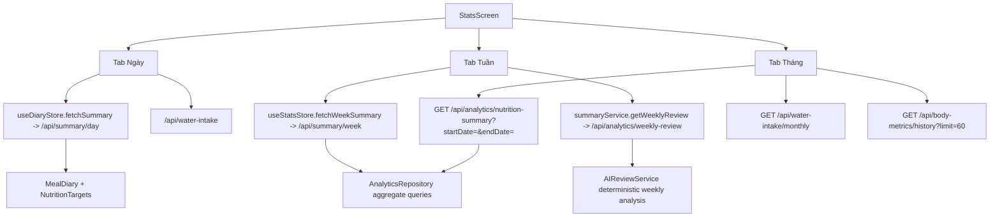

Lưu ý: Weekly review hiện nằm dưới tên `AIReviewService`, nhưng về runtime chủ yếu là phân tích deterministic từ dữ liệu user, không phải call Gemini trực tiếp theo luồng AI Provider.

## 19. Chức Năng Thường - Telemetry, Error Tracking, QA Gates

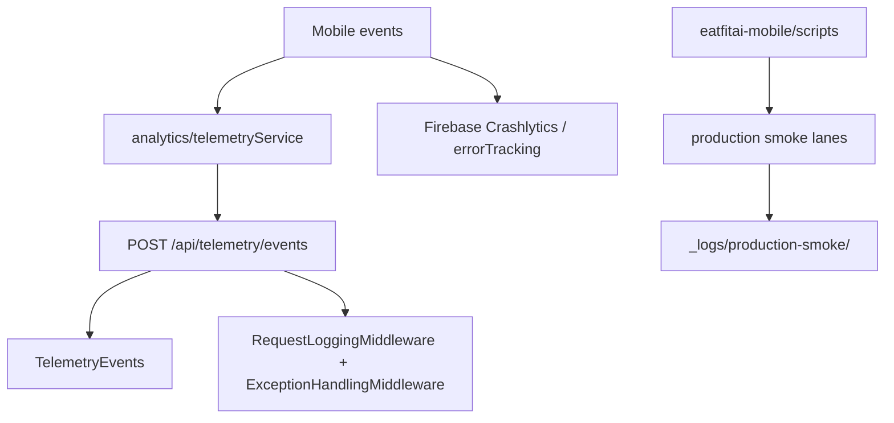

Smoke scripts hiện bao gồm:

- preflight
- auth API
- user API
- AI API
- infra gate
- backend non-UI
- regression
- metrics
- release gate

## 20. AI Capability Overview

```mermaid
flowchart TD
    AIEntry["AI features"] --> Vision["AI Scan / Vision"]
    AIEntry --> Nutrition["Nutrition Target AI"]
    AIEntry --> Recipe["Recipe Suggestions / Cooking"]
    AIEntry --> Voice["Voice"]
    AIEntry --> Runtime["AI Health/Admin Runtime"]

    Vision --> YOLO["YOLO ONNX in Flask"]
    Vision --> Mapping["Backend label mapping"]
    Vision --> Teach["Teach AI / correction events"]

    Nutrition --> GeminiNutri["Gemini nutrition-advice"]
    Nutrition --> Formula["Formula fallback"]
    Nutrition --> Insight["Backend deterministic insights"]

    Recipe --> DBRanking["RecipeSuggestionService DB ranking"]
    Recipe --> GeminiCooking["Gemini cooking instructions"]

    Voice --> STT["Gemini Audio STT"]
    Voice --> Parse["Regex + Gemini parse"]
    Voice --> Execute["Backend executes command"]

    Runtime --> Health["/api/ai/status + /healthz"]
    Runtime --> Logs["AILogs"]
    Runtime --> GeminiPool["Gemini pool/quota state"]
```

## 21. AI Scan / Vision - End-to-End Flow

### 21.1 Product Flow

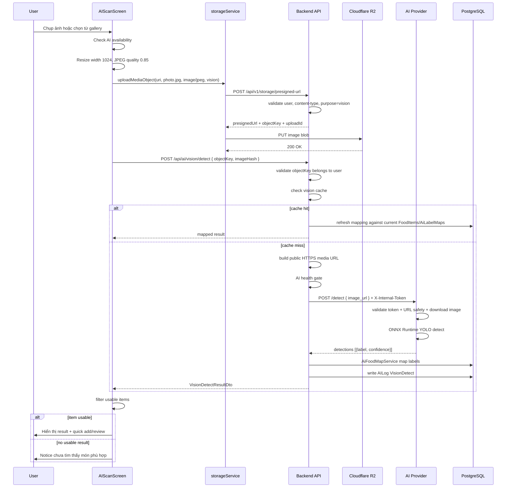

### 21.2 Mobile Details

Màn hình: `AIScanScreen.tsx`

State chính:

- `mode`: camera, preview, results.
- `captureLane`: ai hoặc barcode.
- `isCapturing`, `isProcessing`.
- `detectionResult`.
- `resultNotice`.
- `resultGrams`.
- ingredient basket state.

Mobile behavior:

- Nếu AI unavailable: block scan, toast, telemetry `ai_scan_blocked`, điều hướng fallback sang FoodSearch.
- Ảnh camera dùng `takePictureAsync({ base64:false, quality:0.85 })`.
- Ảnh gallery qua `ImagePicker.launchImageLibraryAsync`.
- Compress qua `ImageManipulator.manipulateAsync`.
- Nếu compression lỗi, fallback ảnh gốc.
- Gọi `aiService.detectFoodByImage(processedUri)`.
- Nếu lỗi AI offline: hiển thị thông báo AI tạm offline.
- Nếu lỗi server/network: toast và quay về camera.

### 21.3 Backend Vision Contract

Endpoint:

```text
POST /api/ai/vision/detect
Authorization: Bearer <JWT>
Content-Type: application/json

{
  "objectKey": "vision/{userIdN}/yyyy/MM/dd/{uploadId}_photo.jpg",
  "imageHash": "{uploadId hoặc hash client}"
}
```

Backend checks:

- User ID lấy từ JWT.
- `ObjectKey` hoặc URL phải parse được.
- Object key không được rỗng, không quá dài, không chứa backslash, `//`, path traversal.
- Object key phải bắt đầu bằng `vision/{userId:N}/`.
- Extension phải là `.jpg`, `.jpeg`, `.png`, `.webp`.
- Public media URL phải build được từ HTTPS `Media:PublicBaseUrl`.
- AI provider health gate không ở trạng thái DOWN fresh.

Backend output:

```text
items:
  - label
  - confidence
  - foodItemId?
  - foodName?
  - calories/protein/carbs/fat?
  - isMatched
  - source
unmappedLabels:
  - label chưa map được
```

### 21.4 AI Provider Detection Details

AI Provider `/detect`:

- Bắt buộc `X-Internal-Token`.
- Nhận `image_url` JSON hoặc legacy multipart file.
- Với remote image:
  - chỉ HTTPS
  - host trong allowlist
  - không username/password
  - DNS không resolve về private/loopback/link-local/multicast/reserved
  - không follow redirect
  - giới hạn download khoảng 10MB
  - validate content type ảnh
- Lưu temp file trong uploads.
- Lazy-load `best.onnx`.
- Dùng ONNX Runtime CPUExecutionProvider.
- Preprocess:
  - OpenCV đọc ảnh
  - letterbox square canvas
  - RGB blob 1/255
- Postprocess:
  - decode YOLO output
  - confidence threshold
  - clamp box
  - NMS
  - giữ best detection mỗi label
  - sort confidence desc
- Trả về `detections`.
- Xóa temp file ở finally.

### 21.5 Mapping Details

`AiFoodMapService` map detection sang DB:

```mermaid
flowchart TD
    Detection["label + confidence"] --> Normalize["trim + lowercase + remove diacritics khi fuzzy"]
    Normalize --> Exact["Lookup AiLabelMaps exact label"]
    Exact --> ExactOK{"FoodItem exists, confidence >= MinConfidence, nutrition usable?"}
    ExactOK -->|Có| ReturnExact["Return matched FoodItem"]
    ExactOK -->|Không| Fuzzy{"confidence >= 0.60?"}
    Fuzzy -->|Không| Unmapped["Return IsMatched=false"]
    Fuzzy -->|Có| Synonym["Apply synonym chicken/beef..."]
    Synonym --> Catalog["Score active FoodItems"]
    Catalog --> Usable{"nutrition usable?"}
    Usable -->|Có| ReturnCatalog["Return matched catalog item"]
    Usable -->|Không| Unmapped
```

Nutrition usable nghĩa là:

- calories > 0
- macros không âm
- ít nhất một macro > 0

## 22. AI Scan Review, Teach AI, Save Diary

```mermaid
flowchart TD
    Result["Vision result"] --> UsableTop{"Top item có FoodItemId + nutrition usable?"}
    UsableTop -->|Có| QuickAdd["Quick add 100g với meal type gợi ý"]
    UsableTop -->|Không| Review["AddMealFromVisionScreen"]

    Review --> Select["Chọn/bỏ chọn item"]
    Review --> Gram["Chỉnh grams 25..1000"]
    Review --> MealType["Chọn meal type"]
    Review --> Replace["Replace bằng FoodSearch"]
    Review --> Teach["TeachLabelBottomSheet"]

    Teach --> Suggest["GET /api/ai/vision/suggest-mapping/{label}"]
    Teach --> PostTeach["POST /api/ai/labels/teach"]
    PostTeach --> LabelMap["Upsert AiLabelMap"]
    LabelMap --> Correction["Write AiCorrectionEvent"]
    PostTeach --> Rerun["Mobile rerun detectFoodByImage"]

    QuickAdd --> Diary["POST /api/meal-diary"]
    Review --> Save["Save selected items"]
    Save --> Diary
```

Teach AI không train lại YOLO. Nó cập nhật mapping label -> FoodItem để lần scan sau map chính xác hơn.

## 23. Vision History & Admin AI Logs

Vision history đọc từ `AILogs` action `VisionDetect`.

Endpoint:

```text
POST /api/ai/vision/history
GET  /api/ai/vision/unmapped-stats?days=
GET  /api/ai/vision/suggest-mapping/{label}
```

Admin AI:

```text
GET    /api/admin/ai/logs
GET    /api/admin/ai/corrections
GET    /api/admin/ai/label-map
PUT    /api/admin/ai/label-map/{label}
DELETE /api/admin/ai/label-map/{label}
GET    /api/admin/ai/stats
```

## 24. AI Nutrition Target Flow

```mermaid
sequenceDiagram
    participant App as NutritionSettings/Profile flow
    participant Backend as AIController/NutritionController
    participant AI as AI Provider
    participant Gemini as Gemini
    participant DB as PostgreSQL

    App->>Backend: GET /api/profile
    Backend-->>App: gender/age/weight/height/activity/goal
    App->>Backend: POST /api/ai/nutrition/recalculate
    Backend->>Backend: AI health check
    alt AI available
        Backend->>AI: POST /nutrition-advice + internal token
        AI->>Gemini: JSON nutrition prompt
        alt Gemini valid response
            Gemini-->>AI: targets + explanation
            AI-->>Backend: source=gemini
        else quota/error/invalid
            AI-->>Backend: formula fallback
        end
    else AI down
        Backend->>Backend: formula fallback
    end
    Backend-->>App: target calories/macros + source/offlineMode
    App->>Backend: POST /api/ai/nutrition/apply-target hoặc /api/ai/nutrition/apply
    Backend->>DB: save NutritionTarget effectiveFrom
```

Formula fallback:

- Mifflin-St Jeor BMR.
- TDEE = BMR * activity factor.
- Lose/cut: khoảng 80% TDEE.
- Maintain: khoảng 100% TDEE.
- Gain/bulk: khoảng 110% TDEE.
- Protein: cut khoảng 2.2g/kg, còn lại khoảng 1.8g/kg.
- Fat khoảng 25% calories.
- Carbs là phần calories còn lại.

## 25. Nutrition Insights & Adaptive Target

```mermaid
flowchart TD
    App["NutritionInsightsScreen"] --> Insights["POST /api/ai/nutrition/insights"]
    Insights --> Service["NutritionInsightService"]
    Service --> Diary["MealDiary history"]
    Service --> Target["Current NutritionTarget"]
    Service --> Output["Adherence score, averages, trend, recommendations"]

    App --> Adaptive["POST /api/ai/nutrition/adaptive-target"]
    Adaptive --> Analyze["Analyze user history + target"]
    Analyze --> Confidence{"confidence >= 75 và autoApply?"}
    Confidence -->|Có| Save["Save new NutritionTarget"]
    Confidence -->|Không| Suggest["Return suggested target only"]
```

Quan trọng: nhánh insights/adaptive hiện chủ yếu deterministic backend analysis, không phải call Gemini.

## 26. Recipe Suggestion & Cooking Instructions

### 26.1 Ingredient Basket

AI Scan có thể thêm label/nguyên liệu vào ingredient basket. Basket lưu local qua Zustand + AsyncStorage.

```mermaid
flowchart TD
    Scan["AI Scan result"] --> Basket["IngredientBasketStore"]
    Basket --> Sheet["IngredientBasketSheet"]
    Sheet --> RecipeSuggestions["RecipeSuggestionsScreen"]
    RecipeSuggestions --> Backend["POST /api/ai/recipes/suggest"]
```

### 26.2 Recipe Suggestion

`RecipeSuggestionService` hiện là database ranking, không phải Gemini.

```mermaid
flowchart TD
    Request["availableIngredients + preferences"] --> Expand["Expand ingredient names EN/VN"]
    Expand --> Cache["Load recipes cache 10 phút"]
    Cache --> Filter["Apply allergy/dietary restrictions"]
    Filter --> Score["Match ingredients, match %, missing ingredients"]
    Score --> Sort["Sort by match quality"]
    Sort --> Return["RecipeSuggestionDto[]"]
```

### 26.3 Cooking Instructions

Cooking instructions dùng Gemini qua AI provider:

```mermaid
sequenceDiagram
    participant App as RecipeDetailScreen
    participant Backend as AIController
    participant Cache as Backend MemoryCache
    participant AI as AI Provider
    participant Gemini as Gemini

    App->>Backend: POST /api/ai/cooking-instructions
    Backend->>Cache: check recipe cache
    alt cache hit
        Cache-->>Backend: instructions
    else cache miss
        Backend->>AI: POST /cooking-instructions + internal token
        AI->>Gemini: prompt cooking steps
        Gemini-->>AI: steps/time/difficulty/tips
        AI-->>Backend: JSON
        Backend->>Cache: cache khoảng 1h
    end
    Backend-->>App: CookingInstructionsDto
```

Nếu AI lỗi, mobile/backend có fallback hướng dẫn nấu cơ bản.

## 27. Voice AI Flow

### 27.1 Voice Transcription

```mermaid
sequenceDiagram
    participant App as VoiceScreen/voiceService
    participant Storage as storageService
    participant Backend as VoiceController
    participant R2 as Cloudflare R2
    participant AI as AI Provider
    participant Gemini as Gemini Audio

    App->>Storage: uploadMediaObject(audioUri, fileName, audio/*, voice)
    Storage->>Backend: POST /api/v1/storage/presigned-url purpose=voice
    Backend-->>Storage: presignedUrl + objectKey
    Storage->>R2: PUT audio
    App->>Backend: POST /api/voice/transcribe { objectKey, uploadId }
    Backend->>Backend: validate voice/{userId}/... + audio extension
    Backend->>AI: POST /voice/transcribe { audio_url } + internal token
    AI->>AI: validate URL safety + download audio
    AI->>Gemini: inline base64 audio transcription prompt
    Gemini-->>AI: Vietnamese text
    AI-->>Backend: text/language/success
    Backend-->>App: TranscriptionResponse
```

### 27.2 Voice Parse + Execute

```mermaid
flowchart TD
    Text["Voice text"] --> Parse["POST /api/voice/parse"]
    Parse --> Provider["AI Provider /voice/parse"]
    Provider --> RegexFirst["Provider regex first"]
    RegexFirst --> Simple{"simple command?"}
    Simple -->|Có| Parsed["Parsed command source=regex"]
    Simple -->|Không| Gemini["Gemini parse complex ADD_FOOD"]
    Gemini --> Parsed

    Parsed --> Quality{"Intent valid + enough entities?"}
    Quality -->|Có| Return["Return parsed command"]
    Quality -->|Không| BackendFallback["Backend VoiceProcessingService regex fallback"]
    BackendFallback --> Review["reviewRequired=true nếu chưa đủ tin cậy"]

    Return --> Execute["POST /api/voice/execute"]
    Review --> Execute
    Execute --> Intent{"intent"}
    Intent -->|ADD_FOOD| SearchFood["Search DB food + create MealDiary nếu confidence >= 0.5"]
    Intent -->|LOG_WEIGHT| Confirm["Return requireConfirm payload"]
    Intent -->|ASK_CALORIES| Summary["Return today calories summary"]
    Confirm --> SaveWeight["POST /api/voice/confirm-weight"]
```

Supported intents:

- `ADD_FOOD`
- `LOG_WEIGHT`
- `ASK_CALORIES`
- `ASK_NUTRITION`
- `UNKNOWN`

## 28. AI Health, Runtime, Gemini Pool

```mermaid
flowchart TD
    BackendHealth["AiHealthBackgroundService"] --> Poll["GET AI Provider /healthz mỗi ~30s"]
    Poll --> State["AiHealthService state"]
    State --> Healthy{"HEALTHY?"}
    Healthy -->|Có| Allow["AI scan/feature allowed"]
    Healthy -->|DOWN fresh| Block["Backend blocks vision early 503 ai_provider_down"]
    Healthy -->|DEGRADED| Degraded["Allow/fallback tùy feature"]

    AdminRuntime["AdminRuntimeSnapshotBackgroundService"] --> RuntimeStatus["GET /internal/runtime/status"]
    RuntimeStatus --> GeminiPool["Gemini pool usage entries"]

    GeminiPool --> Limits["RPM/TPM/RPD per project"]
    Limits --> Exhausted["Exhausted -> cooldown/pending probe"]
    Exhausted --> Store["Persist to Postgres/file"]
```

AI Provider `/healthz` không load YOLO nặng lúc deploy nếu lazy model đang pending. Nó trả:

- status
- model_loaded
- model_file
- model_load_error
- model_classes_count
- Gemini configured/available
- Gemini usage state

Backend `/api/ai/status` trả health status cho mobile để UI chặn scan sớm.

## 29. Backend Application Architecture

```mermaid
flowchart TB
    Controllers["Controllers"] --> Services["Services"]
    Services --> Repositories["Repositories"]
    Services --> DbContexts["DbContexts"]
    Repositories --> DbContexts
    DbContexts --> Postgres["PostgreSQL/Supabase"]

    Controllers --> Middleware["Auth/RateLimit/Exception/Logging/SecurityHeaders"]
    Services --> HttpClients["HttpClientFactory"]
    HttpClients --> AIProvider["AI Provider"]
    HttpClients --> External["Google/Brevo/Barcode provider"]

    Services --> Media["IMediaStorageService"]
    Media --> R2["R2MediaStorageService"]
    Media --> SupabaseStorage["SupabaseMediaStorageService legacy/fallback"]

    Services --> Cache["IMemoryCache"]
    Cache --> VisionCache["VisionCacheService"]
    Cache --> LookupCache["LookupCacheService"]
    Cache --> RecipeCache["Recipe suggestions/cooking cache"]
```

### 29.1 DbContexts

| Context | Vai trò |
|---|---|
| `EatFitAIDbContext` | Product domain scaffold: users, food, diary, nutrition, recipes, AI logs |
| `ApplicationDbContext` | Admin/governance/runtime/telemetry/preferences/water/auth infra |

Cả hai context hiện dùng Npgsql và cùng production connection string.

### 29.2 Middleware Order

```text
ForwardedHeaders
ResponseCompression
ExceptionHandlingMiddleware
RequestLoggingMiddleware
SecurityHeadersMiddleware
Swagger only dev/staging
HttpsRedirection production
Routing
CORS
Authentication
RateLimiter
Authorization
StaticFiles
MapControllers
/discovery
```

## 30. API Surface Summary

### 30.1 User-Facing API

| Domain | Endpoints chính |
|---|---|
| Auth | `/api/auth/register-with-verification`, `/verify-email`, `/resend-verification`, `/login`, `/refresh`, `/logout`, `/forgot-password`, `/verify-reset-code`, `/reset-password`, `/change-password`, `/mark-onboarding-completed` |
| Google Auth | `/api/auth/google/signin`, `/api/auth/google/link` |
| Profile | `GET/PUT/DELETE /api/profile`, `POST /api/profile/avatar`, `POST /api/body-metrics`, `GET /api/body-metrics/history` |
| Food | `GET /api/search`, `GET /api/food/search`, `GET /api/food/search-all`, `GET /api/food/{id}`, `GET /api/food/recent`, `GET /api/food/barcode/{barcode}` |
| User Food | `GET/POST /api/user-food-items`, `GET/PUT/DELETE /api/user-food-items/{id}` |
| Custom Dish | `GET/POST /api/custom-dishes`, `GET/PUT/DELETE /api/custom-dishes/{id}`, `POST /api/custom-dishes/{id}/apply` |
| Diary | `GET/POST /api/meal-diary`, `GET/PUT/DELETE /api/meal-diary/{id}`, `POST /api/meal-diary/copy-previous-day` |
| Summary | `GET /api/summary/day`, `GET /api/summary/week` |
| Analytics | `GET /api/analytics/nutrition-summary`, `GET /api/analytics/weekly-review` |
| Favorites | `GET/POST /api/favorites`, `GET /api/favorites/check/{foodId}` |
| Water | `GET /api/water-intake`, `POST /api/water-intake/add`, `POST /api/water-intake/subtract`, `GET /api/water-intake/monthly` |
| Preferences | `GET/POST /api/user/preferences` |
| Storage | `POST /api/v1/storage/presigned-url` |
| Telemetry | `POST /api/telemetry/events` |
| Voice | `POST /api/voice/transcribe`, `/parse`, `/process`, `/execute`, `/confirm-weight`, `GET /api/voice/commands` |
| AI | `/api/ai/status`, `/vision/detect`, `/recipes/suggest`, `/recipes/{id}`, `/nutrition/*`, `/vision/history`, `/vision/unmapped-stats`, `/vision/suggest-mapping/{label}`, `/labels/teach`, `/cooking-instructions` |

### 30.2 Admin API

| Domain | Endpoints chính |
|---|---|
| Admin session/dashboard | `/api/admin/session`, `/dashboard-stats`, `/users`, `/support/users/{id}/overview`, `/system/health`, `/inbox` |
| Admin users | role, suspend, access-state, deactivate, delete |
| Admin foods | list/create/update/delete/verify foods |
| Admin meals | `/api/admin/meals`, `/stats`, delete |
| Master data | meal-types, activity-levels, serving-units |
| Admin AI logs | `/api/admin/ai/logs`, corrections, label-map, stats |
| Admin AI keys/runtime | `/api/admin-ai/keys`, bulk, toggle, test, runtime-projects, metrics, telemetry, probes |
| Admin runtime | `/api/admin/runtime/snapshot`, `/events` |
| Audit | `/api/admin/audit-events` |

## 31. Data Domain Map

```mermaid
erDiagram
    User ||--o{ MealDiary : logs
    User ||--o{ BodyMetric : records
    User ||--o{ NutritionTarget : owns
    User ||--o{ UserFoodItem : creates
    User ||--o{ UserDish : creates
    User ||--o{ UserFavoriteFood : favorites
    User ||--o{ UserRecentFood : uses
    User ||--o{ AILog : triggers
    User ||--o{ AiCorrectionEvent : teaches
    User ||--o{ WaterIntake : drinks
    User ||--o{ UserPreference : configures

    FoodItem ||--o{ MealDiary : catalog_source
    UserFoodItem ||--o{ MealDiary : user_source
    UserDish ||--o{ MealDiary : dish_source
    Recipe ||--o{ MealDiary : recipe_source

    UserDish ||--o{ UserDishIngredient : contains
    FoodItem ||--o{ UserDishIngredient : ingredient
    Recipe ||--o{ RecipeIngredient : contains
    FoodItem ||--o{ RecipeIngredient : ingredient

    FoodItem ||--o{ AiLabelMap : mapped_by
    AILog ||--o{ ImageDetection : has
    AILog ||--o{ AISuggestion : has
```

## 32. Media & Storage Architecture

```mermaid
flowchart TD
    Client["Mobile"] --> Presign["POST /api/v1/storage/presigned-url"]
    Presign --> Purpose{"purpose"}
    Purpose -->|vision| VisionRules["image/jpeg/png/webp"]
    Purpose -->|voice| VoiceRules["audio mp4/mpeg/mp3/wav/webm/ogg/flac/x-m4a"]

    VisionRules --> ObjectKey["vision/{userIdN}/yyyy/MM/dd/{uploadId}_filename"]
    VoiceRules --> ObjectKey2["voice/{userIdN}/yyyy/MM/dd/{uploadId}_filename"]
    ObjectKey --> R2Presign["R2 S3 presigned PUT"]
    ObjectKey2 --> R2Presign
    R2Presign --> ClientPUT["Mobile PUT directly to R2"]
    ClientPUT --> PublicURL["Media:PublicBaseUrl + objectKey"]
    PublicURL --> BackendUse["Backend builds URL for AI provider"]
```

Production storage requirements:

- `Media:Provider=r2`
- `Media:PublicBaseUrl` HTTPS
- R2 account/bucket/access key/secret configured
- Bucket hiện là `eatfitai-media`

Image processing:

- Avatar/user food upload backend tạo webp thumb/medium variants.
- Vision upload từ mobile được resize trước rồi upload raw JPEG.
- AI Provider không cần credential R2; chỉ tải public HTTPS URL đã được allowlist.

## 33. Deployment Architecture

```mermaid
flowchart LR
    Git["Repo"] --> RenderBlueprint["render.yaml"]
    RenderBlueprint --> BackendService["Render Web: eatfitai-backend"]
    RenderBlueprint --> AIService["Render Web: eatfitai-ai-provider"]

    BackendService --> BackendDocker["eatfitai-backend/Dockerfile"]
    BackendDocker --> Dotnet[".NET 9 Alpine runtime"]
    BackendService --> BackendEnv["ConnectionStrings, JWT, Encryption, AIProvider, R2, Supabase, Brevo, Google"]
    BackendService --> BackendHealth["/health/ready"]

    AIService --> AIDocker["ai-provider/Dockerfile"]
    AIDocker --> Python["Python 3.11 slim + OpenCV + ONNX Runtime + Gemini SDK"]
    AIService --> AIEnv["AI token, Gemini pool, YOLO threshold, media hosts, STT"]
    AIService --> AIHealth["/healthz"]

    BackendService --> Supabase["Supabase/Postgres"]
    BackendService --> R2["Cloudflare R2"]
    AIService --> Gemini["Gemini"]
```

Render config hiện tại:

| Service | Runtime | Region | Plan | Health |
|---|---|---|---|---|
| `eatfitai-backend` | Docker / ASP.NET Core | Singapore | Free | `/health/ready` |
| `eatfitai-ai-provider` | Docker / Flask Gunicorn | Singapore | Free | `/healthz` |

AI Provider Gunicorn:

- `workers=1`
- `threads=2`
- timeout 120s
- không preload app để tránh duplicate model/cold-start memory issue

Backend Docker có memory tuning cho Render free plan:

- Server GC off
- heap hard limit
- conserve memory

## 34. External Services

| Service | Dùng cho | Current integration |
|---|---|---|
| Supabase/PostgreSQL | Primary DB, health, possibly Gemini usage state | Npgsql EF Core, health check |
| Cloudflare R2 | Media storage | S3-compatible presigned PUT + public base URL |
| Render | Hosting backend/AI | `render.yaml`, Docker services |
| Gemini | Nutrition, cooking, voice parse, STT | AI Provider key pool |
| Google OAuth | Google Sign-In | Mobile native sign-in + backend verify |
| Brevo | Email verification/reset password | Backend HTTP email service |
| Barcode provider/OpenFoodFacts-compatible | Barcode fallback | Backend HTTP client with User-Agent |
| Firebase/Crashlytics | Mobile crash/error tracking | Mobile deps/config |
| Expo/EAS/dev tools | Mobile runtime/build/dev | Expo SDK 54, React Native 0.81 |

## 35. Security & Governance

```mermaid
flowchart TD
    Request["Incoming request"] --> Cors["CORS policy"]
    Cors --> Auth["JWT auth: local HS256 + Supabase JWKS"]
    Auth --> Access["Admin claims transformation/access state"]
    Access --> Rate["Rate limiter"]
    Rate --> Controller["Controller"]
    Controller --> Ownership["User ownership checks"]
    Ownership --> Service["Service logic"]

    BackendToAI["Backend -> AI Provider"] --> InternalToken["X-Internal-Token"]
    InternalToken --> AIAuth["hmac compare_digest"]

    MediaURL["AI Provider remote media URL"] --> SSRF["HTTPS + allowlist + DNS private IP block + no redirect"]
    SSRF --> Download["Bounded streaming download"]

    Production["Production startup"] --> Guard["Required config guard"]
    Guard --> Secrets["JWT/Encryption/InternalToken/R2/AllowedOrigins/DB"]
```

Key protections:

- JWT required for user APIs.
- Rate limit global và AI-specific.
- AI Provider protected by internal token.
- Mobile cannot directly target AI provider.
- Vision/voice object key scoped by user ID.
- R2 presigned upload has purpose/content-type restrictions.
- Production fails fast if required secrets/config missing.
- Admin APIs use capability-based authorization policies.
- Google/Supabase JWT compatibility supported.

## 36. Rate Limiting & Reliability

| Mechanism | Current behavior |
|---|---|
| Global rate limiter | khoảng 120 req/phút theo user/IP |
| AI policy | khoảng 20 req/phút, queue nhỏ |
| Auth refresh | access token refresh trước expiry, retry once on 401 |
| AI health gate | Backend poll AI provider; fresh DOWN blocks vision early |
| Vision cache | Memory cache khoảng 24h absolute + 6h sliding |
| Food search cache | Memory cache khoảng 5 phút |
| Recipe cache | In-memory recipe cache khoảng 10 phút |
| Cooking cache | Backend memory cache khoảng 1 giờ |
| Offline fallback | Mobile caches summary/profile/diary/stats reads |
| Health endpoints | `/health`, `/health/live`, `/health/ready`, `/discovery` |

## 37. Current Risks / Watch Points

| Area | Risk | Why it matters |
|---|---|---|
| Encoding | `FoodController.cs` có mojibake ở một số message barcode/error | Ảnh hưởng UX tiếng Việt và có thể làm QA fail nếu assert text |
| Render free plan | Cold start, RAM thấp, service ngủ | AI scan/voice có thể chậm hoặc timeout |
| Vision cache memory-only | Restart mất cache | Tăng latency/cost sau deploy |
| AI label mapping | YOLO label tốt nhưng catalog nutrition thiếu thì item không usable | Scan có thể ra "không tìm thấy món phù hợp" |
| Bounding box | AI provider không trả box | UX không highlight vùng nhận diện |
| Gemini quota | RPM/RPD thấp theo project | Cần pool/probe/fallback hoạt động ổn |
| Admin runtime polling | Có background load định kỳ | Có thể tạo tải nền trên Render/Supabase |
| Dual DbContext | Cùng DB nhưng chia context | Cần cẩn thận migration/schema bootstrap |
| Direct legacy docs | Một số comment/docs cũ nhắc Ollama/Whisper/best.pt | Source of truth hiện tại là backend-proxied Gemini/ONNX |
| Batch diary insert | Mobile add nhiều item bằng loop POST | Có thể chậm nếu lưu nhiều món cùng lúc |

## 38. Regression Checklist Khi Sửa Hệ Thống

### Auth

- Register-with-verification vẫn gửi/verify code.
- Login từ user verified vẫn trả `needsOnboarding`.
- Refresh token rotation không làm logout ngẫu nhiên.
- Forgot password lưu code trong DB và mark consumed.
- Google Sign-In vẫn dùng `/api/auth/google/signin`.

### Diary/Food

- Add catalog food, user food, custom dish, recipe đều compute macro đúng.
- Mỗi diary entry chỉ có đúng một source.
- Copy hôm qua không duplicate khi target đã có entry.
- Delete là soft-delete và stats không còn tính entry deleted.
- Recent food cập nhật sau add.

### AI Scan

- Mobile upload vision qua backend presigned URL.
- Object key đúng prefix `vision/{userIdN}/`.
- Backend không accept object của user khác.
- AI provider token đúng.
- Map label vẫn lọc nutrition usable.
- Teach AI update mapping và rerun scan.

### Voice

- Audio upload purpose `voice`.
- Backend validate voice object key theo user.
- STT fallback text input vẫn usable khi AI lỗi.
- ADD_FOOD không execute nếu confidence thấp.
- LOG_WEIGHT yêu cầu confirm trước khi lưu.

### Infra

- `/health/ready` pass.
- `/healthz` AI provider pass.
- R2 public base URL HTTPS.
- Allowed media hosts match R2 host.
- Brevo env còn đúng sau redeploy.
- Gemini usage state Postgres không degraded production.

## 39. Recommended PM/System Architecture View

```mermaid
flowchart TB
    subgraph Product["Product Experience"]
        AuthUX["Auth + onboarding"]
        HomeUX["Home dashboard"]
        DiaryUX["Diary + food logging"]
        ScanUX["AI Scan"]
        VoiceUX["Voice assistant"]
        StatsUX["Stats + insights"]
        ProfileUX["Profile + goals"]
    end

    subgraph Mobile["Mobile Client Responsibilities"]
        UI["UI/navigation"]
        State["React Query + Zustand"]
        Token["Token/session storage"]
        MediaPre["Image/audio preprocessing"]
        Offline["Offline read fallback"]
    end

    subgraph Backend["Backend Responsibilities"]
        AuthAPI["Auth/session/security"]
        DomainAPI["Food/diary/profile/stats"]
        AIOrch["AI orchestration/fallback"]
        MediaAPI["Presigned storage"]
        AdminAPI["Admin/runtime governance"]
        TelemetryAPI["Telemetry/logging"]
    end

    subgraph Data["Data & Storage"]
        ProductDB["Product tables"]
        AdminDB["Admin/telemetry/preferences/water"]
        MediaStore["Cloudflare R2"]
        Cache["Memory caches"]
    end

    subgraph AIInfra["AI Runtime"]
        VisionModel["YOLO ONNX"]
        GeminiRuntime["Gemini key pool"]
        RuntimeHealth["Health/runtime status"]
    end

    Product --> Mobile
    Mobile --> Backend
    Backend --> Data
    Backend --> AIInfra
```

## 40. One-Line System Principle

EatFitAI đang đi theo mô hình "backend-owned intelligence": mobile chỉ thu thập input và hiển thị kết quả; backend giữ quyền kiểm soát identity, ownership, storage, AI provider access, fallback, mapping, logging và dữ liệu cuối cùng được lưu vào diary.

