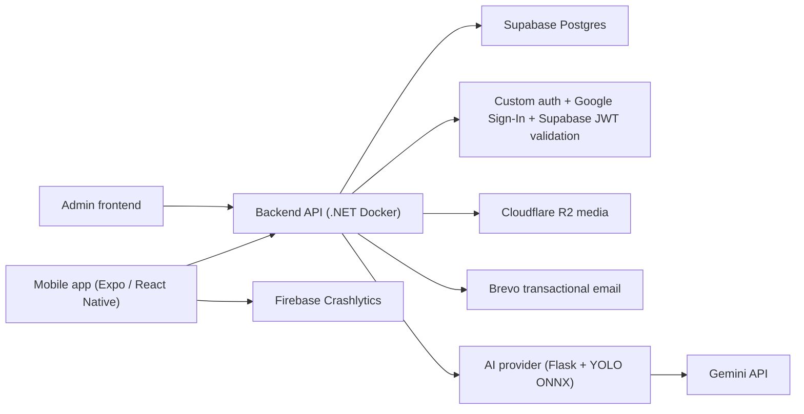

# EatFitAI - đánh giá hạ tầng production và bài toán chi phí 1 năm

Ngày lập: 2026-05-06  
Phạm vi: mobile app + ASP.NET Core API + Python AI provider + DB/Auth/media/email/build/monitoring  
Đơn vị tiền: USD/tháng và USD/năm  
Mức độ chính xác: ước tính theo cấu hình repo và giá công khai tại thời điểm lập tài liệu, chưa thay cho báo giá/chốt invoice thực tế.

## 1. Kết luận ngắn

Hạ tầng hiện tại của EatFitAI **không sai hướng**. Các dịch vụ đang được chọn khá đúng theo từng trách nhiệm:

- Expo/EAS cho build mobile.
- Firebase Crashlytics cho crash mobile.
- Supabase Postgres/Auth cho DB/Auth.
- Cloudflare R2 cho media ảnh/audio.
- Render Docker cho backend và AI provider.
- Gemini API cho LLM/STT/AI reasoning.
- Brevo cho email verify/reset password.
- Vercel cho admin frontend origin.

Điểm yếu production lớn nhất hiện tại không phải là "dùng nhiều dịch vụ", mà là **runtime compute đang ở Render Free**:

- Backend API có cold start/sleep.
- AI provider nặng hơn backend, dễ cold start lâu hơn.
- Free runtime yếu CPU/RAM.
- Free/build/runtime quota có thể chặn deploy hoặc làm trải nghiệm app không ổn định.

Nếu mục tiêu là production thật trong 1 năm, chắc chắn cần nâng gói. Có 2 hướng hợp lý:

| Hướng | Khi nào chọn | Ước tính 1 năm |
|---|---|---:|
| Giữ setup hiện tại và nâng Render paid | Muốn deploy tiện nhất, ít vận hành server nhất | khoảng `$1,668-$3,564/năm` |
| Tối ưu chi phí bằng AWS Lightsail cho runtime | Muốn server 24/7 rẻ hơn, chấp nhận setup CI/CD/server | khoảng `$1,200-$2,616/năm` |

Khuyến nghị của tài liệu này:

> Giữ Supabase + R2 + Gemini + Brevo + EAS + Firebase. Chỉ đổi/nâng phần runtime backend và AI provider. Nếu ưu tiên tiết kiệm 1 năm, dùng AWS Lightsail cho backend/AI. Nếu ưu tiên tiện triển khai, dùng Render paid.

## 2. Repo hiện tại đang cho thấy điều gì

Đánh giá này dựa vào repo/config/docs local, chưa dựa vào live metrics vì Render MCP chưa có workspace được chọn trong phiên hiện tại.

| Nguồn trong repo | Ý nghĩa hạ tầng |
|---|---|
| `render.yaml` | Có 2 web service Docker: `eatfitai-backend` và `eatfitai-ai-provider`, đều đang `plan: free`, `region: singapore`. |
| `eatfitai-backend/appsettings.Production.json` | Backend production lấy DB, Supabase, R2, Brevo, Google, AI provider qua env/secret store. |
| `eatfitai-backend/Program.cs` | Backend có health checks, hosted/background services, Supabase health, R2 media, Brevo email, JWT/Auth, AI health background checks. |
| `ai-provider/app.py` | AI provider là Flask + YOLO ONNX + Gemini; không chỉ là API nhẹ. |
| `ai-provider/README.md` | Production AI provider dùng Gemini, ONNX CPU, Postgres state cho Gemini usage. |
| `eatfitai-mobile/eas.json` | Mobile build đang trỏ backend Render URL và media R2 public URL qua EAS env. |
| `docs/29_MEDIA_EGRESS_AND_PRODUCTION_COST_STRATEGY_2026-04-27.md` | Đã từng có vấn đề egress Supabase Storage, nên R2 là quyết định hợp lý. |
| `docs/30_SERVICE_RISK_REGISTER_2026-04-27.md` | Đã ghi nhận rủi ro Render free, R2 custom domain, Supabase backup/PITR, Gemini quota, secrets. |
| `docs/42_PRODUCT_SYSTEM_AI_FLOW_ARCHITECTURE_2026-05-01.md` | Kiến trúc hệ thống đã tách mobile, backend, DB, media, AI provider đúng hướng. |

Giới hạn của đánh giá:

- Chưa có số CPU/RAM/request thực tế từ Render.
- Chưa có invoice Supabase/R2/Gemini thực tế.
- Chưa có số lượng user/scan/ngày chính xác.
- Vì vậy chi phí là **range hợp lý**, không phải cam kết billing.

## 3. Kiến trúc logic hiện tại

Đây là mô hình khá chuẩn cho mobile app có AI:

- Mobile không giữ business logic nặng.
- Backend API là nơi kiểm soát auth, quyền, diary/food/profile/admin.
- DB/Auth dùng managed service.
- Media tách khỏi database.
- AI provider tách khỏi API chính vì AI nặng CPU/RAM.
- LLM nằm sau provider riêng, không gọi thẳng từ mobile.

Nhiều dịch vụ không tự động đồng nghĩa với hạ tầng rối. Nó chỉ rối nếu:

- Một trách nhiệm bị chia cho nhiều bên không rõ ràng.
- URL vendor bị hardcode vào mobile.
- Secrets rải trong app/client.
- Không có monitoring/backup/budget.
- Không có kế hoạch đổi provider bằng env/domain.

Hiện tại EatFitAI đang tách trách nhiệm khá rõ. Việc cần làm là nâng production discipline, không phải gom hết vào một cloud.

## 4. Inventory hạ tầng hiện tại

| Khối | Dịch vụ hiện tại | Vai trò | Đánh giá production |
|---|---|---|---|
| Mobile build | Expo/EAS | Build APK/AAB/IPA, credentials, store profiles | Rất phù hợp. |
| Mobile crash | Firebase Crashlytics | Crash/error telemetry mobile | Phù hợp. |
| Auth | Backend custom auth + Google Sign-In + Supabase JWT validation | Login/register/google/session validation | Phù hợp nếu audit kỹ. |
| Backend API | Render Docker Free | ASP.NET Core API | Kiến trúc đúng, gói free không đủ production. |
| AI provider | Render Docker Free | Flask + YOLO ONNX + Gemini | Tách đúng, gói free yếu nhất hệ thống. |
| Database | Supabase Postgres | user/diary/food/admin/quota state | Phù hợp, cần nâng Pro. |
| Media | Cloudflare R2 + Supabase Storage legacy | ảnh món ăn/avatar/audio | R2 rất phù hợp, Supabase Storage chỉ nên legacy. |
| LLM/STT | Gemini API | nutrition, voice, cooking, advice | Phù hợp, cần kiểm soát quota/cost. |
| Email | Brevo | verify/reset password | Phù hợp cho email. Không phải auth provider. |
| Admin target | Vercel allowlisted | admin frontend origin | Phù hợp nếu admin nhỏ. |
| Training | Colab/Kaggle/Roboflow scripts | train YOLO/dataset | Phù hợp cho offline training, không phải runtime. |

## 5. Giả định để tính chi phí 1 năm

So sánh dưới đây dùng cùng một mức traffic/user cho cả 2 hướng.

Giả định chung:

- Cùng số user.
- Cùng số lần mở app.
- Cùng số ảnh/audio upload.
- Cùng số lần gọi AI/Gemini.
- Cùng email verify/reset.
- Cùng mobile build workflow.
- Cùng DB/Auth usage.
- Target region chính: Việt Nam/Southeast Asia, ưu tiên Singapore nếu có.

Không tính trong bảng:

- Thuế/VAT.
- Chênh lệch tỷ giá.
- Phí Apple Developer/Google Play Console.
- Domain registration.
- Chi phí nhân sự vận hành.
- Chi phí marketing/acquisition.
- Chi phí GPU training.
- Chi phí legal/compliance.

Production year-one giả định:

- Chưa cần Kubernetes.
- Chưa cần multi-region active-active.
- Chưa cần GPU server 24/7.
- Chưa dời DB sang AWS RDS.
- Chưa bật Supabase PITR mặc định.
- Chưa cần load balancer riêng nếu dùng 1 backend instance.

## 6. Chi phí chung giống nhau giữa các phương án

Các chi phí này gần như giống nhau dù runtime chạy trên Render paid hay AWS Lightsail.

| Dịch vụ | Gói/thiết lập hợp lý | Ước tính tháng | Ước tính năm | Ghi chú |
|---|---|---:|---:|---|
| Supabase | Pro, Micro compute ban đầu | `$25` | `$300` | Pro phù hợp cho production nhỏ/vừa; có quota cao hơn Free. |
| Cloudflare R2 | Standard storage + custom domain | `$1-$10` | `$12-$120` | Egress internet free, nhưng storage và request vẫn tính phí. |
| Gemini API | Paid billing | `$5-$50+` | `$60-$600+` | Phụ thuộc mạnh vào số scan/voice/token. |
| Expo/EAS | Starter hoặc gói tương đương | `$19` | `$228` | Có thể giữ free nếu build ít, nhưng production nên dự trù paid. |
| Brevo | Starter/Standard | `$9-$18` | `$108-$216` | Dùng cho email. SMS/phone auth là bài toán riêng. |
| Firebase Crashlytics | Crashlytics no-cost | `$0` | `$0` | Cẩn thận nếu bật thêm sản phẩm Firebase tính phí. |
| Admin frontend | Vercel Hobby/Pro hoặc static host | `$0-$20` | `$0-$240` | Admin nhỏ có thể vẫn $0. |
| Monitoring/backup phụ | Uptime monitor, log/backup job | `$5-$15` | `$60-$180` | Uptime check, backup job, log retention phụ. |

Subtotal chi phí chung:

| Mức | Theo tháng | Theo năm |
|---|---:|---:|
| Thấp | khoảng `$64` | khoảng `$768` |
| Cao | khoảng `$162` | khoảng `$1,944` |

Lưu ý: Gemini là biến số lớn nhất. Một app AI có thể tiết kiệm runtime nhưng vẫn tăng bill vì gọi LLM/voice quá nhiều.

## 7. Phương án A - giữ setup hiện tại và nâng lên production bằng Render paid

Ý nghĩa:

- Vẫn dùng Render làm nơi chạy backend và AI provider.
- Không còn dùng Render Free.
- Giữ auto deploy từ Git.
- Giữ Docker service boundary hiện tại.
- Giữ Supabase/R2/Gemini/Brevo/EAS/Firebase như hiện tại.

### 7.1 Runtime sizing đề xuất

| Service | Gói Render hợp lý | Ước tính tháng | Lý do |
|---|---|---:|---|
| Backend API | Standard, khoảng 2 GB RAM / 1 CPU | `$25` | Đủ cho ASP.NET Core API production nhỏ/beta. |
| AI provider lean | Standard, khoảng 2 GB RAM / 1 CPU | `$25` | Chỉ dùng nếu YOLO ONNX/OpenCV ổn trong 2GB. |
| AI provider an toàn hơn | Pro, khoảng 4 GB RAM / 2 CPU | `$85` | Thực tế hơn cho Python + OpenCV + ONNX + xử lý ảnh. |
| Render workspace Pro | Pro workspace | khoảng `$25` | Nên tính nếu dùng Render như production/team platform. |

### 7.2 Chi phí Render route

| Biến thể | Runtime/tháng | Chi phí chung/tháng | Tổng/tháng | Tổng/năm |
|---|---:|---:|---:|---:|
| Render paid lean | `$25 backend + $25 AI + $25 workspace = $75` | `$64-$162` | `$139-$237` | `$1,668-$2,844` |
| Render paid an toàn hơn | `$25 backend + $85 AI + $25 workspace = $135` | `$64-$162` | `$199-$297` | `$2,388-$3,564` |

Nếu bỏ Render Pro workspace và chỉ dùng paid compute trên workspace thấp hơn, chi phí có thể giảm. Nhưng nếu nói theo hướng "app chuyên nghiệp", nên dự trù workspace production đúng nghĩa thay vì chỉ tính máy chạy.

### 7.3 Ưu điểm

- Ít thay đổi nhất so với hiện tại.
- Deploy tiện nhất.
- Auto deploy, health check, TLS, custom domain, rollback dễ hơn tự vận hành VPS.
- Không phải tự lo patch server, Docker daemon, firewall, log rotation.
- Phù hợp nếu cần ra production nhanh.

### 7.4 Nhược điểm

- Đắt hơn AWS Lightsail nếu AI provider cần nhiều RAM.
- AI provider có thể là phần đội giá nhanh.
- Vẫn phụ thuộc Render build/deploy pipeline.
- Ít kiểm soát runtime thấp hơn VPS/EC2.

### 7.5 Khi nào nên chọn Render paid

Chọn Render paid nếu:

- Bạn muốn đi production nhanh.
- Bạn muốn giữ trải nghiệm dev hiện tại.
- Bạn chưa muốn tự quản lý Linux server.
- Bạn chấp nhận trả thêm để giảm vận hành.

## 8. Phương án B - tối ưu chi phí bằng AWS Lightsail cho runtime

Ý nghĩa:

- Backend API chuyển sang AWS Lightsail.
- AI provider chuyển sang AWS Lightsail riêng hoặc cùng máy giai đoạn đầu.
- Vẫn giữ Supabase Pro, R2, Gemini, Brevo, EAS, Firebase.
- Dùng Docker Compose/systemd/Caddy hoặc Nginx.
- Dùng GitHub Actions deploy qua SSH hoặc pull image/restart container.

### 8.1 Runtime sizing đề xuất

| Service | Gói Lightsail hợp lý | Ước tính tháng | Lý do |
|---|---|---:|---|
| Backend API | Linux/Unix public IPv4, 2 GB RAM / 2 vCPU / 60 GB SSD | `$12` | Baseline tốt cho ASP.NET Core API chạy 24/7. |
| AI provider lean | Linux/Unix public IPv4, 4 GB RAM / 2 vCPU / 80 GB SSD | `$24` | Hợp lý cho AI provider CPU-only ở giai đoạn đầu. |
| AI provider an toàn hơn | Linux/Unix public IPv4, 8 GB RAM / 2 vCPU / 160 GB SSD | `$44` | An toàn hơn nếu model/OpenCV/ONNX ăn RAM. |

### 8.2 Chi phí AWS Lightsail route

| Biến thể | Runtime/tháng | Chi phí chung/tháng | Tổng/tháng | Tổng/năm |
|---|---:|---:|---:|---:|
| Lightsail cân bằng | `$12 backend + $24 AI = $36` | `$64-$162` | `$100-$198` | `$1,200-$2,376` |
| Lightsail AI an toàn hơn | `$12 backend + $44 AI = $56` | `$64-$162` | `$120-$218` | `$1,440-$2,616` |
| Cực tiết kiệm, backend + AI chung 1 VM | `$24-$44` | `$64-$162` | `$88-$206` | `$1,056-$2,472` |

Biến thể "backend + AI chung 1 VM" rẻ nhất nhưng không khuyến nghị làm production lâu dài. AI có thể spike CPU/RAM và kéo chậm backend. Nếu dùng tạm, phải:

- Chạy Docker container riêng.
- Set memory/CPU limits.
- Giữ `AIProvider__VisionBaseUrl` như endpoint riêng.
- Chuẩn bị tách AI sang máy riêng chỉ bằng đổi env/domain.

### 8.3 Ưu điểm

- Chi phí runtime 24/7 thấp hơn Render paid.
- Hết cold start nếu instance chạy liên tục.
- Nhiều RAM hơn trên mỗi USD, đặc biệt có lợi cho AI provider.
- Kiểm soát server tốt hơn.
- Dễ chạy cron backup/log/monitoring agent.
- Dễ nâng size hoặc tách backend/AI về sau nếu dùng domain/env chuẩn.

### 8.4 Nhược điểm

- Lần đầu setup khó hơn Render.
- Phải tự lo server update, firewall, Docker restart, TLS, log rotation, disk usage.
- Rollback phải tự thiết kế.
- CI/CD phải tự dựng.
- AWS billing cần budget alert để tránh quên tài nguyên.

### 8.5 Khi nào nên chọn AWS Lightsail

Chọn AWS Lightsail nếu:

- Bạn muốn tối ưu chi phí 1 năm.
- Bạn muốn backend/AI sống 24/7.
- Bạn chấp nhận vận hành server ở mức vừa phải.
- AI provider cần nhiều RAM hơn gói Render rẻ.

## 9. Phương án C - dời toàn bộ sang AWS managed stack

Ý nghĩa:

- Backend/AI sang ECS/Fargate/EC2.
- DB sang RDS.
- Auth sang Cognito.
- Media sang S3/CloudFront.
- Email sang SES.
- Logs/metrics sang CloudWatch.
- Secrets sang SSM/Secrets Manager.

Không khuyến nghị cho năm production đầu.

Lý do:

- Sửa nhiều hơn.
- Rủi ro migration cao hơn.
- Cognito/Auth migration không nhỏ.
- RDS chỉ thay DB, không thay toàn bộ Supabase Auth/JWT/dashboard tooling.
- S3/CloudFront mạnh nhưng media egress có thể tốn hơn R2.
- ECS/Fargate + ALB thường đắt hơn Lightsail cho traffic nhỏ/vừa.

Chỉ nên cân nhắc nếu:

- Có yêu cầu compliance/enterprise.
- Có ngân sách DevOps.
- Có traffic đủ lớn để cần autoscaling/multi-instance nghiêm túc.
- Có lý do chiến lược phải gom toàn bộ vào AWS.

## 10. Bảng so sánh tổng thể

| Tiêu chí | Giữ setup hiện tại + Render paid | AWS Lightsail tối ưu chi phí |
|---|---|---|
| Chi phí 1 năm | Cao hơn | Thấp hơn |
| Độ tiện deploy | Rất cao | Trung bình lúc đầu, tốt sau khi có CI/CD |
| Cold start | Hết trên paid runtime | Hết nếu instance chạy 24/7 |
| Sửa code backend | Gần như không | Gần như không nếu giữ Docker/env |
| Sửa code mobile | Không nếu dùng domain ổn định | Không nếu dùng domain ổn định |
| Sửa DB/Auth | Không | Không |
| Sửa media | Không | Không |
| Vận hành server | Thấp | Trung bình |
| Rollback | Dễ | Cần tự làm |
| Log/monitoring | Có sẵn hơn | Cần setup thêm |
| Scale ngắn hạn | Nâng plan Render | Nâng Lightsail size/tách service |
| Scale dài hạn | Render autoscale/managed | Tách instance, sau này thêm LB/ECS nếu cần |
| Phù hợp nhất khi | Muốn nhanh, ít ops | Muốn tiết kiệm mà vẫn production |

## 11. Vì sao hiện tại chọn những bên này là hợp lý

### 11.1 Expo/EAS

Chọn hiện tại: Expo/EAS.

Vì sao hợp:

- Mobile app là Expo/React Native.
- EAS là đường tự nhiên nhất cho Expo app.
- Quản lý build profile, native credentials, Android/iOS build tốt hơn tự dựng từ đầu.

Sao không chọn Bitrise/Codemagic/GitHub Actions:

- Các lựa chọn đó hợp lệ.
- Nhưng với Expo app, EAS giảm nhiều cấu hình native build.
- Đổi sang bên khác không giải quyết bottleneck hiện tại.

Khuyến nghị:

- Giữ EAS.
- Nâng plan khi cần build production ổn định/team workflow.

### 11.2 Firebase Crashlytics

Chọn hiện tại: Firebase Crashlytics.

Vì sao hợp:

- Chuẩn phổ biến cho mobile crash reporting.
- Dễ tích hợp với Android/iOS.
- Không bắt buộc phải dùng Firebase cho toàn bộ backend.

Sao không chọn Sentry/Bugsnag/Datadog:

- Sentry tốt nếu cần full-stack error tracking.
- Datadog mạnh nhưng quá đắt/quá nặng cho năm đầu.
- Crashlytics đủ cho crash mobile.

Khuyến nghị:

- Giữ Crashlytics.
- Thêm Sentry sau nếu muốn gom mobile/backend/frontend error correlation.

### 11.3 Supabase Postgres/Auth

Chọn hiện tại: Supabase Postgres/Auth.

Vì sao hợp:

- Backend .NET/EF Core hợp với Postgres.
- App có user/diary/food/admin/quota state dạng relational.
- Supabase có managed Postgres, Auth/JWT ecosystem, dashboard, connection pooling, backup.
- Repo đã có Supabase/JWT/connection config.

Sao không chọn AWS RDS:

- RDS mạnh nhưng chỉ là DB.
- Bạn sẽ phải tự xử lý Auth/JWT/admin tooling nhiều hơn.
- Migration từ Supabase sang RDS không giải quyết cold start.
- Hiện bottleneck chính là runtime compute, không phải DB.

Sao không chọn Firebase/Firestore:

- Firestore là document database, không hợp nếu app đang dùng relational model.
- Đổi sang Firebase là đổi kiến trúc data lớn.
- Không đáng nếu Supabase đang chạy đúng vai trò.

Sao không chọn Neon:

- Neon Postgres tốt.
- Nhưng Supabase đang có DB + Auth + dashboard + project ecosystem.
- Dời sang Neon vẫn phải thêm auth provider khác.

Khuyến nghị:

- Giữ Supabase.
- Nâng Supabase Pro cho production.
- Audit RLS/security.
- Thêm offsite `pg_dump` lên R2.
- Chỉ bật PITR khi rủi ro mất dữ liệu/người dùng/doanh thu đủ lớn.

### 11.4 Cloudflare R2

Chọn hiện tại: Cloudflare R2.

Vì sao hợp:

- EatFitAI có ảnh món ăn/avatar/audio.
- R2 không tính egress internet, rất hợp app media-heavy.
- Repo đã dùng S3-compatible SDK cho R2.
- Docs trong repo đã ghi nhận Supabase Storage egress từng là vấn đề.

Sao không chọn Supabase Storage làm media chính:

- Supabase Storage tiện, nhưng public media egress có thể tăng bill.
- Backup DB không restore file object.
- R2 đã giải quyết đúng pain point cũ.

Sao không chọn AWS S3:

- S3 rất mạnh.
- Nhưng media public có thể tốn egress hơn R2.
- Vì R2 đã tích hợp, dời sang S3 không có lợi rõ trong năm đầu.

Khuyến nghị:

- Giữ R2.
- Gắn custom domain `media.eatfitai.com`.
- Giữ thumb/medium variant, WebP, cache headers.
- Không quay lại public Supabase Storage làm media chính.

### 11.5 Render

Chọn hiện tại: Render Docker.

Vì sao hợp lúc dev/beta:

- Auto deploy rất tiện.
- Docker phù hợp với backend .NET và AI provider.
- Blueprint `render.yaml` đã có.
- Tốc độ phát triển nhanh.

Vì sao yếu khi production nếu vẫn free:

- Cold start.
- RAM/CPU yếu.
- Có thể gặp giới hạn build/deploy.
- AI provider nặng hơn free runtime.

Sao không chọn AWS ngay từ đầu:

- AWS setup khó hơn.
- Phải tự lo CI/CD, SSL, firewall, server update.
- Với dev phase, Render giúp đi nhanh hơn.

Khuyến nghị:

- Nếu muốn tiện nhất: nâng Render paid.
- Nếu muốn tối ưu chi phí: chuyển backend/AI runtime sang AWS Lightsail.

### 11.6 Gemini API

Chọn hiện tại: Gemini API.

Vì sao hợp:

- Code đã tích hợp Gemini.
- App cần multimodal/nutrition/cooking/voice-like flows.
- Gemini có nhóm model giá tốt cho nhiều tác vụ AI phổ thông.

Sao không chọn OpenAI/Claude/Bedrock ngay:

- Các provider đó đều hợp lệ.
- Nhưng đổi provider cần test output, JSON schema, prompt, rate limit, cost.
- Hiện rủi ro chính là quota/cost control, không phải bắt buộc đổi model.

Khuyến nghị:

- Giữ Gemini.
- Thêm budget alert.
- Thêm quota theo user/tính năng.
- Theo dõi cost per scan/cost per voice.
- Chuẩn bị abstraction layer nếu sau này cần fallback OpenAI/Claude.

### 11.7 Brevo

Chọn hiện tại: Brevo.

Vì sao hợp:

- Hợp cho transactional email.
- Verify/reset password là use case đúng.
- Dễ vận hành hơn SES ở giai đoạn đầu.

Điểm cần nói rõ:

> Brevo không phải auth provider. Brevo chỉ là kênh gửi email/SMS.

Auth thật phải nằm ở:

- Backend custom auth.
- Supabase Auth.
- Firebase Auth.
- Twilio Verify.
- Auth0/Cognito.

Sao không chọn SES:

- SES rẻ hơn ở scale.
- Nhưng setup deliverability, domain reputation, sandbox, bounce/complaint handling khó hơn.
- Năm đầu dùng Brevo đơn giản hơn.

Sao không chọn SendGrid/Postmark/Mailgun:

- Đều hợp lệ.
- Postmark rất tốt cho transactional email nhưng thường đắt hơn.
- SendGrid/Mailgun không làm auth đơn giản hơn.
- Brevo hiện đã đủ cho email verify/reset.

Khuyến nghị:

- Giữ Brevo cho email.
- Không dùng Brevo làm lớp auth.
- Nếu thêm phone login/OTP production, dùng Twilio Verify, Firebase Phone Auth, hoặc Supabase Phone Auth với SMS provider đúng nghĩa.

### 11.8 Vercel admin

Chọn hiện tại: Vercel allowlisted admin origin.

Vì sao hợp:

- Admin frontend thường traffic thấp.
- Vercel deploy frontend rất nhanh.
- Custom domain/preview dễ.

Sao không chọn Cloudflare Pages/Netlify/AWS Amplify:

- Đều hợp lệ.
- Cloudflare Pages có thể rẻ và hợp nếu muốn gom với R2.
- Nhưng admin hiện không phải bottleneck chi phí/hạ tầng.

Khuyến nghị:

- Giữ Vercel nếu đang ổn.
- Đổi sang Cloudflare Pages chỉ khi muốn giảm chi phí hoặc gom frontend static với Cloudflare.

## 12. Brevo và auth: phân định trách nhiệm

Hiện tại EatFitAI đang có mô hình auth như sau:

| Trách nhiệm | Nơi xử lý đúng |
|---|---|
| Email/password login/register | Backend |
| Google Sign-In | Google + backend validation |
| JWT/session | Backend + Supabase JWT validation |
| Gửi email verify/reset | Brevo |

Brevo chỉ thuộc dòng cuối.

Nếu thêm số điện thoại:

| Nhu cầu | Nên dùng |
|---|---|
| Lưu phone trong profile | Backend DB, không cần SMS provider |
| Verify phone một lần | Twilio Verify/Firebase Phone Auth/Supabase Phone Auth |
| Login bằng phone OTP | Twilio Verify/Firebase Phone Auth/Supabase Phone Auth |
| Gửi SMS thông báo | Brevo SMS có thể dùng |

Nếu tự code OTP qua Brevo SMS, backend phải tự làm đủ:

- Chuẩn hóa số điện thoại E.164.
- Sinh OTP an toàn.
- Hash OTP trước khi lưu.
- Expiry ngắn.
- Resend cooldown.
- Attempt limit.
- Rate limit theo IP/device/phone.
- Audit logs.
- Chống SMS pumping.
- Budget cap.

Vì vậy production phone auth không nên là "Brevo SMS + code sơ sài".

## 13. Phân tích chi phí theo điểm tăng trưởng

| Thứ tăng lên | Ảnh hưởng chi phí | Ghi chú |
|---|---|---|
| User mở app nhiều hơn | Thấp đến trung bình | Runtime cố định cho đến khi CPU/RAM bão hòa. |
| Ảnh/audio upload/download nhiều hơn | Trung bình | R2 storage/request tăng; egress vẫn free. |
| AI scan nhiều hơn | Cao | Gemini + AI CPU là chi phí chính. |
| Voice/audio nhiều hơn | Cao | Audio token/minute và storage tăng nhanh. |
| MAU tăng | Thấp trong quota | Supabase Pro có quota lớn, chỉ tính overage sau quota. |
| Team/admin workflow tăng | Thấp đến trung bình | Có thể cần Vercel/EAS/Render team plan. |
| Cần PITR | Cao | Supabase PITR 7 ngày khoảng `$100/tháng`. |

Theo giai đoạn:

| Giai đoạn | Điểm nghẽn có khả năng xuất hiện |
|---|---|
| 10-50 user | Cold start, deploy reliability, monitoring. |
| 100-500 user | AI provider CPU/RAM, Gemini cost, ảnh/audio optimization. |
| 1,000-5,000 user | Queue cho AI, rate limits, DB indexes, R2 request pattern. |
| 10,000+ user | Supabase compute, Gemini spend, background jobs, multi-instance backend. |

## 14. Production readiness checklist

Trước khi public production, nên xử lý các mục này dù chọn Render paid hay AWS Lightsail.

| Nhóm | Việc cần làm |
|---|---|
| Runtime | Không dùng Render Free cho backend/AI production. |
| Domain | Dùng `api.eatfitai.com`, `media.eatfitai.com`, optional `ai.eatfitai.com`. |
| Mobile config | Mobile/EAS không trỏ raw Render/AWS URL. |
| Secrets | Rotate key từng lộ, service-role chỉ nằm server-side. |
| Supabase | Nâng Pro, audit RLS/security, xác nhận backup. |
| Backup | Scheduled `pg_dump` offsite lên R2/S3. |
| Media | R2 custom domain, cache headers, image variants. |
| AI cost | Per-user quota, feature quota, budget alert, key rotation. |
| Monitoring | Uptime check `/health/ready`, `/healthz`, critical user flows. |
| Logs | Log retention, error triage, request correlation ID. |
| Deploy | CI/CD rõ ràng, rollback rõ ràng. |
| Incident runbook | Có checklist khi backend/AI/DB/R2/Gemini/Brevo lỗi. |

## 15. Roadmap setup ít phải sửa về sau

### Phase 0 - chuẩn hóa domain/env trước khi dời runtime

Mục tiêu: sau này đổi Render/AWS không cần sửa mobile/backend logic.

Việc làm:

1. Tạo `api.eatfitai.com`.
2. Tạo `media.eatfitai.com`.
3. Cân nhắc `ai.eatfitai.com` hoặc internal private URL.
4. Mobile EAS chỉ dùng domain ổn định.
5. Backend gọi AI qua `AIProvider__VisionBaseUrl`.
6. Backend public media qua `Media__PublicBaseUrl`.
7. Không để mobile biết R2 secret/Supabase service-role.

### Phase 1 - production minimum

Mục tiêu: bỏ free-tier fragility.

Việc làm:

1. Nâng Supabase Pro.
2. Giữ R2 làm media chính.
3. Gắn custom domain cho R2.
4. Chuyển backend API sang paid runtime:
   - Render Standard nếu ưu tiên tiện.
   - AWS Lightsail 2GB nếu ưu tiên chi phí.
5. Bật uptime monitoring.
6. Thêm offsite DB backup.

### Phase 2 - harden AI provider

Mục tiêu: AI scan ổn định và kiểm soát chi phí.

Việc làm:

1. Chuyển AI provider sang paid runtime:
   - Render Pro 4GB nếu giữ Render.
   - Lightsail 4GB/8GB nếu tối ưu chi phí.
2. Giữ AI provider tách backend API.
3. Thêm timeout/concurrency limit.
4. Theo dõi Gemini usage theo user/tính năng.
5. Giới hạn ảnh/audio trước khi gửi Gemini.

### Phase 3 - scale không rewrite

Mục tiêu: tăng tải bằng infra/config, không sửa lõi app.

Việc làm:

1. Nâng backend instance size nếu CPU/RAM tăng.
2. Nâng AI instance riêng nếu AI chậm.
3. Thêm queue/background worker nếu AI blocking.
4. Chỉ nâng Supabase compute khi có bằng chứng query/connection/CPU.
5. Bật PITR khi business risk đủ lớn.

## 16. Quyết định đề xuất

Nếu hỏi "setup nào chuyên nghiệp và tối ưu nhất cho 1 năm đầu?", câu trả lời là:

| Khối | Quyết định đề xuất |
|---|---|
| Mobile build | Giữ Expo/EAS |
| Mobile crash | Giữ Firebase Crashlytics |
| Backend API | AWS Lightsail 2GB nếu tối ưu chi phí; Render Standard nếu ưu tiên tiện |
| AI provider | AWS Lightsail 4GB/8GB riêng nếu tối ưu chi phí; Render Pro nếu ưu tiên tiện |
| Database/Auth | Supabase Pro |
| Media | Cloudflare R2 + custom domain |
| LLM/STT | Gemini paid + quota/budget |
| Email | Brevo cho email |
| Phone auth | Twilio Verify/Firebase Phone Auth/Supabase Phone Auth, không dùng Brevo-only |
| Admin | Giữ Vercel nếu đang ổn |
| Monitoring | External uptime + logs + budget alerts |
| Backup | Supabase daily + offsite logical backup lên R2 |

Lựa chọn tốt nhất theo chi phí:

- Backend API: AWS Lightsail 2GB, khoảng `$12/tháng`.
- AI provider: AWS Lightsail 4GB, khoảng `$24/tháng`; nâng 8GB `$44/tháng` nếu cần.
- DB/Auth: Supabase Pro, khoảng `$25/tháng`.
- Media: R2, khoảng `$1-$10/tháng` giai đoạn đầu.
- Mobile build: EAS Starter, khoảng `$19/tháng`.
- Email: Brevo Starter/Standard, khoảng `$9-$18/tháng`.
- Gemini: usage-based, cần kiểm soát như chi phí biến đổi lớn nhất.

Expected 1-year cost:

| Phương án | Ước tính năm |
|---|---:|
| AWS Lightsail lean | khoảng `$1,200/năm` |
| AWS Lightsail an toàn hơn | khoảng `$1,440-$2,616/năm` |
| Render paid tiện nhất | khoảng `$1,668-$3,564/năm` |

Kết luận cuối:

> Hạ tầng hiện tại của EatFitAI đang đúng hướng. Không cần đập đi xây lại. Production nên nâng runtime, DB plan, domain, monitoring, backup và budget control. Nếu muốn tối ưu chi phí 1 năm, chuyển backend/AI runtime sang AWS Lightsail. Nếu muốn triển khai nhanh và ít vận hành, nâng Render paid.

## 17. Nguồn giá và tài liệu đã đối chiếu

Nguồn chính thức/vendor:

- AWS Lightsail pricing: https://aws.amazon.com/lightsail/pricing/
- Render pricing: https://render.com/pricing
- Supabase billing: https://supabase.com/docs/guides/platform/billing-on-supabase
- Supabase compute usage: https://supabase.com/docs/guides/platform/manage-your-usage/compute
- Supabase backups and PITR: https://supabase.com/docs/guides/platform/backups
- Supabase storage pricing: https://supabase.com/docs/guides/storage/pricing
- Supabase MAU usage: https://supabase.com/docs/guides/platform/manage-your-usage/monthly-active-users
- Cloudflare R2 pricing: https://developers.cloudflare.com/r2/pricing/
- Gemini API pricing: https://ai.google.dev/gemini-api/docs/pricing
- Expo EAS pricing: https://expo.dev/pricing
- Brevo pricing: https://help.brevo.com/hc/en-us/articles/208589409-About-Brevo-s-pricing-plans
- Firebase pricing: https://firebase.google.com/pricing
- Twelve-Factor backing services: https://12factor.net/backing-services

