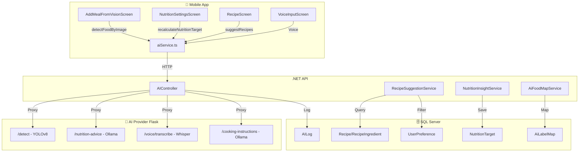

# 📊 AI System Evaluation - EatFitAI

## 🔄 AI Feature Data Flow



---

## 📋 AI Features - Field Mapping

### 1. AI Vision (Food Detection)

| Layer | Component | Fields |
|-------|-----------|--------|
| **FE** | `aiService.detectFoodByImage()` | imageUri → VisionDetectResult |
| **BE** | `AIController.DetectVision()` | IFormFile image → DetectionResultDto |
| **AI** | `/detect` | image → {detections, labels, confidences} |
| **DB** | `AILog` | UserId, RequestType, RequestData, ResponseData, CreatedAt |
| **DB** | `AiLabelMap` | Label, FoodItemId, MinConfidence |
| **DB** | `ImageDetection` | UserId, ImageHash, Detections, CreatedAt |

**Flow:**
```
Mobile → POST /api/ai/vision/detect (FormData: image)
     → Backend proxy → AI Provider /detect
     → YOLOv8 inference → Return detections
     → Backend: Match AiLabelMap → FoodItem
     → Log to AILog
     → Return mapped foods to Mobile
```

---

### 2. AI Nutrition (TDEE Calculation)

| Layer | Component | Fields |
|-------|-----------|--------|
| **FE** | `aiService.recalculateNutritionTarget()` | - → NutritionTarget |
| **BE** | `AIController.RecalculateNutritionTargets()` | UserProfile → NutritionTargetDto |
| **AI** | `/nutrition-advice` | {gender, age, height, weight, activity, goal} → {calories, protein, carbs, fat, source} |
| **DB** | `NutritionTarget` | UserId, TargetCalories, TargetProtein, TargetCarbs, TargetFat, Goal |
| **DB** | `User` | HeightCm, WeightKg, Gender, Birthday, ActivityLevel |

**Flow:**
```
Mobile → GET /api/ai/nutrition/recalculate
     → Backend: Get UserProfile from DB
     → Proxy to AI Provider /nutrition-advice
     → Ollama qwen2:1.5b inference (or fallback formula)
     → Save to NutritionTarget
     → Return to Mobile
```

---

### 3. AI Recipe Suggestion

| Layer | Component | Fields |
|-------|-----------|--------|
| **FE** | `aiService.suggestRecipes()` | ingredients[] → SuggestedRecipe[] |
| **FE** | `aiService.suggestRecipesEnhanced()` | RecipeSuggestionRequest → RecipeSuggestion[] |
| **BE** | `AIController.SuggestRecipes()` | RecipeSuggestionRequest → RecipeSuggestionResponse |
| **BE** | `RecipeSuggestionService` | Ingredients + UserPreference → Filtered Recipes |
| **DB** | `Recipe` | Id, Name, Description, Calories, Protein, Carbs, Fat |
| **DB** | `RecipeIngredient` | RecipeId, FoodItemId, Grams |
| **DB** | `UserPreference` | UserId, DietaryRestrictions, Allergies |

**Flow:**
```
Mobile → POST /api/ai/recipes/suggest {ingredients, userId}
     → Backend: Query Recipes matching ingredients
     → Get UserPreference (Vegetarian, Allergies)
     → GetForbiddenKeywords() → Filter out restricted
     → Score & rank matches
     → Return filtered recipes
```

---

### 4. AI Voice (Speech-to-Text)

| Layer | Component | Fields |
|-------|-----------|--------|
| **FE** | Voice Input Screen | audioUri → text |
| **BE** | `AIController` (TODO) | audio → text |
| **AI** | `/voice/transcribe` | audio file → {text, language, confidence} |
| **AI** | `/voice/parse` | text → {intent, entities} |

**Flow:**
```
Mobile → Record audio → Upload
     → Backend proxy → AI Provider /voice/transcribe
     → Whisper STT → Return text
     → (Optional) /voice/parse → Extract intent
```

---

### 5. AI Cooking Instructions

| Layer | Component | Fields |
|-------|-----------|--------|
| **FE** | `aiService.getCookingInstructions()` | recipeName, ingredients → {steps, cookingTime, difficulty} |
| **BE** | `AIController.GetCookingInstructions()` | CookingInstructionsRequest → CookingInstructionsResponse |
| **AI** | `/cooking-instructions` | {dish_name, ingredients} → {steps, time, difficulty} |

**Flow:**
```
Mobile → POST /api/ai/recipes/{id}/cooking-instructions
     → Backend: Check cache (IMemoryCache)
     → If miss: Proxy to AI Provider /cooking-instructions
     → Ollama generates instructions
     → Cache & Return
```

---

## ✅ Strengths (Điểm mạnh)

| # | Feature | Detail |
|---|---------|--------|
| 1 | **Modular Architecture** | AI Provider tách biệt, dễ upgrade models |
| 2 | **GPU Acceleration** | YOLO + Whisper trên CUDA |
| 3 | **Fallback Strategy** | PhoWhisper → Whisper, Ollama → Formula |
| 4 | **Caching** | Image hash + Memory cache for cooking instructions |
| 5 | **AiLabelMap** | Cho phép user dạy AI (teachLabel) |
| 6 | **Dietary Filtering** | Lọc recipe theo UserPreference |
| 7 | **Logging** | AILog lưu lại mọi request/response |

---

## ⚠️ Weaknesses (Điểm yếu)

| # | Issue | Severity | Recommendation |
|---|-------|----------|----------------|
| 1 | **Voice endpoint chưa hoàn thiện** | Medium | Implement /api/ai/voice/transcribe |
| 2 | **PhoWhisper cần HF_TOKEN** | Low | Đã có fallback Whisper |
| 3 | **Ollama chạy trên CPU chậm** | Low | Đã fix với GPU |
| 4 | **Recipe DB limited** | Medium | Thêm nhiều công thức Việt Nam |
| 5 | **No offline mode** | Low | Cache results for offline |
| 6 | **AILog không có cleanup** | Low | Thêm job xóa log cũ |
| 7 | **Thiếu unit tests cho AI services** | Medium | Thêm test coverage |

---

## 📈 Performance Benchmarks

| Feature | CPU Time | GPU Time | Status |
|---------|----------|----------|--------|
| Vision Detection | ~3s | ~0.5s | ✅ |
| Nutrition Advice | ~1.7s | ~1.7s | ✅ (Ollama) |
| Voice Transcribe | ~5s | ~1s | ✅ |
| Cooking Instructions | ~10s | ~10s | ✅ (Ollama) |
