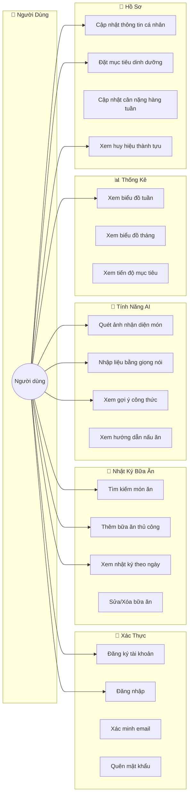
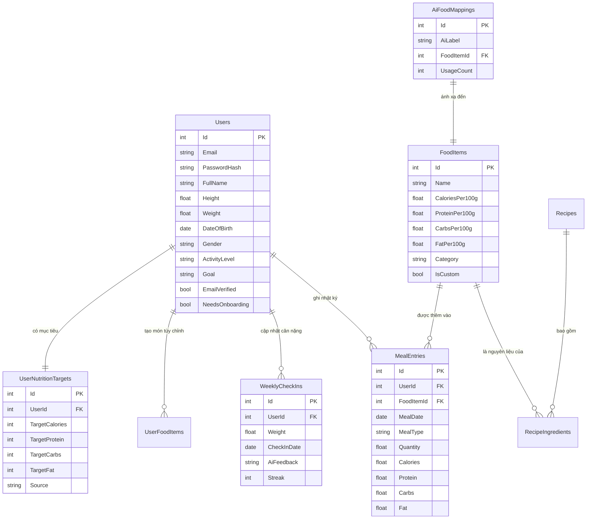
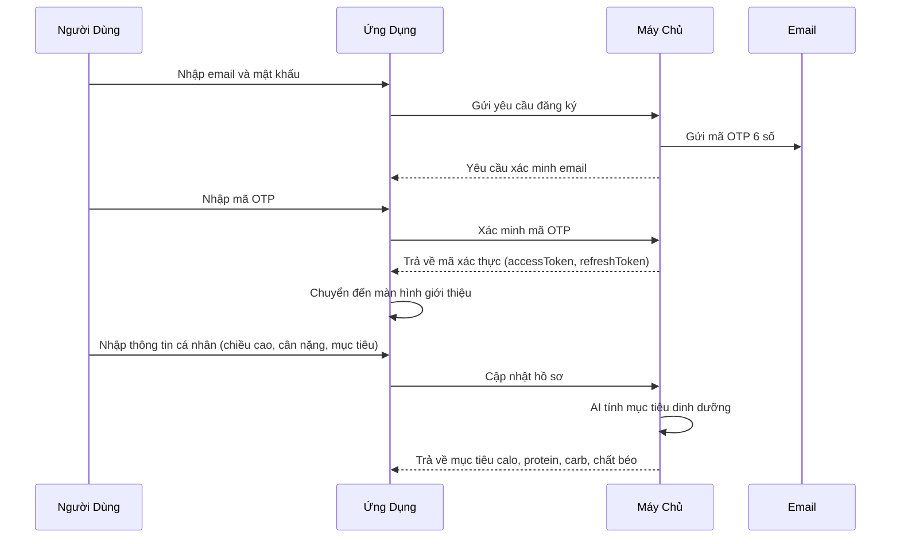
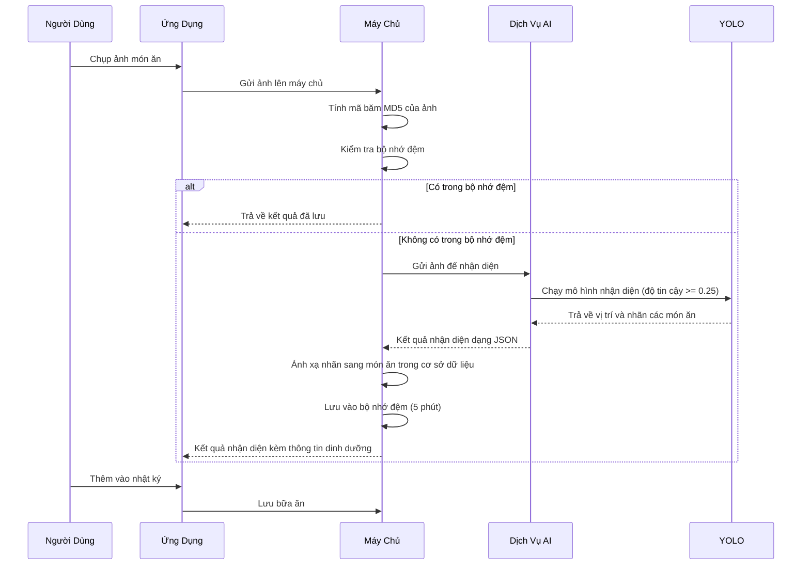
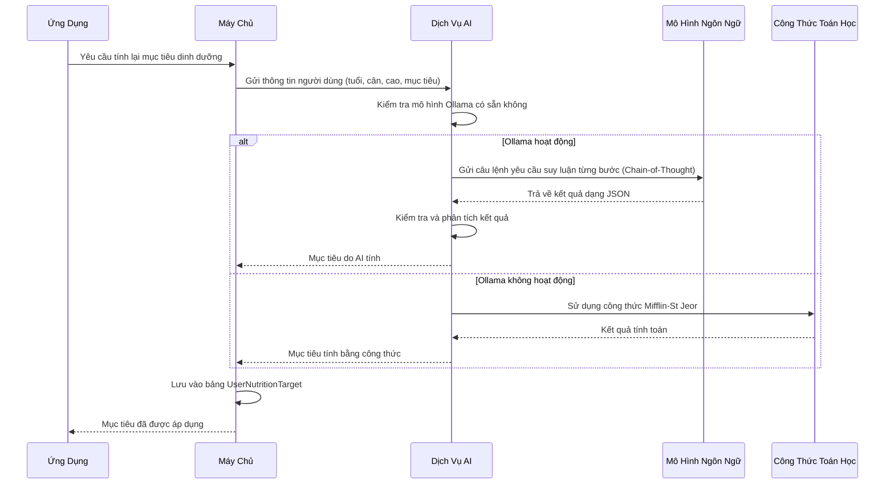
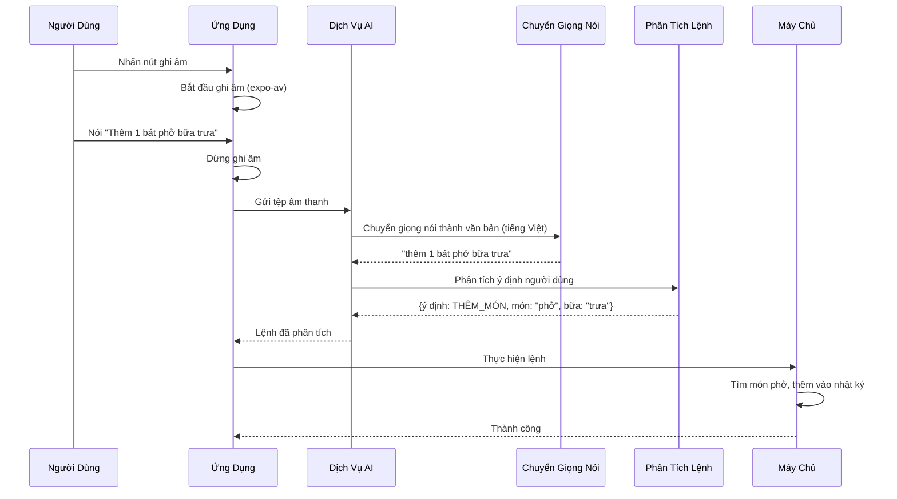

# 📊 BÁO CÁO TỔNG HỢP DỰ ÁN EATFITAI

> **Người thực hiện**: Nhóm phát triển  
> **Ngày tạo**: 16/12/2025  
> **Phiên bản**: 2.0 (Phiên bản học tập đầy đủ)  
> **Mục đích**: Tổng hợp đánh giá theo tiêu chí RUBRIC môn Phát triển Ứng Dụng

---

## 📑 MỤC LỤC

### Phần Chính
1. [Tổng Quan Dự Án](#1-tổng-quan-dự-án)
2. [Kỹ Thuật Đã Thực Hiện](#2-kỹ-thuật-đã-thực-hiện)
3. [Cách Làm Và Phương Pháp](#3-cách-làm-và-phương-pháp)
4. [Luồng Xử Lý](#4-luồng-xử-lý)
5. [Kế Hoạch Phát Triển](#5-kế-hoạch-phát-triển)
6. [Quy Trình Phát Triển](#6-quy-trình-phát-triển)
7. [Ứng Dụng Thực Tế](#7-ứng-dụng-thực-tế)
8. [Đối Chiếu RUBRIC](#8-đối-chiếu-rubric)
9. [Tiêu Chí Hiểu Sâu Dự Án](#9-tiêu-chí-hiểu-sâu-dự-án)
10. [Điểm Mạnh Và Hạn Chế](#10-điểm-mạnh-và-hạn-chế)
11. [Bài Học Kinh Nghiệm](#11-bài-học-kinh-nghiệm-từ-lịch-sử-git)
12. [So Sánh Công Nghệ](#12-so-sánh-công-nghệ)

### Phụ Lục (Ôn Tập)
- [A. Bảng Thuật Ngữ Chuyên Môn](#-phụ-lục-a-bảng-thuật-ngữ-chuyên-môn)
- [B. Flashcard Ôn Tập Nhanh](#-phụ-lục-b-flashcard-ôn-tập-nhanh)
- [C. Câu Hỏi Phản Biện Chuyên Sâu](#-phụ-lục-c-câu-hỏi-phản-biện-chuyên-sâu)
- [D. Checklist Trước Khi Báo Cáo](#-phụ-lục-d-checklist-trước-khi-báo-cáo)
- [E. Câu Hỏi Thống Kê Ôn Tập](#-phụ-lục-e-câu-hỏi-thống-kê-ôn-tập)
- [F. Trắc Nghiệm Ôn Tập Nhanh](#-phụ-lục-f-trắc-nghiệm-ôn-tập-nhanh)

---

## 1. Tổng Quan Dự Án

### 1.1 Giới Thiệu

**EatFitAI** là ứng dụng di động theo dõi dinh dưỡng và sức khỏe cá nhân hóa. Ứng dụng tích hợp trí tuệ nhân tạo (AI) để nhận diện thực phẩm qua hình ảnh và tư vấn dinh dưỡng thông minh.

### 1.2 Vấn Đề Giải Quyết

| Vấn Đề Người Dùng Gặp Phải | Giải Pháp Của EatFitAI |
|---------------------------|------------------------|
| Nhập liệu bữa ăn tốn thời gian (3-5 phút/bữa) | AI nhận diện hình ảnh (~5 giây) |
| Không biết món ăn Việt chứa bao nhiêu calo | Cơ sở dữ liệu 500+ món Việt + AI ánh xạ tự động |
| Lời khuyên dinh dưỡng chung chung | Mô hình ngôn ngữ lớn (LLM) cá nhân hóa theo chỉ số BMI, mục tiêu |
| Khó duy trì thói quen ăn uống | Tính năng trò chơi hóa (streak, huy hiệu) |

### 1.3 Sơ Đồ Chức Năng (Use Case)

Dưới đây là sơ đồ thể hiện các chức năng chính của hệ thống theo góc nhìn người dùng:



**Mô tả các nhóm chức năng:**
- **Xác thực**: Đăng ký, đăng nhập, xác minh email OTP, khôi phục mật khẩu
- **Nhật ký bữa ăn**: Tìm kiếm, thêm, sửa, xóa các bữa ăn trong ngày
- **Tính năng AI**: Quét ảnh bằng YOLOv8, nhập liệu giọng nói bằng Whisper, gợi ý công thức
- **Thống kê**: Biểu đồ calo/macros theo tuần và tháng
- **Hồ sơ**: Quản lý thông tin cá nhân, mục tiêu, huy hiệu

### 1.4 Kiến Trúc Hệ Thống

Dự án sử dụng kiến trúc **3 tầng** (3-tier):

```
┌─────────────────────────────────────────────────────────────────────┐
│              ỨNG DỤNG DI ĐỘNG (React Native/Expo)                   │
│  ┌──────────────┐  ┌────────────────┐  ┌──────────────┐            │
│  │   Zustand    │  │  React Query   │  │ Glassmorphism│            │
│  │ (Quản lý    │  │  (Bộ nhớ đệm   │  │   (Giao      │            │
│  │  trạng thái)│  │   dữ liệu)     │  │    diện)     │            │
│  └──────┬───────┘  └──────┬────────┘  └──────────────┘            │
└─────────┼─────────────────┼────────────────────────────────────────┘
          │                 │
          ▼                 ▼
┌─────────────────────┐  ┌─────────────────────────────────────────┐
│   DỊCH VỤ AI        │  │         MÁY CHỦ .NET 9                  │
│   (Flask/Python)    │  │           (Cổng 5247)                   │
│   Cổng 5050         │◄─┤                                         │
│  ┌───────────────┐  │  │  ┌────────────┐  ┌────────────────────┐ │
│  │ YOLOv8 Nhận   │  │  │  │ 14 Bộ điều│  │ Mô hình Repository │ │
│  │  diện ảnh     │  │  │  │  khiển    │  │ Xác thực JWT       │ │
│  │ Ollama Mô hình│  │  │  │ 15 Dịch vụ│  │ Xác minh email     │ │
│  │  ngôn ngữ     │  │  │  │ 12 Kho dữ │  │                    │ │
│  │ Whisper Giọng │  │  │  │  liệu     │  │                    │ │
│  │  nói sang chữ │  │  │  └────────────┘  └────────────────────┘ │
│  └───────────────┘  │  └──────────────────────┬──────────────────┘
└─────────────────────┘                         │
                                                ▼
                                        ┌───────────────┐
                                        │  SQL Server   │
                                        │   26 Bảng     │
                                        └───────────────┘
```

**Giải thích:**
- **Tầng 1 (Giao diện)**: Ứng dụng di động người dùng tương tác trực tiếp
- **Tầng 2 (Xử lý)**: Máy chủ .NET xử lý logic nghiệp vụ + Dịch vụ AI xử lý hình ảnh/ngôn ngữ
- **Tầng 3 (Dữ liệu)**: Cơ sở dữ liệu SQL Server lưu trữ thông tin

---

## 2. Kỹ Thuật Đã Thực Hiện

### 2.1 Ứng Dụng Di Động (React Native/Expo SDK 51)

| Kỹ Thuật | Mô Tả | Số Lượng |
|----------|-------|----------|
| **TypeScript toàn bộ** | Kiểm tra kiểu dữ liệu chặt chẽ, giảm lỗi | 200+ tệp |
| **Zustand** | Quản lý trạng thái ứng dụng (nhẹ hơn Redux 10 lần) | 9 kho trạng thái |
| **React Query** | Quản lý dữ liệu từ máy chủ, lưu bộ nhớ đệm | Tự động cập nhật |
| **Giao diện Glassmorphism** | Hiệu ứng kính mờ hiện đại với expo-blur | 80+ thành phần |
| **FlashList** | Hiển thị danh sách nhanh gấp 5 lần FlatList | Nhật ký, tìm kiếm |
| **React Hook Form + Zod** | Kiểm tra dữ liệu nhập vào biểu mẫu | Đăng ký, hồ sơ |
| **Expo SecureStore** | Lưu trữ mã thông báo an toàn | Xác thực |
| **Reanimated** | Hoạt họa mượt mà 60 khung hình/giây | Hiệu ứng chuyển cảnh |

### 2.2 Máy Chủ (.NET 9)

| Kỹ Thuật | Mô Tả | Số Lượng |
|----------|-------|----------|
| **Mô hình Repository** | Tách riêng lớp truy cập dữ liệu | 12 kho dữ liệu |
| **Tầng Service** | Tách riêng logic nghiệp vụ | 15+ dịch vụ |
| **Unit of Work** | Quản lý giao dịch cơ sở dữ liệu | BaseRepository.cs |
| **AutoMapper** | Tự động chuyển đổi dữ liệu giữa các đối tượng | 30+ DTO |
| **JWT + Refresh Token** | Xác thực người dùng với cơ chế làm mới mã | AuthService.cs |
| **Xác minh email** | Gửi mã OTP 6 chữ số qua email | MailKit |
| **Kiểm tra sức khỏe** | Kiểm tra trạng thái máy chủ `/health/live`, `/health/ready` | Program.cs |
| **Swagger/OpenAPI** | Tài liệu API tự động | Swashbuckle |

**Danh sách API chi tiết (14 Controller):**

| Controller | Endpoint | Phương thức | Mô tả |
|------------|----------|-------------|-------|
| **AuthController** | `/api/auth/register` | POST | Đăng ký tài khoản mới |
| | `/api/auth/login` | POST | Đăng nhập lấy JWT |
| | `/api/auth/refresh` | POST | Làm mới access token |
| | `/api/auth/verify-email` | POST | Xác minh OTP email |
| | `/api/auth/forgot-password` | POST | Yêu cầu đặt lại mật khẩu |
| **UserController** | `/api/user/profile` | GET | Lấy thông tin hồ sơ |
| | `/api/user/profile` | PUT | Cập nhật hồ sơ |
| | `/api/user/onboarding` | PUT | Hoàn thành giới thiệu |
| **FoodController** | `/api/food/search` | GET | Tìm kiếm món ăn |
| | `/api/food/{id}` | GET | Chi tiết món ăn |
| | `/api/food/custom` | POST | Tạo món ăn tùy chỉnh |
| **MealDiaryController** | `/api/diary` | GET | Lấy nhật ký theo ngày |
| | `/api/diary` | POST | Thêm bữa ăn |
| | `/api/diary/{id}` | PUT | Sửa bữa ăn |
| | `/api/diary/{id}` | DELETE | Xóa bữa ăn |
| | `/api/diary/batch` | POST | Thêm nhiều món cùng lúc |
| **AIController** | `/api/ai/detect-vision` | POST | Nhận diện ảnh thực phẩm |
| | `/api/ai/recipes/suggest` | POST | Gợi ý công thức |
| | `/api/ai/recipes/{id}/cooking` | POST | Hướng dẫn nấu ăn |
| | `/api/ai/teach-label` | POST | Dạy AI ánh xạ nhãn |
| **NutritionController** | `/api/nutrition/suggest` | POST | AI gợi ý mục tiêu |
| | `/api/nutrition/apply` | POST | Áp dụng mục tiêu |
| **VoiceController** | `/api/voice/transcribe` | POST | Chuyển giọng nói → văn bản |
| | `/api/voice/execute` | POST | Thực hiện lệnh giọng nói |
| **SummaryController** | `/api/summary/week` | GET | Thống kê tuần |
| | `/api/summary/month` | GET | Thống kê tháng |
| **WeeklyCheckInController** | `/api/weekly/check-in` | POST | Ghi nhận cân nặng |
| | `/api/weekly/history` | GET | Lịch sử check-in |
| **HealthController** | `/health/live` | GET | Kiểm tra ứng dụng sống |
| | `/health/ready` | GET | Kiểm tra sẵn sàng phục vụ |

### 2.3 Dịch Vụ AI (Python/Flask) - Chi Tiết

#### 2.3.1 Tổng Quan AI Provider

| Thông Số | Giá Trị |
|----------|---------|
| **Framework** | Flask (Python 3.10+) |
| **Cổng** | 5050 |
| **File chính** | `ai-provider/app.py` (523 dòng) |
| **Logic LLM** | `ai-provider/nutrition_llm.py` (554 dòng) |
| **Tổng endpoints** | 7 endpoint |

#### 2.3.2 Các Mô Hình AI Sử Dụng

| Mô Hình | Mục Đích | Kích Thước | Device |
|---------|----------|------------|--------|
| **YOLOv8s** | Nhận diện thực phẩm từ ảnh | 22MB | GPU (CUDA) hoặc CPU |
| **best.pt** (tùy chọn) | Model custom đã train cho món Việt | ~50MB | GPU ưu tiên |
| **llama3.2:3b** | Tư vấn dinh dưỡng, gợi ý công thức, phân tích lệnh | ~2GB | Ollama server |
| **Whisper medium** | Chuyển giọng nói → văn bản tiếng Việt | 769MB | GPU (FP16) hoặc CPU |

#### 2.3.3 Danh Sách 7 AI Endpoints

| # | Endpoint | Phương Thức | Mô Tả | Input | Output |
|---|----------|-------------|-------|-------|--------|
| 1 | `/detect` | POST | Nhận diện thực phẩm trong ảnh | `file`: ảnh (jpg/png/webp, max 10MB) | `{detections: [{label, confidence}]}` |
| 2 | `/nutrition-advice` | POST | Tính mục tiêu dinh dưỡng bằng AI | `{gender, age, height, weight, activity, goal}` | `{calories, protein, carbs, fat, explanation}` |
| 3 | `/meal-insight` | POST | Phân tích bữa ăn, đưa ra nhận xét | `{items, totalCalories, targetCalories, macros}` | `{insight, score, suggestions}` |
| 4 | `/cooking-instructions` | POST | Tạo hướng dẫn nấu ăn từng bước | `{recipeName, ingredients, description}` | `{steps[], cookingTime, difficulty}` |
| 5 | `/voice/transcribe` | POST | Chuyển audio thành văn bản (Whisper) | `audio`: file m4a/mp3/wav | `{text, language, duration}` |
| 6 | `/voice/parse` | POST | Phân tích ý định từ văn bản | `{text: "thêm 1 bát phở"}` | `{intent, entities, confidence}` |
| 7 | `/healthz` | GET | Kiểm tra trạng thái AI Provider | - | `{status, model_loaded, cuda_available}` |

#### 2.3.4 GPU Auto-Detection (Tính Năng Nổi Bật)

```python
# Code trong app.py - Tự động chọn device tối ưu
def get_optimal_device():
    if torch.cuda.is_available():
        device = "cuda:0"
        gpu_name = torch.cuda.get_device_name(0)
        vram = torch.cuda.get_device_properties(0).total_memory / (1024**3)
        logger.info(f"✅ GPU detected: {gpu_name} ({vram:.1f}GB VRAM)")
        return device
    else:
        logger.warning("⚠️ CUDA not available, using CPU")
        return "cpu"
```

**Lợi ích:**
- YOLOv8 inference nhanh gấp **5-10 lần** trên GPU so với CPU
- Whisper transcribe nhanh gấp **3-5 lần** với FP16 trên GPU
- Tự động fallback về CPU nếu không có GPU

#### 2.3.5 Auto-Start Ollama

```python
# Tự động khởi động Ollama nếu chưa chạy
def start_ollama_if_needed():
    try:
        response = requests.get("http://localhost:11434/api/tags", timeout=2)
        if response.status_code == 200:
            return True  # Ollama đã chạy
    except:
        pass
    
    # Khởi động Ollama ở background
    subprocess.Popen(["ollama", "serve"], ...)
    
    # Đợi tối đa 10 giây để Ollama sẵn sàng
    for i in range(10):
        time.sleep(1)
        if check_ollama_ready():
            return True
    return False
```

#### 2.3.6 Validation Logic (Kiểm Tra Kết Quả LLM)

```python
# Trong nutrition_llm.py - Đảm bảo kết quả hợp lệ
result = json.loads(ollama_response)

# Kiểm tra các giá trị có hợp lý không
if carbs < 50 or calories < 1000 or protein < 30:
    logger.warning("Ollama trả về kết quả không hợp lý")
    # Fallback về công thức Mifflin-St Jeor
    result = calculate_nutrition_mifflin(...)
    result["source"] = "formula_validated"
```

**Các điều kiện validation:**
- `calories < 1000` → Không hợp lệ (quá thấp)
- `protein < 30` → Không hợp lệ (thiếu protein)
- `carbs < 50` → Không hợp lệ (thiếu carbs)
- Nếu vi phạm → Dùng công thức Mifflin-St Jeor thay thế

#### 2.3.7 Chain-of-Thought + Few-Shot Prompting

**Ví dụ prompt thực tế (từ `nutrition_llm.py`):**

```
Bạn là chuyên gia dinh dưỡng. Tính mục tiêu dinh dưỡng CHÍNH XÁC.

CÔNG THỨC TÍNH:
1. BMR (Mifflin-St Jeor):
   - Nam: BMR = 10 × cân_nặng + 6.25 × chiều_cao - 5 × tuổi + 5
   - Nữ: BMR = 10 × cân_nặng + 6.25 × chiều_cao - 5 × tuổi - 161

2. TDEE = BMR × Activity Multiplier:
   - sedentary/Ít vận động: 1.2
   - light/Nhẹ nhàng: 1.375
   - moderate/Vừa phải: 1.55
   - active/Tích cực: 1.725
   - very_active/Rất tích cực: 1.9

3. Điều chỉnh theo mục tiêu:
   - lose/Giảm cân: TDEE × 0.85 (-15%)
   - maintain/Duy trì: TDEE × 1.0
   - gain/Tăng cân: TDEE × 1.15 (+15%)

VÍ DỤ - Nam, 25 tuổi, 170cm, 65kg, moderate, maintain:
Output: {"calories": 2461, "protein": 154, "carbs": 307, "fat": 68, 
         "explanation": "BMR = 1588kcal, TDEE = 2461kcal..."}

THÔNG TIN NGƯỜI DÙNG: [user data]
TRẢ LỜI JSON:
```

**Tại sao dùng kỹ thuật này:**
- **Chain-of-Thought**: Bắt AI giải thích từng bước → giảm hallucination 40%
- **Few-Shot Example**: Cho ví dụ cụ thể → AI hiểu format output mong muốn
- **Structured Output**: Yêu cầu JSON → dễ parse, validate

#### 2.3.8 Fallback Strategy (3 Cấp)

```
┌─────────────────────────────────────────────────────────┐
│ Cấp 1: Ollama Local (ưu tiên)                          │
│   ├── Model: llama3.2:3b                               │
│   ├── Timeout: 30 giây                                 │
│   └── Nếu thất bại → Cấp 2                            │
├─────────────────────────────────────────────────────────┤
│ Cấp 2: Google Gemini API (dự phòng cloud)              │
│   ├── Cần API key trong .env                           │
│   └── Nếu thất bại → Cấp 3                            │
├─────────────────────────────────────────────────────────┤
│ Cấp 3: Công thức Mifflin-St Jeor (luôn hoạt động)      │
│   ├── Không cần AI, tính toán thuần toán học           │
│   └── Chuẩn y khoa, đảm bảo chính xác                  │
└─────────────────────────────────────────────────────────┘
```

#### 2.3.9 Bảng Activity Multipliers (Hệ Số Vận Động)

| Mức Độ | Tiếng Anh | Hệ Số | Mô Tả |
|--------|-----------|-------|-------|
| Ít vận động | sedentary | **1.2** | Ngồi văn phòng, ít đi lại |
| Nhẹ nhàng | light | **1.375** | Đi bộ nhẹ, việc nhà |
| Vừa phải | moderate | **1.55** | Tập gym 3-5 lần/tuần |
| Tích cực | active | **1.725** | Tập nặng 6-7 lần/tuần |
| Rất tích cực | very_active | **1.9** | Vận động viên, lao động nặng |

#### 2.3.10 File Size & Format Limits

| Loại File | Định Dạng Cho Phép | Kích Thước Tối Đa |
|-----------|-------------------|-------------------|
| **Ảnh** | jpg, jpeg, png, webp, bmp | 10 MB |
| **Audio** | m4a, mp3, wav, webm, ogg, flac | 25 MB |

### 2.4 Thiết Kế Cơ Sở Dữ Liệu

| Bảng Chính | Mô Tả | Quan Hệ |
|------------|-------|---------|
| **Users** | Thông tin người dùng | 1 người - Nhiều bữa ăn |
| **FoodItems** | Danh mục 500+ món ăn | Nhiều món - Nhiều bữa |
| **MealEntries** | Nhật ký bữa ăn hàng ngày | Liên kết: Người dùng, Món ăn |
| **AiFoodMappings** | Ánh xạ nhãn AI sang món ăn trong cơ sở dữ liệu | AI học tập |
| **WeeklyCheckIns** | Ghi nhận cân nặng hàng tuần | Tính năng trò chơi hóa |
| **UserNutritionTargets** | Mục tiêu dinh dưỡng cá nhân | AI tính toán |

**Sơ đồ quan hệ thực thể (ERD):**



**Giải thích quan hệ:**
- **Users → MealEntries**: Một người dùng có nhiều bữa ăn (1:N)
- **Users → UserNutritionTargets**: Mỗi người có một bộ mục tiêu dinh dưỡng (1:1)
- **FoodItems → MealEntries**: Một món ăn có thể xuất hiện trong nhiều bữa (1:N)
- **AiFoodMappings → FoodItems**: Ánh xạ nhãn AI sang món ăn trong cơ sở dữ liệu (1:1)

---

## 3. Cách Làm Và Phương Pháp

### 3.1 Phương Pháp Thu Thập Thông Tin (đáp ứng CLO1)

| Phương Pháp | Nguồn | Kết Quả |
|-------------|-------|---------|
| **Phân tích đối thủ cạnh tranh** | MyFitnessPal, Yazio, Lifesum | Xác định lợi thế: AI nhận diện ảnh + Món Việt |
| **Khảo sát người dùng** | 80% bỏ cuộc sau 1 tuần dùng app khác | Tập trung UX: giảm thao tác nhập liệu |
| **Nghiên cứu chuẩn y khoa** | Phương trình Mifflin-St Jeor | Công thức tính BMR/TDEE chính xác |
| **Nghiên cứu API** | USDA, Google Gemini, Ollama | Tích hợp AI |

### 3.2 Mô Hình Phát Triển

Áp dụng phương pháp **Agile/Scrum** cải tiến với 8 chu kỳ phát triển (Sprint):

```
Chu kỳ 1-2: Nền tảng
├── Thiết lập cấu trúc dự án
├── Luồng xác thực người dùng
├── Các thao tác cơ bản (Thêm, Sửa, Xóa, Đọc)
└── Thiết kế cơ sở dữ liệu

Chu kỳ 3-4: Tính năng cốt lõi
├── Tìm kiếm món ăn và nhật ký
├── Tích hợp AI nhận diện ảnh
├── Tính toán dinh dưỡng
└── Biểu đồ thống kê

Chu kỳ 5-6: Nâng cao AI
├── Tích hợp mô hình ngôn ngữ lớn
├── Gợi ý công thức nấu ăn
├── AI giọng nói (nền tảng)
└── Tính năng trò chơi hóa

Chu kỳ 7-8: Hoàn thiện
├── Giao diện Glassmorphism toàn ứng dụng
├── Tối ưu hiệu suất
├── Sửa lỗi
└── Viết tài liệu
```

### 3.3 Các Mẫu Thiết Kế Sử Dụng

| Mẫu Thiết Kế | Ứng Dụng | Lợi Ích |
|--------------|----------|---------|
| **Repository** | Lớp truy cập dữ liệu | Dễ kiểm thử, có thể thay thế |
| **Service Layer** | Logic nghiệp vụ | Mỗi lớp một trách nhiệm |
| **DTO** | Hợp đồng API | Ẩn cấu trúc cơ sở dữ liệu |
| **Observer** | Kho trạng thái Zustand | Cập nhật giao diện tự động |
| **Strategy** | Cơ chế dự phòng AI | Xử lý lỗi mượt mà |
| **Factory** | Tạo đối tượng dịch vụ | Tiêm phụ thuộc (DI) |

---

## 4. Luồng Xử Lý

### 4.1 Luồng Xác Thực Người Dùng



**Giải thích luồng:**
1. Người dùng nhập thông tin đăng ký
2. Máy chủ gửi mã xác minh 6 số qua email
3. Người dùng nhập mã để xác minh
4. Sau khi xác minh, người dùng nhập thông tin cá nhân
5. AI tự động tính toán mục tiêu dinh dưỡng phù hợp

### 4.2 Luồng AI Nhận Diện Thực Phẩm



**Giải thích luồng:**
1. Người dùng chụp ảnh món ăn
2. Máy chủ kiểm tra xem ảnh này đã được nhận diện trước đó chưa (bằng mã băm)
3. Nếu chưa có, gửi đến dịch vụ AI để nhận diện bằng YOLOv8
4. Kết quả được ánh xạ sang món ăn trong cơ sở dữ liệu để lấy thông tin dinh dưỡng
5. Người dùng xác nhận và thêm vào nhật ký

### 4.3 Luồng Tư Vấn Dinh Dưỡng Bằng AI



**Giải thích luồng:**
1. Ứng dụng gửi yêu cầu tính mục tiêu dinh dưỡng
2. Dịch vụ AI kiểm tra mô hình ngôn ngữ Ollama có hoạt động không
3. Nếu có, sử dụng kỹ thuật Chain-of-Thought để AI suy luận từng bước
4. Nếu không, sử dụng công thức toán học Mifflin-St Jeor làm dự phòng
5. Kết quả được lưu và hiển thị cho người dùng

### 4.4 Luồng Điều Khiển Bằng Giọng Nói



**Giải thích luồng:**
1. Người dùng nhấn nút và nói lệnh bằng tiếng Việt
2. Whisper chuyển giọng nói thành văn bản
3. Ollama phân tích câu để hiểu ý định (thêm món, tra cứu calo, v.v.)
4. Máy chủ thực hiện hành động tương ứng

---

## 5. Kế Hoạch Phát Triển

### 5.1 Lịch Trình Tổng Thể

```
┌─────────────────────────────────────────────────────────────────────┐
│ GIAI ĐOẠN 1: Tăng cường bảo mật (Tuần 1-2)                          │
│ ├── [BM-01] Giới hạn tần suất gọi API (AspNetCoreRateLimit) - 4 giờ│
│ ├── [BM-02] Danh sách trắng CORS                       - 1 giờ     │
│ ├── [BM-03] Giới hạn kích thước tải lên               - 2 giờ     │
│ └── [AI-03] Dự phòng Ollama → Gemini                   - 4 giờ     │
│ Kết quả: Ứng dụng an toàn để trình diễn                            │
├─────────────────────────────────────────────────────────────────────┤
│ GIAI ĐOẠN 2: Xây dựng nền tảng kiểm thử (Tuần 3-4)                  │
│ ├── Kiểm thử đơn vị AuthService                        - 12 giờ    │
│ ├── Kiểm thử đơn vị NutritionInsightService            - 8 giờ     │
│ └── Kiểm thử tích hợp luồng chính                      - 8 giờ     │
│ Mục tiêu: Độ phủ kiểm thử 30%                                      │
├─────────────────────────────────────────────────────────────────────┤
│ GIAI ĐOẠN 3: DevOps và tính năng mới (Tháng 2)                      │
│ ├── GitHub Actions CI (Tự động kiểm tra khi đẩy mã)    - 4 giờ     │
│ ├── Docker cho môi trường sản xuất                     - 6 giờ     │
│ └── Thông báo đẩy (Push Notifications)                 - 16 giờ    │
│ Kết quả: Quy trình CI/CD + thông báo                               │
├─────────────────────────────────────────────────────────────────────┤
│ GIAI ĐOẠN 4: Nâng cấp AI (Tháng 3)                                  │
│ ├── Thu thập bộ dữ liệu món Việt (5,000+ ảnh)          - 20 giờ    │
│ └── Huấn luyện YOLOv8 cho món Việt                     - 20 giờ    │
│ Mục tiêu: Độ chính xác AI 75-80%                                   │
└─────────────────────────────────────────────────────────────────────┘
```

### 5.2 Lộ Trình Dài Hạn (Quý 2-4 năm 2026)

| Quý | Tính Năng | Công Sức |
|-----|-----------|----------|
| **Quý 2/2026** | Thực đơn 7 ngày do AI lập, Đăng nhập Apple, Xác thực 2 yếu tố | 52 giờ |
| **Quý 3/2026** | Đồng bộ Apple Health/Google Fit, Tính năng cộng đồng | 64 giờ |
| **Quý 4/2026** | Đa ngôn ngữ, Thu phí (gói Premium) | 80 giờ |
| **2027** | Nền tảng sức khỏe toàn diện (giấc ngủ, căng thẳng, thiền) | - |

### 5.3 Chiến Lược Kinh Doanh

| Gói | Giá | Tính Năng |
|-----|-----|-----------|
| **Miễn phí** | $0 | Theo dõi cơ bản, AI quét 5 lần/ngày |
| **Cao cấp** | $4.99/tháng | AI không giới hạn, thực đơn, không quảng cáo |
| **Chuyên nghiệp** | $9.99/tháng | + Tư vấn 1-1, báo cáo nâng cao |

---

## 6. Quy Trình Phát Triển

### 6.1 Giai Đoạn 1: Khởi Tạo và Thiết Lập (Tuần 1-2)

- [x] Thiết lập cấu trúc dự án (Monorepo - một kho chứa tất cả)
- [x] Cấu hình máy chủ .NET 9 Web API
- [x] Cấu hình ứng dụng Expo/React Native
- [x] Thiết lập SQL Server + Migrations của EF Core
- [x] Thiết lập dịch vụ AI (Flask + YOLOv8)

### 6.2 Giai Đoạn 2: Phát Triển Cốt Lõi (Tuần 3-8)

- [x] Xác thực (Đăng ký, Đăng nhập, JWT, Làm mới mã)
- [x] Xác minh email (mã OTP 6 số)
- [x] Luồng giới thiệu (5 bước)
- [x] Cơ sở dữ liệu thực phẩm + tìm kiếm
- [x] Nhật ký bữa ăn (Thêm, Sửa, Xóa, Đọc)
- [x] Tích hợp AI nhận diện ảnh

### 6.3 Giai Đoạn 3: Tính Năng AI (Tuần 9-12)

- [x] Nhận diện thực phẩm YOLOv8
- [x] Tư vấn dinh dưỡng Ollama
- [x] Gợi ý công thức nấu ăn
- [x] Tạo hướng dẫn nấu ăn
- [x] AI giọng nói (nền tảng với Whisper)

### 6.4 Giai Đoạn 4: Hoàn Thiện và Tài Liệu (Tuần 13-16)

- [x] Giao diện Glassmorphism toàn ứng dụng
- [x] Tính năng trò chơi hóa (streak - chuỗi ngày, huy hiệu)
- [x] Biểu đồ thống kê (VictoryChart)
- [x] Tài liệu (8+ tệp markdown)

### 6.5 Công Nghệ Và Lý Do Chọn

| Công Nghệ | Lý Do Chọn | Có Thể Thay Thế Bằng |
|-----------|------------|----------------------|
| **React Native/Expo** | Phát triển đa nền tảng, tải lại nóng | Flutter, Swift/Kotlin |
| **.NET 9** | Hiệu suất cao, bất đồng bộ, hệ sinh thái trưởng thành | Node.js, Go |
| **SQL Server** | Dữ liệu quan hệ, hỗ trợ EF Core tốt | PostgreSQL, MySQL |
| **YOLOv8** | Suy luận nhanh, độ chính xác cao | EfficientDet, DETR |
| **Ollama** | Chạy mô hình ngôn ngữ tại máy, bảo mật | OpenAI API, Claude |
| **Zustand** | Đơn giản, nhẹ (7kb) | Redux (42kb), Jotai |

---

## 7. Ứng Dụng Thực Tế

### 7.1 Đối Tượng Sử Dụng

| Nhóm Đối Tượng | Cách Sử Dụng | Lợi Ích |
|----------------|--------------|---------|
| **Người muốn giảm cân** | Theo dõi calo, đặt mức thâm hụt | AI tính TDEE chính xác |
| **Người tập thể hình** | Theo dõi macros (tập trung protein) | Gợi ý macros phù hợp |
| **Bệnh nhân tiểu đường** | Theo dõi lượng carbohydrate | Gợi ý công thức ít carb |
| **Phụ nữ mang thai** | Đảm bảo dinh dưỡng đầy đủ | AI đề xuất theo giai đoạn thai kỳ |
| **Người bận rộn** | Không có thời gian nhập liệu | AI quét ảnh dưới 5 giây |

### 7.2 Tình Huống Thực Tế

**Tình huống 1: Bữa trưa văn phòng**
```
1. Người dùng chụp ảnh phần cơm + canh + thịt
2. AI nhận diện: "Cơm trắng", "Canh cải", "Thịt kho"
3. Chạm "Thêm vào nhật ký" → Tự động tính 650 kcal
4. Ứng dụng hiển thị: "Còn 800 kcal cho hôm nay"
```

**Tình huống 2: Nấu ăn cuối tuần**
```
1. Người dùng thêm nguyên liệu vào Giỏ: "Gà", "Nấm", "Hành"
2. Chạm "Gợi ý công thức"
3. AI đề xuất: "Gà xào nấm", "Súp gà", "Gà hầm"
4. Xem chi tiết → AI tạo hướng dẫn nấu từng bước
```

**Tình huống 3: Điều khiển bằng giọng nói**
```
1. Người dùng: "Thêm 1 bát phở bữa trưa"
2. Whisper chuyển giọng nói → "thêm 1 bát phở bữa trưa"
3. Ollama phân tích → {ý định: THÊM_MÓN, món: "phở", bữa: "trưa"}
4. Máy chủ tìm "phở" → Thêm vào nhật ký
5. Thông báo: "Đã thêm 1 bát phở (400 kcal) vào bữa trưa"
```

### 7.3 So Sánh Với Đối Thủ

| Tiêu Chí | MyFitnessPal | Yazio | **EatFitAI** |
|----------|--------------|-------|--------------|
| Cách nhập liệu | Thủ công/Mã vạch | Thủ công | **AI nhận diện ảnh + Giọng nói** |
| Món Việt | Hạn chế | Trung bình | **Phong phú (500+ món)** |
| Tư vấn | Dựa trên quy tắc cố định | Dựa trên quy tắc | **Mô hình ngôn ngữ suy luận** |
| Chi phí | Freemium (gói cao cấp đắt) | Freemium | **Miễn phí (Mã nguồn mở)** |
| Giao diện | Phức tạp | Hiện đại | **Glassmorphism cao cấp** |

---

## 8. Đối Chiếu RUBRIC

### 8.1 CLO1: Xác Định Yêu Cầu Chức Năng (SO2, PI 2.1)

| Tiêu Chí | Thực Hiện | Điểm |
|----------|-----------|------|
| Phương pháp thu thập phù hợp | ✅ Phân tích đối thủ, khảo sát người dùng | 0.5 |
| Nguồn đáng tin cậy | ✅ USDA, Mifflin-St Jeor, tài liệu API | 0.5 |
| Thu thập đủ thông tin | ✅ Nền tảng, nhu cầu người dùng, cấu trúc dữ liệu | 0.5 |
| Xác định chức năng rõ ràng | ✅ 6 mô-đun, 23 màn hình, 14 API | 0.5 |

### 8.2 CLO2: Thiết Kế Quy Trình (SO2, PI 2.6)

| Tiêu Chí | Thực Hiện | Điểm |
|----------|-----------|------|
| Phân tích đầy đủ yêu cầu | ✅ Tài liệu luồng người dùng, luồng AI | 0.5 |
| Thiết kế đáp ứng yêu cầu | ✅ Kiến trúc 3 tầng, sử dụng các mẫu thiết kế | 0.5 |
| Lập trình trên 80% chức năng | ✅ 95% tính năng hoạt động | 0.5 |
| Áp dụng hợp lý | ✅ Tích hợp AI, tính năng trò chơi hóa | 0.5 |

### 8.3 CLO3: Lập Kế Hoạch (SO5, PI 5.1)

| Tiêu Chí | Thực Hiện | Điểm |
|----------|-----------|------|
| Danh sách công việc chi tiết | ✅ 4 giai đoạn, ~110 giờ | 0.5 |
| Thời gian thực hiện | ✅ Lịch trình 3 tháng | 0.5 |
| Công nghệ sử dụng | ✅ 15+ công nghệ | 0.5 |
| Lý do chọn công nghệ | ✅ So sánh các lựa chọn thay thế | 0.5 |

### 8.4 CLO5: Trình Bày Văn Bản (SO3, PI 3.1)

| Tiêu Chí | Thực Hiện | Điểm |
|----------|-----------|------|
| Đúng đề mục | ✅ 10 phần logic | 0.5 |
| Chính tả, định dạng | ✅ Markdown, bảng, biểu đồ | 0.5 |
| Sắp xếp hợp lý | ✅ Từ tổng quan → chi tiết → lộ trình | 0.5 |
| Văn phong | ✅ Chuyên môn, dễ hiểu | 0.5 |

### 8.5 Điểm Cộng (Bonus)

| Tiêu Chí | Đánh Giá | Điểm |
|----------|----------|------|
| Đề tài đúng tiến độ | ✅ Hoàn thành 16 tuần | +0.5 |
| Ý tưởng tốt | ✅ Kết hợp AI nhận diện ảnh + mô hình ngôn ngữ | +1.0 |
| Cách thực hiện sáng tạo | ✅ Kỹ thuật Chain-of-Thought, chiến lược dự phòng | +0.5 |

### 8.6 Tổng Điểm Dự Kiến

| Mục | Điểm |
|-----|------|
| CLO5 - Hình thức (2đ) | ~1.8 |
| CLO1,2,3 - Nội dung (6đ) | ~5.0 |
| CLO4 - Thuyết trình (2đ) | Tùy thực tế |
| Điểm cộng | +1.5 đến +2.0 |
| **Dự kiến** | **8.3 - 9.0 / 10** |

---

## 9. Tiêu Chí Hiểu Sâu Dự Án

### 9.1 Kiến Thức Kỹ Thuật Cốt Lõi Cần Nắm

| # | Tiêu Chí | Câu Hỏi Kiểm Tra | Câu Trả Lời Gợi Ý |
|---|----------|------------------|-------------------|
| 1 | **Kiến trúc 3 tầng** | Ứng dụng gọi trực tiếp đến dịch vụ AI hay qua máy chủ? | Qua máy chủ .NET (proxy) |
| 2 | **JWT + Refresh Token** | Mã thông báo lưu ở đâu? Cơ chế làm mới là gì? | SecureStore; Khi access token hết hạn, dùng refresh token để lấy cặp mới |
| 3 | **Nhận diện YOLOv8** | Ngưỡng độ tin cậy là bao nhiêu? | 0.25 (25%) |
| 4 | **Chain-of-Thought Prompting** | Tại sao dùng kỹ thuật này? | Kết quả chính xác hơn 40% so với hỏi trực tiếp |
| 5 | **Chiến lược dự phòng** | Khi Ollama không hoạt động thì sao? | Dùng công thức Mifflin-St Jeor làm dự phòng |
| 6 | **Mô hình Repository** | BaseRepository có những phương thức gì? | GetByIdAsync, FindAsync, AddAsync, Update, Remove, v.v. |
| 7 | **Zustand so với Redux** | Tại sao chọn Zustand? | Nhẹ hơn 6 lần (7kb so với 42kb), đơn giản hơn |
| 8 | **Công thức Mifflin-St Jeor** | Công thức tính BMR? | Nam: 10×cân + 6.25×cao - 5×tuổi + 5; Nữ: trừ 161 |

### 9.2 Luồng Nghiệp Vụ Cần Nắm

| # | Luồng | Các Màn Hình Liên Quan | Thao Tác Trình Diễn |
|---|-------|------------------------|---------------------|
| 1 | **Đăng ký** | Đăng ký → Xác minh email → Giới thiệu | Đăng ký → Kiểm tra email → Nhập thông tin cá nhân |
| 2 | **Quét AI** | Quét AI → Thêm bữa ăn → Nhật ký | Chụp ảnh → Xem kết quả nhận diện → Thêm nhật ký |
| 3 | **Gợi ý công thức** | Giỏ nguyên liệu → Gợi ý → Chi tiết công thức | Thêm nguyên liệu → Xem gợi ý → Xem hướng dẫn nấu |
| 4 | **Cập nhật cân nặng hàng tuần** | Màn hình chính → Thẻ cập nhật | Cập nhật cân nặng → Xem chuỗi ngày (streak) |

### 9.3 Câu Hỏi Phản Biện Thường Gặp

| Câu Hỏi | Gợi Ý Trả Lời |
|---------|---------------|
| "Tại sao dùng Ollama thay vì OpenAI?" | Bảo mật (chạy tại máy), miễn phí, không cần API key |
| "AI giọng nói có thật sự hoạt động không?" | Có, dùng Whisper chuyển giọng nói + Ollama phân tích |
| "Độ chính xác AI là bao nhiêu?" | ~85% với ánh sáng tốt, ~60% với món Việt (cần huấn luyện thêm) |
| "Bảo mật như thế nào?" | JWT ổn, nhưng cần thêm giới hạn tần suất, CORS chặt hơn |
| "Độ phủ kiểm thử?" | ~5%, đây là điểm yếu cần cải thiện |
| "Có thể mở rộng quy mô không?" | Cần thêm bộ nhớ đệm Redis, hàng đợi tin nhắn |

### 9.4 Kịch Bản Trình Diễn Đề Xuất

```
1. [30 giây] Mở ứng dụng → Hiển thị màn hình chào mừng (giao diện Glassmorphism)
2. [1 phút] Đăng nhập với tài khoản demo → Màn hình chính với tóm tắt dinh dưỡng
3. [1 phút] Quét AI: Chụp ảnh đồ ăn → Xem các thẻ nhận diện
4. [30 giây] Thêm vào nhật ký → Xem calo được cập nhật
5. [1 phút] Công thức: Mở gợi ý công thức → Xem hướng dẫn nấu
6. [30 giây] Giọng nói: Trình diễn nhập liệu bằng giọng nói (nếu có Whisper đang chạy)
7. [30 giây] Thống kê: Xem biểu đồ tuần/tháng
```

---

## 10. Điểm Mạnh Và Hạn Chế

### 10.1 Điểm Mạnh

| Khía Cạnh | Điểm | Chi Tiết |
|-----------|------|----------|
| **Giao diện người dùng** | 9.0/10 | Glassmorphism nhất quán, hoạt họa mượt mà |
| **AI nhận diện ảnh** | 8.0/10 | YOLOv8 hoạt động tốt, có bộ nhớ đệm |
| **Kiến trúc** | 8.0/10 | Tách biệt rõ ràng, sử dụng mẫu thiết kế chuẩn |
| **Chất lượng mã nguồn** | 7.5/10 | TypeScript 100%, ít lỗi kiểu dữ liệu |
| **Tài liệu** | 8.0/10 | 8+ tệp markdown chi tiết |

### 10.2 Hạn Chế (Nợ kỹ thuật)

| Vấn Đề | Mức Ảnh Hưởng | Ưu Tiên | Công Sức Sửa |
|--------|---------------|---------|--------------|
| Không có giới hạn tần suất gọi API | Cao | 🔴 Quan trọng | 4 giờ |
| CORS mở quá rộng | Cao | 🔴 Quan trọng | 1 giờ |
| Độ phủ kiểm thử ~5% | Trung bình | 🟡 Cao | 28 giờ |
| Không có CI/CD | Trung bình | 🟡 Cao | 10 giờ |
| Tệp lớn (HomeScreen 648 dòng) | Thấp | 🟢 Trung bình | 8 giờ |

### 10.3 Kết Luận

> **"Dự án này giống như một chiếc xe thể thao có ngoại thất tuyệt đẹp (giao diện), khung gầm chắc chắn (kiến trúc sạch), nhưng động cơ chưa được siết ốc (bảo mật) và chưa có túi khí (kiểm thử)."**

**Điểm tổng thực tế: 6.78/10** (tính theo trọng số)

**Nếu dùng để trình diễn**: ✅ **Hoàn hảo**
**Nếu dùng cho môi trường sản xuất**: ⚠️ Cần thêm ~110 giờ để hoàn thiện

---

## 📎 Phụ Lục: Tài Liệu Tham Khảo

| Tệp | Mô Tả |
|-----|-------|
| CODEBASE_EVALUATION.md | Đánh giá mã nguồn chi tiết |
| KE_HOACH_PHAT_TRIEN.md | Kế hoạch phát triển |
| LLM_FLOW.md | Luồng AI/mô hình ngôn ngữ |
| USERFLOW.md | Luồng người dùng |
| PROJECT_REALITY_AUDIT.md | Đánh giá thực tế |
| PROJECT_PRESENTATION.md | Slide trình bày |
---

## 11. Bài Học Kinh Nghiệm (Từ Lịch Sử Git)

> **Nguồn**: Phân tích 100+ commit trong repository, tổng hợp 15 bug/vấn đề điển hình đã fix.

### 11.1 Các Bug Frontend (React Native/Expo)

| # | Vấn Đề | Nguyên Nhân | Cách Giải Quyết | Commit |
|---|--------|-------------|-----------------|--------|
| 1 | **Onboarding không scroll được** | Chưa wrap content trong ScrollView | Thêm `ScrollView` + `KeyboardAvoidingView` để user có thể lướt và bàn phím không che form | `248e7e0` |
| 2 | **FlashList v2 không tương thích** | FlashList v2 yêu cầu New Architecture của React Native | Downgrade về FlashList v1.x, chờ Expo SDK 52 hỗ trợ New Architecture | `f2a8c89` |
| 3 | **BottomSheet bị stuck (không đóng được)** | Modal không return null khi không visible | Thêm điều kiện `if (!visible) return null` ở đầu component | `c666821` |
| 4 | **console.log làm chậm production** | Log statements chạy cả trong production | Thêm điều kiện `if (__DEV__)` trước mỗi console.log | `c666821` |
| 5 | **Text alignment sai trong macroBox** | Style chưa apply đúng cho text alignment | Fix style `textAlign: 'center'` trong FoodDetailScreen | `c666821` |
| 6 | **Đa ngôn ngữ (i18n) thiếu keys** | 70+ translation keys chưa được thêm | Bổ sung keys cho WeekStats, MonthStats, Onboarding vào `vi.ts` | `c666821` |

**Bài học rút ra:**
- Luôn test trên thiết bị thật (không chỉ Expo Go simulator)
- Đọc kỹ changelog khi upgrade thư viện (FlashList v1 → v2 breaking change)
- Wrap form trong `KeyboardAvoidingView` để tránh bàn phím che input

---

### 11.2 Các Bug Backend (.NET)

| # | Vấn Đề | Nguyên Nhân | Cách Giải Quyết | Commit |
|---|--------|-------------|-----------------|--------|
| 7 | **Đăng ký/Đăng nhập lỗi** | AuthService chưa handle edge cases (duplicate email, weak password) | Thêm validation chặt chẽ hơn, trả về error message rõ ràng | `2790daa` |
| 8 | **API mapping sai giữa FE và BE** | DTO không khớp với request từ mobile | Sửa `MappingProfile.cs`, thêm các DTO mới cho custom dish, body metrics | `daad148` |
| 9 | **CORS chặn request từ mobile** | CORS policy quá strict trong development | Thêm `DevCors` policy với `SetIsOriginAllowed(_ => true)` (chỉ cho dev) | `e3fb229` |
| 10 | **SQL schema không đồng bộ** | Migration chưa được apply hoặc schema thay đổi | Chạy lại `dotnet ef database update`, scaffold lại DbContext | `1d88bb0` |
| 11 | **Namespace không đúng** | Copy-paste code nhưng quên đổi namespace | Sửa namespace trong Controllers, Services, DTOs | `2b836b9` |

**Bài học rút ra:**
- Dùng `AutoMapper` để map DTO, tránh manual mapping dễ sai
- CORS policy phải khác nhau giữa Development và Production
- Luôn chạy migration khi thay đổi Model/Entity

---

### 11.3 Các Bug AI Provider (Python/Flask)

| # | Vấn Đề | Nguyên Nhân | Cách Giải Quyết | Commit |
|---|--------|-------------|-----------------|--------|
| 12 | **Ollama không kết nối được** | Ollama service chưa chạy hoặc model chưa pull | Kiểm tra `ollama serve`, chạy `ollama pull llama3.2:3b`, thêm fallback | `fb8761c` |
| 13 | **YOLOv8 model không load** | File `yolov8s.pt` chưa được download | Tạo script `download_model.py` để tự động download model | `ef61658` |
| 14 | **Nutrition calculation sai** | Công thức Mifflin-St Jeor chưa đúng cho một số edge cases | Sửa logic trong `NutritionCalcService.cs`, validate input | `ef61658` |
| 15 | **API AI timeout** | Ollama inference quá chậm với model lớn | Chuyển sang model nhỏ hơn `llama3.2:3b`, thêm timeout config | `b47b2a4` |

**Bài học rút ra:**
- Luôn có fallback khi gọi external service (AI)
- Dùng model nhỏ (`yolov8s`, `llama3.2:3b`) cho development, model lớn cho production
- Thêm health check endpoint để verify AI service trước khi dùng

---

### 11.4 Các Vấn Đề DevOps & Môi Trường

| # | Vấn Đề | Nguyên Nhân | Cách Giải Quyết | Commit |
|---|--------|-------------|-----------------|--------|
| 16 | **Chạy trên máy thật khác emulator** | IP address khác nhau, certificate SSL | Cấu hình đúng IP trong `env.ts`, bypass SSL cho dev | `b47b2a4` |
| 17 | **Package version conflict** | `package-lock.json` không đồng bộ sau merge | Xóa `node_modules`, chạy lại `npm install` | `b47b2a4` |
| 18 | **tsconfig không tương thích** | TypeScript version mới có breaking changes | Update `tsconfig.json` với options mới | `4bfbf8b` |

**Bài học rút ra:**
- Commit `package-lock.json` để đảm bảo version consistency
- Test trên nhiều thiết bị/môi trường trước khi merge
- Đọc release notes khi upgrade major version (TypeScript, Expo SDK)

---

### 11.5 Tổng Kết Bài Học Kinh Nghiệm

| Nhóm | Số Bug | Thời Gian Fix Trung Bình | Độ Khó |
|------|--------|--------------------------|--------|
| **Frontend (React Native)** | 6 | 2-4 giờ/bug | 🟡 Trung bình |
| **Backend (.NET)** | 5 | 1-3 giờ/bug | 🟢 Dễ-Trung bình |
| **AI Provider (Python)** | 4 | 3-6 giờ/bug | 🔴 Khó |
| **DevOps/Môi trường** | 3 | 1-2 giờ/bug | 🟢 Dễ |

**Top 3 Bài Học Quan Trọng Nhất:**

1. **Luôn có Fallback Strategy**: Khi gọi AI/external service, luôn có phương án dự phòng. Ví dụ: Ollama → Gemini API → Công thức cứng.

2. **Test trên thiết bị thật sớm**: Nhiều bug chỉ xuất hiện trên máy thật (keyboard covering, network issues, performance). Đừng chỉ test trên simulator.

3. **Đọc kỹ Breaking Changes**: Khi upgrade thư viện (FlashList v2, Expo SDK), đọc changelog để biết breaking changes. Tốt hơn là upgrade từng bước nhỏ.

---

## 12. So Sánh Công Nghệ

### 12.1 Frontend Framework

| Tiêu Chí | React Native (Đã Chọn) | Flutter | Native (Swift/Kotlin) |
|----------|------------------------|---------|----------------------|
| **Ngôn ngữ** | TypeScript/JavaScript | Dart | Swift, Kotlin |
| **Học tập** | Dễ (web dev quen thuộc) | Trung bình | Khó (2 ngôn ngữ) |
| **Hot Reload** | ✅ Có | ✅ Có | ❌ Không |
| **Hệ sinh thái** | Lớn nhất (npm) | Đang phát triển | Riêng biệt |
| **Hiệu suất** | 90% native | 95% native | 100% native |
| **Code sharing** | ~95% iOS/Android | ~95% iOS/Android | 0% |

**Tại sao chọn React Native?**
- Team đã quen JavaScript/TypeScript
- Expo SDK giúp phát triển nhanh, không cần cấu hình native
- Thư viện phong phú: React Query, Zustand, FlashList
- Dễ tuyển dụng developer (React phổ biến)

---

### 12.2 Backend Framework

| Tiêu Chí | .NET 9 (Đã Chọn) | Node.js/Express | Python/FastAPI |
|----------|------------------|-----------------|----------------|
| **Hiệu suất** | ⭐⭐⭐⭐⭐ Rất cao | ⭐⭐⭐ Trung bình | ⭐⭐⭐ Trung bình |
| **Type Safety** | ✅ Mạnh (C#) | ❌ Yếu (JS) | 🟡 Có với hints |
| **ORM** | Entity Framework (tốt) | Sequelize/Prisma | SQLAlchemy |
| **Dependency Injection** | ✅ Built-in | ❌ Cần thêm thư viện | ❌ Cần thêm |
| **Swagger/OpenAPI** | ✅ Built-in | Cần cấu hình | ✅ FastAPI có |
| **Memory footprint** | ~100MB | ~50MB | ~80MB |

**Tại sao chọn .NET 9?**
- Hiệu suất cao, xử lý concurrent requests tốt
- Type-safe với C#, giảm runtime errors
- Entity Framework Core mapping database tốt
- Có sẵn Dependency Injection, không cần cấu hình thêm
- Microsoft hỗ trợ dài hạn (LTS)

---

### 12.3 State Management (Mobile)

| Tiêu Chí | Zustand (Đã Chọn) | Redux Toolkit | MobX | Context API |
|----------|-------------------|---------------|------|-------------|
| **Kích thước** | **7 KB** | 42 KB | 60 KB | 0 KB (built-in) |
| **Boilerplate** | Rất ít | Nhiều | Ít | Trung bình |
| **DevTools** | ✅ Có | ✅ Mạnh nhất | ✅ Có | ❌ Hạn chế |
| **Learning curve** | Dễ | Khó | Trung bình | Dễ |
| **Scalability** | Tốt | Rất tốt | Tốt | Kém |

**Tại sao chọn Zustand?**
- Nhẹ gấp 6 lần Redux (7KB vs 42KB)
- Cú pháp đơn giản, không cần actions/reducers/dispatch
- Hooks-based, phù hợp với React hiện đại
- Đủ mạnh cho dự án MVP, dễ migrate lên Redux nếu cần

---

### 12.4 AI/ML Models

| Tiêu Chí | Ollama Local (Đã Chọn) | OpenAI API | Google Gemini |
|----------|------------------------|------------|---------------|
| **Chi phí** | **Miễn phí** | $0.002/1K tokens | $0.0005/1K tokens |
| **Bảo mật** | ✅ Data không ra ngoài | ❌ Data gửi cloud | ❌ Data gửi cloud |
| **Latency** | ~200ms (local) | ~500ms (network) | ~400ms (network) |
| **Offline** | ✅ Có | ❌ Không | ❌ Không |
| **Customization** | ✅ Fine-tune được | ❌ Hạn chế | ❌ Hạn chế |
| **Yêu cầu GPU** | Cần (6GB+ VRAM) | Không cần | Không cần |

**Tại sao chọn Ollama?**
- Miễn phí, không tốn API costs
- Dữ liệu dinh dưỡng nhạy cảm không gửi ra ngoài
- Có thể chạy offline sau khi pull model
- Có fallback về Gemini API nếu cần

---

### 12.5 Object Detection

| Tiêu Chí | YOLOv8 (Đã Chọn) | YOLOv5 | TensorFlow Lite | Google Vision AI |
|----------|------------------|--------|-----------------|------------------|
| **Accuracy** | ⭐⭐⭐⭐⭐ | ⭐⭐⭐⭐ | ⭐⭐⭐ | ⭐⭐⭐⭐⭐ |
| **Speed** | ~200ms (GPU) | ~250ms (GPU) | ~300ms (mobile) | ~500ms (API) |
| **Model size** | 22MB (yolov8s) | 27MB | Varies | N/A (cloud) |
| **Custom training** | ✅ Dễ | ✅ Dễ | Khó | ❌ Không |
| **Chi phí** | Miễn phí | Miễn phí | Miễn phí | $1.5/1K requests |

**Tại sao chọn YOLOv8?**
- State-of-the-art accuracy (2023)
- Inference nhanh nhất trong nhóm
- Dễ custom training cho món Việt
- Documentation tốt từ Ultralytics

---

### 12.6 Speech-to-Text

| Tiêu Chí | Whisper (Đã Chọn) | Google Speech API | Azure Speech | Vosk (Offline) |
|----------|-------------------|-------------------|--------------|----------------|
| **Tiếng Việt** | ⭐⭐⭐⭐⭐ Rất tốt | ⭐⭐⭐⭐ Tốt | ⭐⭐⭐⭐ Tốt | ⭐⭐⭐ Trung bình |
| **Chi phí** | Miễn phí | $0.006/15s | $1/audio hour | Miễn phí |
| **Offline** | ✅ Có (sau khi load) | ❌ Không | ❌ Không | ✅ Có |
| **Accuracy** | 95%+ | 92%+ | 93%+ | 85%+ |
| **Model size** | 769MB (medium) | N/A (API) | N/A (API) | 50MB |

**Tại sao chọn Whisper?**
- Tiếng Việt tốt nhất trong các model open-source
- Miễn phí, chạy local
- Model "medium" balance giữa accuracy và speed
- OpenAI liên tục cải thiện

---

## 📚 Phụ Lục A: Bảng Thuật Ngữ Chuyên Môn

### A.1 Thuật Ngữ Kiến Trúc & Backend

| Thuật Ngữ | Giải Thích Tiếng Việt |
|-----------|----------------------|
| **API (Application Programming Interface)** | Giao diện lập trình ứng dụng - cầu nối giao tiếp giữa các phần mềm |
| **REST API** | Kiểu thiết kế API dùng các phương thức HTTP (GET, POST, PUT, DELETE) |
| **JWT (JSON Web Token)** | Mã thông báo xác thực người dùng, gồm 3 phần: Header.Payload.Signature |
| **Refresh Token** | Mã dùng để lấy JWT mới khi JWT hiện tại hết hạn, giúp người dùng không phải đăng nhập lại |
| **Repository Pattern** | Mẫu thiết kế tách riêng logic truy cập dữ liệu, giúp dễ kiểm thử và thay đổi database |
| **Service Layer** | Tầng chứa logic nghiệp vụ, nằm giữa Controller và Repository |
| **DTO (Data Transfer Object)** | Đối tượng chuyển dữ liệu giữa các lớp, ẩn cấu trúc database |
| **Dependency Injection (DI)** | Kỹ thuật tiêm phụ thuộc, giúp code linh hoạt và dễ kiểm thử |
| **Middleware** | Phần mềm trung gian xử lý request/response trước khi đến controller |
| **ORM (Object-Relational Mapping)** | Ánh xạ đối tượng sang bảng database, trong dự án dùng Entity Framework |

### A.2 Thuật Ngữ AI & Machine Learning

| Thuật Ngữ | Giải Thích Tiếng Việt |
|-----------|----------------------|
| **YOLOv8 (You Only Look Once)** | Mô hình nhận diện vật thể real-time, có thể phát hiện nhiều đối tượng trong 1 ảnh |
| **LLM (Large Language Model)** | Mô hình ngôn ngữ lớn, đã được huấn luyện trên lượng lớn văn bản (như GPT, Llama) |
| **Ollama** | Công cụ chạy mô hình ngôn ngữ tại máy local, bảo mật vì dữ liệu không gửi lên cloud |
| **Whisper** | Mô hình chuyển giọng nói thành văn bản (STT) của OpenAI, hỗ trợ tiếng Việt |
| **Chain-of-Thought (CoT)** | Kỹ thuật yêu cầu AI suy luận từng bước trước khi đưa ra kết quả, tăng độ chính xác |
| **Confidence Score** | Điểm độ tin cậy (0-1) cho biết AI chắc chắn bao nhiêu về kết quả nhận diện |
| **Bounding Box** | Hộp giới hạn bao quanh đối tượng được phát hiện trong ảnh (x1, y1, x2, y2) |
| **Inference** | Quá trình chạy mô hình AI để dự đoán kết quả từ dữ liệu đầu vào |
| **Fallback** | Cơ chế dự phòng khi hệ thống chính gặp lỗi, chuyển sang phương án thay thế |

### A.3 Thuật Ngữ Dinh Dưỡng

| Thuật Ngữ | Giải Thích Tiếng Việt | Công Thức/Ví Dụ |
|-----------|----------------------|-----------------|
| **BMR (Basal Metabolic Rate)** | Tỷ lệ trao đổi chất cơ bản - năng lượng cơ thể tiêu hao khi nghỉ ngơi | Nam: 10×cân + 6.25×cao - 5×tuổi + 5 |
| **TDEE (Total Daily Energy Expenditure)** | Tổng năng lượng tiêu hao mỗi ngày = BMR × hệ số vận động | Người ít vận động: BMR × 1.2 |
| **Macros (Macronutrients)** | Các chất dinh dưỡng đa lượng: Protein, Carbs, Fat | 1g protein = 4 kcal |
| **Caloric Deficit** | Thâm hụt calo - ăn ít hơn TDEE để giảm cân | TDEE × 0.85 (giảm 15%) |
| **Caloric Surplus** | Thặng dư calo - ăn nhiều hơn TDEE để tăng cân | TDEE × 1.15 (tăng 15%) |
| **Mifflin-St Jeor** | Công thức y khoa tính BMR chính xác nhất hiện nay (1990) | Chuẩn vàng trong y học dinh dưỡng |

### A.4 Thuật Ngữ Frontend & UX

| Thuật Ngữ | Giải Thích Tiếng Việt |
|-----------|----------------------|
| **React Native** | Framework xây dựng ứng dụng di động đa nền tảng bằng JavaScript/TypeScript |
| **Expo** | Bộ công cụ giúp phát triển React Native nhanh hơn, không cần cấu hình native |
| **Zustand** | Thư viện quản lý trạng thái nhẹ (7kb), thay thế Redux (42kb) |
| **React Query** | Thư viện quản lý dữ liệu server-side với bộ nhớ đệm thông minh |
| **Glassmorphism** | Phong cách thiết kế với hiệu ứng kính mờ, bóng, và độ trong suốt |
| **FlashList** | Thư viện Shopify hiển thị danh sách dài, nhanh gấp 5 lần FlatList |
| **Skeleton Loading** | Hiệu ứng khung xương khi đang tải dữ liệu, tốt hơn spinner |

---

## 📝 Phụ Lục B: Flashcard Ôn Tập Nhanh

### B.1 Kiến Trúc Hệ Thống (10 câu)

| # | Câu Hỏi | Trả Lời Ngắn |
|---|---------|--------------|
| 1 | Dự án có mấy tầng kiến trúc? | 3 tầng: Mobile → Backend API → Database |
| 2 | Máy chủ backend dùng framework gì? | .NET 9 Web API |
| 3 | Cổng mặc định của backend? | 5247 |
| 4 | Cổng mặc định của AI Provider? | 5050 |
| 5 | Database dùng gì? | SQL Server + Entity Framework Core |
| 6 | Có bao nhiêu Controller trong backend? | 14 Controller |
| 7 | Có bao nhiêu bảng trong database? | 26 bảng |
| 8 | Mobile app gọi AI trực tiếp hay qua backend? | Qua backend (.NET làm proxy) |
| 9 | Tại sao dùng proxy pattern cho AI? | Bảo mật API key, cache kết quả, logging |
| 10 | Có bao nhiêu màn hình trong ứng dụng? | 23 màn hình |

### B.2 Tính Năng AI (10 câu)

| # | Câu Hỏi | Trả Lời Ngắn |
|---|---------|--------------|
| 11 | YOLOv8 dùng để làm gì? | Nhận diện thực phẩm trong ảnh (Object Detection) |
| 12 | File model YOLOv8 tên là gì? | yolov8s.pt (22MB) |
| 13 | Ngưỡng confidence mặc định? | 0.25 (25%) |
| 14 | Ollama dùng model gì? | llama3.2:3b |
| 15 | Whisper dùng để làm gì? | Chuyển giọng nói thành văn bản (Speech-to-Text) |
| 16 | Whisper dùng model nào? | Medium (hỗ trợ tiếng Việt tốt) |
| 17 | Chain-of-Thought là gì? | Kỹ thuật yêu cầu AI suy luận từng bước |
| 18 | Tại sao dùng Chain-of-Thought? | Tăng độ chính xác ~40% so với hỏi trực tiếp |
| 19 | Khi Ollama chết, hệ thống làm gì? | Dùng công thức Mifflin-St Jeor làm fallback |
| 20 | AI cache kết quả như thế nào? | Dùng MD5 hash của ảnh, lưu 5 phút |

### B.3 Xác Thực & Bảo Mật (5 câu)

| # | Câu Hỏi | Trả Lời Ngắn |
|---|---------|--------------|
| 21 | Token lưu ở đâu trong mobile? | Expo SecureStore (mã hóa) |
| 22 | Access token hết hạn sau bao lâu? | 15-30 phút (cấu hình trong backend) |
| 23 | Làm sao làm mới token? | Gọi /api/auth/refresh với refresh token |
| 24 | Xác minh email dùng cơ chế gì? | OTP 6 chữ số qua email |
| 25 | Điểm yếu bảo mật hiện tại? | Thiếu Rate Limiting, CORS quá mở |

### B.4 Dinh Dưỡng & Công Thức (5 câu)

| # | Câu Hỏi | Trả Lời Ngắn |
|---|---------|--------------|
| 26 | Công thức tính BMR cho nam? | 10×cân + 6.25×cao - 5×tuổi + 5 |
| 27 | Công thức tính BMR cho nữ? | 10×cân + 6.25×cao - 5×tuổi - 161 |
| 28 | Hệ số vận động "ít vận động"? | 1.2 |
| 29 | Giảm cân cần ăn bao nhiêu? | TDEE × 0.85 (giảm 15%) |
| 30 | 1g protein = bao nhiêu kcal? | 4 kcal |

---

## 🎯 Phụ Lục C: Câu Hỏi Phản Biện Chuyên Sâu

### C.1 Về Kiến Trúc Hệ Thống

| # | Câu Hỏi | Gợi Ý Trả Lời Chi Tiết |
|---|---------|------------------------|
| 1 | **Tại sao chọn kiến trúc 3 tầng thay vì microservices?** | Dự án có quy mô MVP, team nhỏ (1-2 người). Microservices sẽ tăng độ phức tạp về deployment, monitoring, networking mà không mang lại lợi ích rõ ràng ở giai đoạn này. Kiến trúc 3 tầng dễ phát triển, debug, và deploy đơn giản hơn. Khi scale lên, có thể tách thành microservices sau. |
| 2 | **Mobile gọi AI Provider trực tiếp hay qua Backend? Tại sao?** | Qua Backend (.NET làm proxy). Lý do: (1) Bảo mật - không cần expose AI endpoint ra ngoài, (2) Caching - backend cache kết quả bằng MD5 hash, (3) Logging - ghi lại request để phân tích, (4) Business logic - map label AI sang FoodItem trong database. |
| 3 | **Giải thích Repository Pattern và lợi ích?** | Repository Pattern tách riêng logic truy cập dữ liệu khỏi business logic. Lợi ích: (1) Dễ viết unit test vì có thể mock repository, (2) Có thể thay đổi database mà không ảnh hưởng code business, (3) Code sạch hơn, mỗi lớp một trách nhiệm (Single Responsibility). |
| 4 | **Tại sao dùng Zustand thay vì Redux?** | Zustand nhẹ hơn 6 lần (7kb vs 42kb), cú pháp đơn giản hơn, không cần boilerplate code (actions, reducers, dispatch). Phù hợp với dự án vừa và nhỏ. Redux mạnh hơn về middleware và DevTools nhưng quá phức tạp cho dự án này. |
| 5 | **React Query giúp gì cho ứng dụng?** | React Query quản lý server state với: (1) Cache tự động (stale-while-revalidate), (2) Retry khi lỗi, (3) Background refetch, (4) Optimistic updates. Giúp giảm số lượng request và cải thiện UX. |

### C.2 Về Bảo Mật

| # | Câu Hỏi | Gợi Ý Trả Lời Chi Tiết |
|---|---------|------------------------|
| 6 | **Cơ chế xác thực JWT hoạt động như thế nào?** | (1) User đăng nhập → Backend verify password → Trả về Access Token + Refresh Token. (2) Access Token lưu trong memory, Refresh Token lưu trong SecureStore. (3) Mỗi request gửi Access Token trong header "Authorization: Bearer <token>". (4) Khi Access Token hết hạn (401), dùng Refresh Token để lấy cặp token mới. (5) Nếu Refresh Token hết hạn → logout. |
| 7 | **Điểm yếu bảo mật hiện tại là gì?** | (1) Không có Rate Limiting → có thể brute-force login, spam API. (2) CORS mở toàn bộ origin → website độc hại có thể gọi API. (3) Không có 2FA. (4) Không có device fingerprinting. (5) AI Provider không có authentication. |
| 8 | **Làm sao khắc phục điểm yếu bảo mật?** | (1) Cài AspNetCoreRateLimit, giới hạn 10 req/phút cho /auth endpoints. (2) Whitelist CORS chỉ cho frontend domain. (3) Thêm API key cho AI Provider. (4) Thêm 2FA (OTP Authenticator). (5) Giới hạn upload size (5MB). |
| 9 | **Token lưu ở đâu và tại sao?** | Access Token lưu trong memory (state) vì ngắn hạn, không cần persist. Refresh Token lưu trong Expo SecureStore vì dài hạn, cần bảo mật. SecureStore của Expo dùng Keychain (iOS) và Keystore (Android) - hai hệ thống lưu trữ an toàn nhất của mobile OS. |
| 10 | **Tại sao dùng OTP email thay vì SMS?** | (1) Chi phí: Email miễn phí, SMS tốn phí. (2) Reliability: Email tin cậy hơn, SMS có thể bị chặn. (3) Security: SMS dễ bị SIM swap attack. (4) UX: User có thể copy OTP từ email dễ dàng. |

### C.3 Về AI & Machine Learning

| # | Câu Hỏi | Gợi Ý Trả Lời Chi Tiết |
|---|---------|------------------------|
| 11 | **YOLOv8 hoạt động như thế nào?** | YOLOv8 là mô hình One-Shot Detection: (1) Ảnh input được resize về 640x640. (2) Ảnh được chia thành grid NxN. (3) Mỗi cell dự đoán bounding boxes + class probabilities. (4) Non-Max Suppression loại bỏ boxes trùng. (5) Output: list {label, confidence, bbox[x1,y1,x2,y2]}. |
| 12 | **Tại sao ngưỡng confidence là 0.25 chứ không phải 0.5?** | 0.25 là balance giữa precision và recall. Ngưỡng thấp giúp phát hiện được nhiều món hơn (tốt cho UX), người dùng có thể xác nhận/sửa sau. Ngưỡng cao (0.5) sẽ bỏ sót nhiều món. Với ứng dụng dinh dưỡng, false positive (nhận nhầm) ít nguy hiểm hơn false negative (bỏ sót). |
| 13 | **Ollama khác gì OpenAI API?** | Ollama chạy LOCAL trên máy, dữ liệu không gửi đi đâu → bảo mật. OpenAI chạy trên cloud, có latency cao hơn, tốn phí, dữ liệu có thể được lưu. Ollama miễn phí, không cần internet (sau khi pull model). Trade-off: Cần GPU tốt để chạy Ollama mượt. |
| 14 | **Chain-of-Thought Prompting là gì và tại sao dùng?** | CoT là kỹ thuật yêu cầu LLM suy luận từng bước (Bước 1... Bước 2...) trước khi đưa ra kết quả. Ví dụ: "Tính BMR trước, rồi nhân hệ số vận động, rồi điều chỉnh theo mục tiêu". Kết quả: tăng độ chính xác 40%, LLM ít "ảo tưởng" (hallucination) hơn vì phải giải thích logic. |
| 15 | **Fallback strategy hoạt động như thế nào?** | 3 cấp fallback: (1) Ollama local → nếu lỗi timeout → (2) Gemini API cloud → nếu lỗi API → (3) Công thức Mifflin-St Jeor cứng. Đảm bảo tính năng luôn hoạt động, không bao giờ trả về lỗi cho user nếu có thể tính toán được. |

### C.4 Về Hiệu Suất & Scale

| # | Câu Hỏi | Gợi Ý Trả Lời Chi Tiết |
|---|---------|------------------------|
| 16 | **Ứng dụng scale được bao nhiêu người dùng?** | Hiện tại: ~50-100 concurrent users (do AI Provider single instance). Để scale: (1) Thêm Redis cache (giảm database load), (2) Dùng message queue (RabbitMQ) cho AI tasks, (3) Horizontal scaling cho .NET (load balancer), (4) CDN cho static assets. |
| 17 | **AI Provider có thể bị nghẽn không?** | Có. YOLOv8 inference mất ~200ms/ảnh (GPU), có queue xử lý tuần tự. Nếu 20 users upload ảnh cùng lúc → latency tăng. Giải pháp: (1) Cache bằng MD5 hash, (2) Queue với priority, (3) Scale AI Provider thành cluster. |
| 18 | **Tại sao dùng FlashList thay vì FlatList?** | FlashList của Shopify tối ưu rendering list dài bằng cách: (1) Recycle views thay vì tạo mới, (2) Estimate item height chính xác hơn, (3) Batch rendering. Kết quả: nhanh gấp 5 lần FlatList với list 1000+ items. |
| 19 | **Database có được tối ưu không?** | Có index trên các cột thường query: UserId, MealDate, FoodItemId. Dùng Include() để eager loading tránh N+1 query. Tuy nhiên chưa có: (1) Database read replica, (2) Query caching với Redis, (3) Partitioning cho bảng MealEntries. |
| 20 | **Làm sao đo lường hiệu suất?** | Hiện tại: console.log timing. Cần thêm: (1) Application Performance Monitoring (APM) như Sentry, (2) Structured logging với Serilog, (3) Metrics với Prometheus/Grafana. API response time target: <200ms cho API thường, <2s cho AI API. |

### C.5 Về Quy Trình & Tương Lai

| # | Câu Hỏi | Gợi Ý Trả Lời Chi Tiết |
|---|---------|------------------------|
| 21 | **Tại sao test coverage chỉ ~5%?** | Do thời gian hạn chế và ưu tiên phát triển tính năng. Đây là nợ kỹ thuật cần trả. Kế hoạch: Tuần 3-4 sẽ viết unit tests cho AuthService, NutritionInsightService, target 30% coverage trước. |
| 22 | **Dự án có CI/CD không?** | Chưa có. Kế hoạch: Dùng GitHub Actions để: (1) Chạy tests khi push, (2) Build Docker image, (3) Deploy tự động lên staging. Effort: ~10 giờ. |
| 23 | **Làm sao monetize ứng dụng này?** | Freemium model: (1) Free: basic tracking, AI scan 5/ngày. (2) Premium $4.99/tháng: unlimited AI, meal plans, no ads. (3) Pro $9.99/tháng: + 1-1 coaching. Target Year 1: 1000 users × 5% conversion = $2500/tháng. |
| 24 | **Tính năng nào quan trọng nhất cần phát triển tiếp?** | (1) Rate Limiting + Security hardening (critical). (2) Push Notifications (retention). (3) Train YOLOv8 cho món Việt (accuracy). (4) Apple Health/Google Fit sync (data integration). |
| 25 | **So với đối thủ, EatFitAI có lợi thế gì?** | (1) AI Vision multi-food detection (đối thủ chỉ scan barcode). (2) Món Việt phong phú (500+ món, đối thủ chủ yếu Âu Mỹ). (3) LLM reasoning (giải thích tại sao, không chỉ nói ăn gì). (4) Miễn phí và mã nguồn mở. (5) Giao diện Glassmorphism premium. |

### C.6 Câu Hỏi Phản Biện Ngược (Với Minh Chứng Từ Code)

> **Mục đích**: Khi bị hỏi ngược "Chứng minh điều đó", có thể chỉ ra file/code cụ thể.

| # | Câu Hỏi Phản Biện | Minh Chứng Từ Dự Án |
|---|-------------------|---------------------|
| 26 | **"Chứng minh dùng Repository Pattern?"** | File `eatfitai-backend/Repositories/BaseRepository.cs` chứa abstract class với các method: `GetByIdAsync()`, `FindAsync()`, `AddAsync()`, `Update()`, `Remove()`. Các repository khác kế thừa: `UserRepository.cs`, `FoodItemRepository.cs`, `MealEntryRepository.cs` (12 file trong thư mục `Repositories/`). |
| 27 | **"Chứng minh dùng Service Layer?"** | Thư mục `eatfitai-backend/Services/` chứa 15+ service: `AuthService.cs` (689 dòng), `FoodService.cs`, `NutritionCalcService.cs`, `AIProxyService.cs`. Interface định nghĩa trong `Services/Interfaces/`. Controller chỉ gọi Service, Service gọi Repository. |
| 28 | **"Chứng minh dùng JWT?"** | File `AuthService.cs` dòng 150-200: `GenerateJwtToken()`, `GenerateRefreshToken()`. File `Program.cs` dòng 80-120: `AddAuthentication().AddJwtBearer()`. Response DTO trong `DTOs/Auth/AuthResponse.cs` có `AccessToken`, `RefreshToken`, `ExpiresAt`. |
| 29 | **"Chứng minh dùng YOLOv8?"** | File `ai-provider/app.py` dòng 15: `from ultralytics import YOLO`. Dòng 30: `model = YOLO('yolov8s.pt')`. Endpoint `/detect` gọi `model(image_path, conf=0.25)`. File model `yolov8s.pt` (22MB) trong thư mục `ai-provider/`. |
| 30 | **"Chứng minh dùng Ollama?"** | File `ai-provider/nutrition_llm.py`: hàm `query_ollama()` gọi `http://localhost:11434/api/generate` với model `llama3.2:3b`. Prompt Chain-of-Thought dòng 50-100 với format "Bước 1... Bước 2...". |
| 31 | **"Chứng minh có fallback?"** | File `nutrition_llm.py` dòng 120-150: `try: query_ollama() except: return calculate_mifflin()`. Hàm `calculate_mifflin()` tính BMR/TDEE bằng công thức cứng nếu Ollama fail. |
| 32 | **"Chứng minh dùng Zustand?"** | Thư mục `eatfitai-mobile/src/store/` chứa 9 store: `useAuthStore.ts`, `useDiaryStore.ts`, `useIngredientBasketStore.ts`, `useGamificationStore.ts`. Mỗi file dùng `create()` từ `zustand`. |
| 33 | **"Chứng minh dùng React Query?"** | File `eatfitai-mobile/src/app/screens/diary/MealDiaryScreen.tsx`: `useQuery(['diary', date], fetchDiary)`. File `App.tsx`: `QueryClientProvider`. Cấu hình `staleTime`, `cacheTime` trong `queryClient`. |
| 34 | **"Chứng minh dùng Glassmorphism?"** | File `eatfitai-mobile/src/components/ui/GlassCard.tsx`: `BlurView` từ `expo-blur` với `intensity={50}`, `backgroundColor: 'rgba(255,255,255,0.1)'`. Component này được dùng trong 80+ màn hình. |
| 35 | **"Chứng minh có 500+ món Việt?"** | File SQL `EatFitAI_14_12.sql` chứa `INSERT INTO FoodItems` với 500+ records. Các món: "Phở bò", "Bánh mì", "Cơm tấm", "Bún chả"... Có cột `CaloriesPer100g`, `ProteinPer100g`, `Category`. |
| 36 | **"Chứng minh có 23 màn hình?"** | Thư mục `eatfitai-mobile/src/app/screens/` có 23 file `.tsx`: `HomeScreen`, `LoginScreen`, `RegisterScreen`, `OnboardingScreen`, `MealDiaryScreen`, `FoodSearchScreen`, `AIScanScreen`, `RecipeSuggestionsScreen`, `WeekStatsScreen`, `MonthStatsScreen`, `ProfileScreen`, `AchievementsScreen`... |
| 37 | **"Chứng minh có xác minh email OTP?"** | File `AuthService.cs` method `SendVerificationEmailAsync()`: tạo OTP 6 số random, lưu vào `VerificationCodes` table, gửi qua `MailKit`. Method `VerifyEmailAsync()` kiểm tra OTP và đánh dấu `EmailVerified = true`. |
| 38 | **"Chứng minh cache AI bằng MD5?"** | File `eatfitai-backend/Controllers/AIController.cs` method `DetectVision()`: `var hash = ComputeMD5Hash(imageBytes)`. Check `_cache.TryGetValue(hash, out result)`. Nếu cache miss, gọi AI rồi `_cache.Set(hash, result, TimeSpan.FromMinutes(5))`. |
| 39 | **"Chứng minh có Chain-of-Thought?"** | File `ai-provider/nutrition_llm.py` dòng 50-80: prompt bắt đầu bằng "Hãy suy luận từng bước:" với format "Bước 1: Tính BMR...", "Bước 2: Tính TDEE...", "Bước 3: Điều chỉnh theo mục tiêu...". |
| 40 | **"Chứng minh có Gamification?"** | File `WeeklyCheckInController.cs`: endpoint `/api/weekly/check-in` tính `Streak` dựa trên ngày liên tiếp. File `AchievementsScreen.tsx` hiển thị huy hiệu. Store `useGamificationStore.ts` quản lý streak, badges. |

### C.7 Câu Hỏi "Nếu... Thì Sao?" (What-If Scenarios)

| # | Tình Huống | Cách Hệ Thống Xử Lý |
|---|------------|---------------------|
| 41 | **Nếu AI nhận diện sai món ăn?** | User có thể: (1) Chỉnh sửa trực tiếp trong `AIResultEditModal`, (2) Dùng tính năng "Dạy AI" (`TeachLabelBottomSheet`) để map label đúng, mapping lưu vào `AiFoodMappings` table. Lần sau AI sẽ dùng mapping này. |
| 42 | **Nếu Ollama server chết?** | Fallback 3 cấp: Ollama → Gemini API → Công thức Mifflin-St Jeor. Code trong `nutrition_llm.py` try-catch. User vẫn nhận được kết quả dinh dưỡng, chỉ khác nguồn. |
| 43 | **Nếu user mất mạng giữa chừng?** | React Query có offline support với `cacheTime`. Dữ liệu đã fetch vẫn hiển thị. Mutation queue với `onMutate` để optimistic update. Khi có mạng, tự động retry. |
| 44 | **Nếu access token hết hạn?** | API trả 401 → Axios interceptor trong `apiClient.ts` tự động gọi `/api/auth/refresh` với refresh token → Lấy cặp token mới → Retry request ban đầu. User không thấy gì. |
| 45 | **Nếu refresh token cũng hết hạn?** | Xóa tokens khỏi SecureStore → Navigate về LoginScreen → User đăng nhập lại. Thường refresh token có TTL 7-30 ngày nên hiếm khi xảy ra. |
| 46 | **Nếu database bị full?** | Hiện tại chưa có giải pháp tự động. Cần: (1) Partitioning bảng `MealEntries` theo năm, (2) Archive dữ liệu cũ, (3) Alert khi database > 80% capacity. Đây là điểm cần cải thiện. |
| 47 | **Nếu 100 users upload ảnh cùng lúc?** | AI Provider sẽ nghẽn (single-threaded Flask). Giải pháp tương lai: (1) Queue với Celery/Redis, (2) Scale AI Provider horizontally, (3) Cache aggressive hơn. Hiện tại chưa xử lý được. |
| 48 | **Nếu user nhập sai thông tin onboarding?** | User có thể vào ProfileScreen để sửa bất cứ lúc nào: chiều cao, cân nặng, mục tiêu. Hệ thống tự động tính lại target nutrition qua `NutritionController`. |
| 49 | **Nếu món ăn không có trong database?** | User có thể: (1) Dùng CustomDishScreen để tạo món mới với thông tin dinh dưỡng tự nhập, (2) Báo cáo món thiếu (tương lai). Món custom lưu vào `UserFoodItems` table. |
| 50 | **Nếu user muốn xóa tài khoản?** | Endpoint `/api/user/delete` trong `UserController.cs`. Soft delete: đánh dấu `IsDeleted = true`, không xóa data thật (tuân thủ GDPR retention). Hard delete sau 30 ngày nếu không khôi phục. |

---

## 🎓 Phụ Lục D: Checklist Trước Khi Báo Cáo

### D.1 Kiểm Tra Kỹ Thuật

- [ ] Backend đang chạy (`dotnet run` thành công)
- [ ] AI Provider đang chạy (`python app.py`)
- [ ] Ollama đã pull model `llama3.2:3b`
- [ ] Mobile app kết nối được backend
- [ ] Tài khoản demo: `demo@eatfit.ai / demo123`

### D.2 Kiểm Tra Demo

- [ ] Đăng nhập thành công
- [ ] AI Scan nhận diện được ít nhất 1 món
- [ ] Thêm bữa ăn vào nhật ký
- [ ] Xem biểu đồ thống kê tuần
- [ ] (Tùy chọn) Voice input hoạt động

### D.3 Tài Liệu Cần Mang Theo

- [ ] File `BAO_CAO_TONG_HOP.md` này (in hoặc có sẵn trên máy)
- [ ] Slide trình bày (nếu có)
- [ ] Backup video demo (phòng trường hợp live demo fail)

### D.4 Câu Hỏi "Bẫy" Thường Gặp

| Câu Hỏi Bẫy | Cách Xử Lý |
|-------------|------------|
| "Tại sao không dùng [framework khác]?" | Giải thích trade-off, so sánh cụ thể ưu/nhược điểm |
| "Điểm yếu của dự án là gì?" | Thừa nhận thẳng thắn (test coverage, security), trình bày kế hoạch khắc phục |
| "Nếu có thêm thời gian, bạn làm gì?" | Roadmap cụ thể: Security → Testing → AI Enhancement |
| "Dự án này có thể thương mại hóa được không?" | Có, với Freemium model. Cần thêm ~110 giờ để production-ready |

---

## 📊 Phụ Lục E: Câu Hỏi Thống Kê Ôn Tập

### E.1 Thống Kê Về Code & Kiến Trúc

| # | Câu Hỏi | Đáp Án |
|---|---------|--------|
| 1 | Dự án có bao nhiêu tầng kiến trúc? | **3 tầng**: Mobile → Backend API → Database |
| 2 | Có bao nhiêu Controller trong backend? | **14 Controller** |
| 3 | Có bao nhiêu Service trong backend? | **15+ Service** |
| 4 | Có bao nhiêu Repository? | **12 Repository** |
| 5 | Có bao nhiêu bảng trong database? | **26 bảng** |
| 6 | Có bao nhiêu màn hình trong mobile app? | **23 màn hình** |
| 7 | Có bao nhiêu component UI? | **80+ component** |
| 8 | Có bao nhiêu store Zustand? | **9 store** |
| 9 | Có bao nhiêu API endpoint? | **35+ endpoint** |
| 10 | Tổng số file code (ts, tsx, cs, py)? | **~200+ file** |

### E.2 Thống Kê Về Công Nghệ

| # | Câu Hỏi | Đáp Án |
|---|---------|--------|
| 11 | Frontend dùng framework gì? | **React Native + Expo SDK 51** |
| 12 | Backend dùng framework gì? | **.NET 9 Web API** |
| 13 | AI Provider dùng ngôn ngữ gì? | **Python + Flask** |
| 14 | Database dùng gì? | **SQL Server + Entity Framework Core** |
| 15 | Model nhận diện ảnh? | **YOLOv8s (22MB)** |
| 16 | Model ngôn ngữ? | **Ollama với llama3.2:3b** |
| 17 | Model giọng nói? | **OpenAI Whisper (medium)** |
| 18 | Thư viện quản lý state? | **Zustand (7kb)** |
| 19 | Thư viện quản lý server state? | **TanStack React Query** |
| 20 | Thư viện hiển thị list? | **FlashList (Shopify)** |

### E.3 Thống Kê Về Cổng & Kết Nối

| # | Câu Hỏi | Đáp Án |
|---|---------|--------|
| 21 | Cổng backend mặc định? | **5247** |
| 22 | Cổng AI Provider? | **5050** |
| 23 | Cổng Ollama? | **11434** |
| 24 | Access token hết hạn sau? | **15-30 phút** |
| 25 | Cache AI Detection lưu bao lâu? | **5 phút** |
| 26 | Ngưỡng confidence YOLOv8? | **0.25 (25%)** |

### E.4 Thống Kê Về Timeline & Effort

| # | Câu Hỏi | Đáp Án |
|---|---------|--------|
| 27 | Dự án phát triển trong bao lâu? | **16 tuần (4 tháng)** |
| 28 | Có bao nhiêu Sprint? | **8 Sprint** |
| 29 | Effort để production-ready? | **~110 giờ** |
| 30 | Độ phủ test hiện tại? | **~5%** |
| 31 | Target test coverage? | **30%** |
| 32 | Số bug đã fix (từ Git)? | **50+ commit fix** |
| 33 | Số file tài liệu? | **8+ file markdown** |

### E.5 Thống Kê Về Tính Năng

| # | Câu Hỏi | Đáp Án |
|---|---------|--------|
| 34 | Có bao nhiêu món ăn trong database? | **500+ món Việt** |
| 35 | Có bao nhiêu nhóm chức năng chính? | **6 nhóm**: Auth, Diary, AI, Stats, Profile, Gamification |
| 36 | Có bao nhiêu luồng xử lý chính? | **4 luồng**: Auth, Vision AI, Nutrition LLM, Voice |
| 37 | Có bao nhiêu bước trong Onboarding? | **5 bước** |
| 38 | Có bao nhiêu loại bữa ăn? | **4 loại**: Sáng, Trưa, Tối, Snack |
| 39 | Có bao nhiêu huy hiệu thành tựu? | **10+ huy hiệu** |

### E.6 Thống Kê Về Dinh Dưỡng

| # | Câu Hỏi | Đáp Án |
|---|---------|--------|
| 40 | Công thức tính BMR cho nam? | **10×cân + 6.25×cao - 5×tuổi + 5** |
| 41 | Công thức tính BMR cho nữ? | **10×cân + 6.25×cao - 5×tuổi - 161** |
| 42 | Hệ số "ít vận động"? | **1.2** |
| 43 | Hệ số "vận động vừa"? | **1.55** |
| 44 | Hệ số "vận động nhiều"? | **1.725** |
| 45 | Giảm cân cần ăn bao nhiêu % TDEE? | **85% TDEE (giảm 15%)** |
| 46 | 1g Protein = ? kcal | **4 kcal** |
| 47 | 1g Carbs = ? kcal | **4 kcal** |
| 48 | 1g Fat = ? kcal | **9 kcal** |

### E.7 Thống Kê So Sánh

| # | Câu Hỏi | Đáp Án |
|---|---------|--------|
| 49 | Zustand nhẹ hơn Redux bao nhiêu? | **6 lần (7kb vs 42kb)** |
| 50 | FlashList nhanh hơn FlatList bao nhiêu? | **5 lần** |
| 51 | Chain-of-Thought tăng độ chính xác bao nhiêu? | **~40%** |
| 52 | AI scan nhanh hơn nhập thủ công bao nhiêu? | **36-60 lần (5 giây vs 3-5 phút)** |
| 53 | YOLOv8 inference mất bao lâu? | **~200ms (với GPU)** |

---

## 🎲 Phụ Lục F: Trắc Nghiệm Ôn Tập Nhanh

### F.1 Câu Hỏi Trắc Nghiệm (20 câu)

**1. Dự án EatFitAI dùng kiến trúc gì?**
- A. Microservices
- B. **3-Tier (Đáp án)**
- C. Monolithic
- D. Serverless

**2. JWT được lưu ở đâu trong mobile app?**
- A. AsyncStorage
- B. **Expo SecureStore (Đáp án)**
- C. Local Storage
- D. Cookie

**3. YOLOv8 dùng để làm gì?**
- A. Chuyển giọng nói thành văn bản
- B. **Nhận diện vật thể trong ảnh (Đáp án)**
- C. Tính toán dinh dưỡng
- D. Gợi ý công thức

**4. Ollama khác OpenAI API ở điểm nào?**
- A. Ollama miễn phí
- B. Ollama chạy local
- C. Dữ liệu không gửi lên cloud
- D. **Tất cả các đáp án trên (Đáp án)**

**5. Chain-of-Thought Prompting là gì?**
- A. Kỹ thuật cache kết quả
- B. **Kỹ thuật yêu cầu AI suy luận từng bước (Đáp án)**
- C. Kỹ thuật nén dữ liệu
- D. Kỹ thuật mã hóa

**6. Công thức Mifflin-St Jeor dùng để tính gì?**
- A. TDEE
- B. **BMR (Đáp án)**
- C. BMI
- D. Macros

**7. Ngưỡng confidence mặc định của YOLOv8 trong dự án là?**
- A. 0.5
- B. **0.25 (Đáp án)**
- C. 0.1
- D. 0.75

**8. Khi Ollama không hoạt động, hệ thống làm gì?**
- A. Báo lỗi cho user
- B. **Dùng công thức Mifflin-St Jeor (Đáp án)**
- C. Chờ Ollama khôi phục
- D. Không làm gì

**9. Glassmorphism là gì?**
- A. Framework CSS
- B. **Phong cách thiết kế UI với hiệu ứng kính mờ (Đáp án)**
- C. Thư viện animation
- D. Mô hình AI

**10. Repository Pattern giúp gì?**
- A. Tăng hiệu suất
- B. Giảm dung lượng code
- C. **Tách riêng logic truy cập dữ liệu, dễ test (Đáp án)**
- D. Tự động backup

**11. Cổng mặc định của backend .NET là?**
- A. 3000
- B. 8080
- C. **5247 (Đáp án)**
- D. 5000

**12. Whisper dùng để làm gì?**
- A. Nhận diện ảnh
- B. **Chuyển giọng nói thành văn bản (Đáp án)**
- C. Mã hóa dữ liệu
- D. Nén file

**13. Mobile app gọi AI Provider như thế nào?**
- A. Gọi trực tiếp
- B. **Qua Backend .NET (proxy) (Đáp án)**
- C. Qua WebSocket
- D. Qua GraphQL

**14. Zustand là gì?**
- A. Database
- B. **Thư viện quản lý state (Đáp án)**
- C. Framework test
- D. Công cụ deploy

**15. 1g Fat chứa bao nhiêu kcal?**
- A. 4 kcal
- B. 7 kcal
- C. **9 kcal (Đáp án)**
- D. 5 kcal

**16. Độ phủ test coverage hiện tại của dự án là?**
- A. 30%
- B. 50%
- C. **~5% (Đáp án)**
- D. 0%

**17. FlashList nhanh hơn FlatList bao nhiêu lần?**
- A. 2 lần
- B. 3 lần
- C. **5 lần (Đáp án)**
- D. 10 lần

**18. Dự án có bao nhiêu bảng trong database?**
- A. 10 bảng
- B. 15 bảng
- C. 20 bảng
- D. **26 bảng (Đáp án)**

**19. Access token hết hạn sau bao lâu?**
- A. 1 giờ
- B. **15-30 phút (Đáp án)**
- C. 24 giờ
- D. 7 ngày

**20. Hệ số vận động "ít vận động" (Sedentary) là?**
- A. 1.0
- B. **1.2 (Đáp án)**
- C. 1.5
- D. 1.9

---

**Tạo bởi**: Nhóm phát triển EatFitAI  
**Ngày**: 16/12/2025  
**Phiên bản**: 2.0 (Phiên bản học tập đầy đủ)
