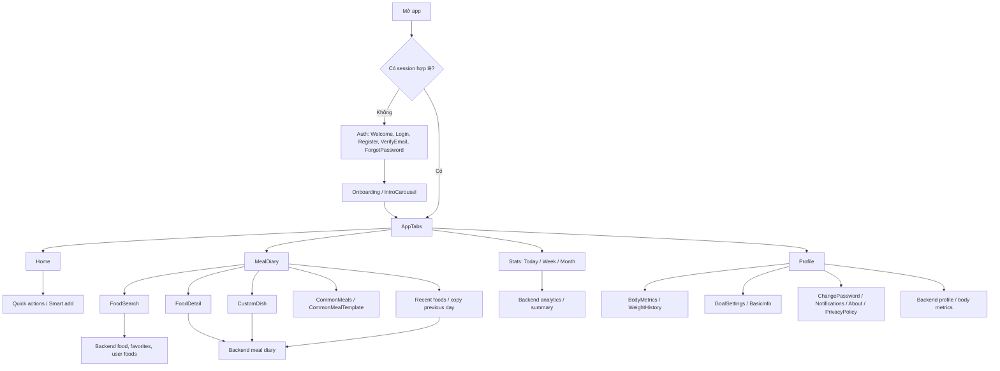
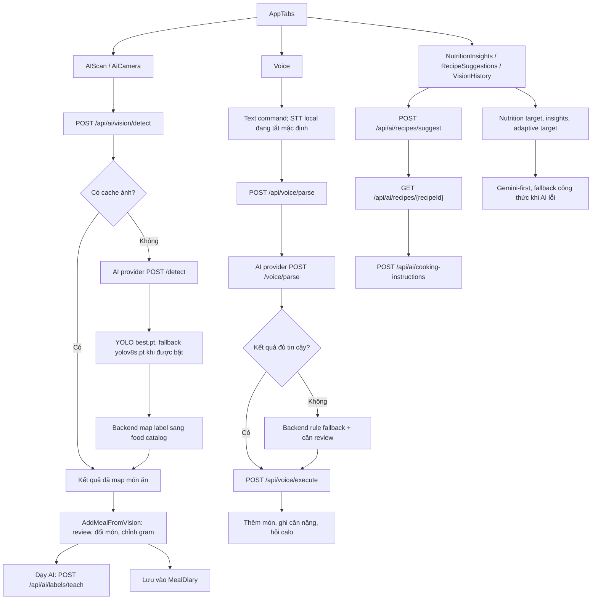
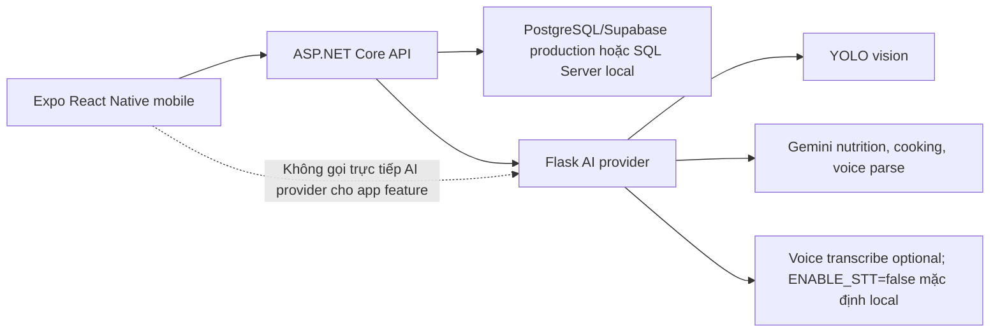

# EatFitAI User Flow

Updated: `2026-04-23`

Tài liệu này tóm tắt user flow hiện tại của app theo runtime trong repo. Khi có khác biệt, ưu tiên:

- `docs/ARCHITECTURE.md`
- `docs/TESTING_AND_RELEASE.md`

## 1. Main Runtime Shape

Core app flow:

```text
Launch -> Auth -> Onboarding / Intro -> Home / Diary / AI / Stats / Profile
```

Primary architecture path:

```text
Mobile -> Backend API -> SQL Server
Mobile -> Backend API -> AI Provider
```

Vision and voice are backend-proxied flows in the current branch.

## 2. Current Screen Inventory

Active screen groups reflected by architecture:

- Auth: `Welcome`, `Login`, `Register`, `VerifyEmail`, `ForgotPassword`, `Onboarding`, `IntroCarousel`
- Diary: `MealDiary`, `FoodSearch`, `FoodDetail`, `CustomDish`
- AI: `AIScan`, `VisionHistory`, `RecipeSuggestions`, `RecipeDetail`, `NutritionInsights`, `NutritionSettings`, `DietaryRestrictions`
- Stats: `Stats`, `WeekStats`, `MonthStats`
- Profile: `Profile`, `EditProfile`, `BodyMetrics`, `GoalSettings`, `WeightHistory`, `ChangePassword`, `Notifications`, `About`, `PrivacyPolicy`

`AddMealFromVision` đang là màn hỗ trợ sau scan trong `AppNavigator`, không phải tab chính. Tên lịch sử như `WeeklyHistory` không nên dùng làm source of truth hiện tại.

### 2.1 Bản đồ chức năng thường



### 2.2 Bản đồ chức năng AI



### 2.3 Ranh giới runtime



## 3. Authentication Flow

Typical first-run path:

1. App launches.
2. If there is no valid session, user goes through `Welcome` -> `Login` or `Register`.
3. Email verification / forgot-password flows remain backend-owned.
4. New users continue through onboarding and intro screens.
5. Authenticated users land in the main app shell.

## 4. Diary Flow

Manual diary flow:

1. User opens `MealDiary`.
2. User adds food through `FoodSearch` or `FoodDetail`.
3. Backend stores entries under `/api/meal-diary`.
4. Day summary and grouped meal UI refresh from backend summary + diary data.

Current quick-log helpers added in this branch:

- recent searches remain local on mobile
- recent foods come from backend `GET /api/food/recent`
- same-as-yesterday uses backend `POST /api/meal-diary/copy-previous-day`

## 5. Vision Flow

Current vision path:

1. User opens `AIScan`.
2. Mobile uploads image to backend `POST /api/ai/vision/detect`.
3. Backend proxies to the AI provider.
4. Backend maps detections to food items and returns app-ready results.
5. User reviews, edits, and saves to diary.

Important note:

- The current app should not be documented as calling `POST /detect` directly from mobile.

## 6. Voice Flow

Current voice path:

1. User records or enters voice/text input.
2. Mobile calls backend-owned routes:
   - `POST /api/voice/transcribe`
   - `POST /api/voice/parse`
   - `POST /api/voice/execute`
3. Backend proxies parse work to AI provider and falls back when needed.
4. Backend executes supported intents such as adding food or logging weight.

Important note:

- Old descriptions that route voice through direct Whisper/Ollama runtime are historical only.

## 7. Stats And Profile Flow

Stats flow:

1. User opens `Stats`.
2. Weekly and monthly views load backend analytics.
3. Weekly review uses current stats screens, not a legacy standalone screen map.

Profile flow:

1. User opens `Profile`.
2. User can edit profile/body metrics/goals and view weight history.
3. Password, notification, about, and privacy screens are part of the active profile surface.

## 8. Doc Safety Notes

This file intentionally replaces the old generated inventory because the generated 2025-12-12 map no longer matched runtime.

If a future feature changes routing or screen names, update this file together with:

- `docs/ARCHITECTURE.md`
- `docs/TESTING_AND_RELEASE.md`
